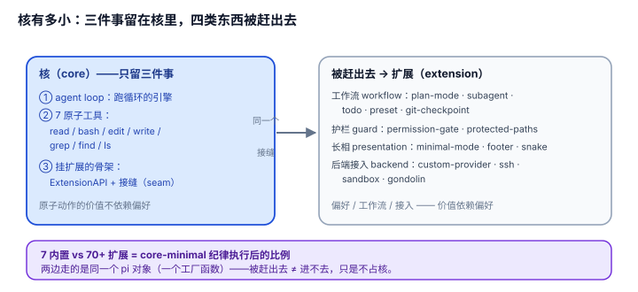

# 1.1 核（core）的清单：只留"跑循环 + 摸文件 + 挂扩展"

## 现象是什么

数一下 pi 的核，会发现它小得反常。一个完整的 coding agent，内置工具只有 8 个：

```typescript
// packages/coding-agent/src/core/tools/index.ts (L95, v0.84.3)
export type ToolName = "read" | "bash" | "edit" | "write" | "grep" | "find" | "ls" | "powershell";
```

（`powershell` 是 v0.84.3 新增的 Windows-only 工具——本质是 bash 的 Windows 兄弟，不在默认激活集 `["read","bash","edit","write"]` 里，见 [4.5](../../agent/04-Harness/4.5_Tool_Bash.md) 的 v0.84.3 警示。）

没有 todo、没有 web search、没有 plan、没有 subagent、没有 git 工具。对照 `examples/extensions/` 里 70+ 个能力（todo、git-checkpoint、plan-mode、subagent、ssh、sandbox……），比例是 8 比 70+。

这不是"还没写完"，是刻意为之。`CONTRIBUTING.md` 第一段就是闸门："pi's core is minimal. If your feature does not belong in the core, it should be an extension."



## 核心矛盾是什么

**"核要小"和"核要能干活"互相拉扯。** 核太小，一个裸 agent 什么也干不了；核太大，又回到"每个功能都想进核"的老路。关键问题是：**哪些东西是"循环本身的零件"，哪些东西是"挂在循环上的工作流"？** 前者必须留在核里，后者必须出去。

## 扩充思路是什么

### 判断一：核里只剩三类东西，每一类都有一个"不能被扩展替代"的理由（硬事实 + 解释）

| 核里的东西 | 具体是 | 为什么不能赶出去 |
|---|---|---|
| **跑循环的引擎** | agent loop、消息图、session 树、compaction、provider 抽象 | 这是"扩展能挂上去"的宿主本身。扩展是**挂在这个循环上的**，循环没了，扩展无处可挂 |
| **8 个摸文件/跑命令的工具** | read / bash / edit / write / grep / find / ls / powershell | 它们是"agent 和世界之间的最小接口"。所有扩展要么调用它们（`createReadTool`），要么覆盖它们（同名注册）——它们是**别的能力的地基**（powershell 是 Windows-only 的 bash 兄弟，见上） |
| **挂扩展的骨架** | `ExtensionAPI`、jiti 加载、事件扇出、生命周期护栏 | 这是"可扩展性"这个性质本身。核存在的目的之一就是"to be extensible so that it can be influenced and manipulated by extensions"（README 原话） |

**关键：** 8 个工具不是"最常用的 8 个功能"，而是"**agent 操作的原子动作（atomic operations）**"——读、写、改、查、找、列、跑（外加 Windows 的跑：powershell）。它们是所有更高层能力（todo、plan、git 流程、代码评审）的地基，而地基才配待在核里。

### 判断二："进核 vs 扩展"的判据可以反推出来（解释）

从 70+ 个示例反推，一条能力"该不该进核"，可以问三个问题：

1. **它是不是循环转起来的前提？** 是（read/bash）→ 进核；不是（todo、git-checkpoint）→ 扩展。
2. **它是不是一种"工作流偏好（workflow preference）"？** 是（plan-mode 先计划再执行、subagent 隔离上下文）→ 扩展，因为不同用户要不同的工作流。
3. **它是不是一种"后端接入（backend integration）"？** 是（ssh、sandbox、custom-provider）→ 扩展，因为接入是开放集（open set），核里不可能枚举完所有远程/沙箱/模型后端。

凡是答"不是前提、是偏好、是接入"的能力，都该出去。这就是为什么 `examples/extensions/` 里既有玩具（pirate、snake）也有正经工作流（plan-mode、subagent、sandbox）——**它们对核来说是同一类东西：不该进核的功能。**

### 判断三：核的"小"不是空的，是"接口密集（seam-dense）"的（解释）

核虽然只有 8 个工具 + 一个循环，但它把一个 agent 循环能暴露的**每一个接缝**都开成了扩展钩子（30+ 事件、register 全家桶、operations 接口）。所以"极小"不是"功能少所以弱"，而是"**功能少，但每个功能都被切开了接缝，供扩展改写**"。

这是"极小核"和"简陋"的区别：简陋是"没做完"，极小是"故意只留原子动作，把组合权让给扩展"。

## 影响是什么

1. **核的体积和认知负担被压在常数级。** 学 pi 的人只需要理解"一个循环 + 8 个工具 + 一个 `pi` 对象"，剩下的能力都在扩展里，按需加载、按需理解。
2. **"加能力"从"改 pi"变成"写扩展"**。todo 不是 pi 的一部分，是 `todo.ts`；plan 不是 pi 的一部分，是 `plan-mode/`。pi 本身永远不需要为"要不要内置 todo"做决定。
3. **但代价是"发现能力"变难**（硬事实）。新用户不知道有 `examples/extensions/` 就不会知道 pi 能 plan、能 subagent。极简核把"能力"藏到了扩展生态里，发现成本从"看文档"变成了"逛示例/装包"。

## 源码/示例锚点

- `packages/coding-agent/src/core/tools/index.ts`：`ToolName` 联合（L95，v0.84.3）——内置工具只有 8 个的硬事实
- `CONTRIBUTING.md`：开篇 "pi's core is minimal" + "core exists to be minimal and to be extensible"
- `packages/coding-agent/README.md`："minimal terminal coding harness" + "skips features like sub agents and plan mode"
- 对比物：`packages/coding-agent/examples/extensions/` 70+ 个能力全部在核外
- 同一事实的纪律视角回指：`../../harness/03-Discipline/3.1_core_minimal.md`（core-minimal 是纪律逼出来的，与本节 1.1 互补）

## 最小例证是什么

**例证 1（原子动作 vs 工作流）：** `read` 是核，`todo` 不是。为什么？`read` 是一个不可再分的原子——读一个文件；`todo` 是一个**有状态的编排**——它维护一个列表、每次执行返回完整快照、靠 `details` 在 session 里随分支走（见 `todo.ts`）。todo 的"状态 + 渲染 + 重建"整套路数是偏好，读文件不是偏好。原子的价值不依赖偏好，编排的价值高度依赖偏好——这就是核与扩展的分界。

**例证 2（地基被复用）：** `minimal-mode.ts` 里 `createReadTool(ctx.cwd)` 拿到内置 read 的真实实现，只换掉 `renderCall`/`renderResult`。如果 read 不在核里、不暴露工厂，这种"只改长相不改行为"的覆盖就做不了。8 个工具是**其他扩展的地基**，所以必须在核里且可复用。

**例证 3（判据自检）：** 拿 `git-checkpoint.ts` 问三个问题——是循环前提吗？不是（没有它循环照转）；是工作流偏好吗？是（要不要每轮 stash 是偏好）；是后端接入吗？不是。答出任意一个"是"，就该是扩展。

可观察信号：例证 1 说明核留的是"原子"不是"常用"；例证 2 说明核里的东西必须**可被扩展复用**；例证 3 说明判据是可操作的、不是拍脑袋。三者同成立，才说"核小得有道理"。
