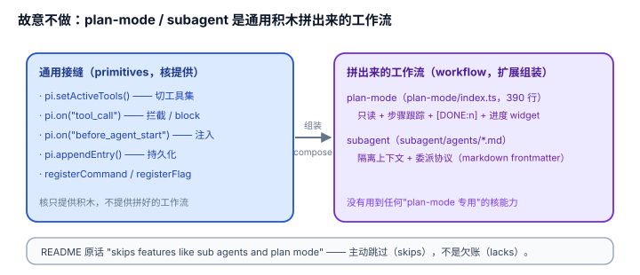

# 1.2 故意不做：plan-mode 和 subagent 被"赶"成了示例（example）

## 现象是什么

pi 的 README 里有一句容易被扫过去、但其实是最硬的一句话：

> "Pi ships with powerful defaults but **skips features like sub agents and plan mode.** Instead, you can ask pi to build what you want or install a third party pi package."

"skips" 是主动语态——不是"还没做"，是"**故意跳过**"。而这两个被跳过的功能，正好就躺在 `examples/extensions/` 里：

- `plan-mode/`：Claude Code 风格的只读计划模式（`/plan`、`Ctrl+Alt+P`、`--plan` flag、`[DONE:n]` 步骤跟踪、进度 widget）。
- `subagent/`：把任务委派给带独立上下文窗口的子代理（`agents/worker.md`、`agents/reviewer.md`、`agents/planner.md`、`agents/scout.md` + `prompts/`）。

Claude Code 用户对 plan mode 和 subagent 太熟了——那是它家产品力的核心。pi 却把它们做成"示例扩展"，等于明说：**这两样不是 pi 的核，是你自己可以装、可以改、可以不装的东西。**



## 核心矛盾是什么

**"内置一个功能"和"把功能做成扩展"是两种成本完全不同的决定。**

- 内置 plan mode：pi 要为"什么是 plan mode""什么时候能写什么时候不能写"下一个**所有人都要接受的唯一定义**。定义错了、或有人不想要，就是 core 的包袱。
- 做成扩展：pi 只提供"能切工具集（`setActiveTools`）+ 能拦命令（`tool_call`）+ 能注入上下文（`before_agent_start`）"这些**原子接缝**，plan mode 是某个扩展作者用这些接缝拼出来的**一种答案**。

核心拉扯是：**pi 该不该替用户决定"工作流（workflow）应该长什么样"？** 极简核的答案是"不"——核只提供拼工作流的积木（building block），不提供拼好的工作流。

## 扩充思路是什么

### 判断一：plan-mode 是"用积木拼出来的工作流"的完整示范（硬事实）

读 `plan-mode/index.ts`（390 行），它没有碰任何 pi 内部，全靠公开接缝拼成：

| plan-mode 的行为 | 用的接缝 |
|---|---|
| 只读：禁用 edit/write | `pi.setActiveTools(getPlanModeTools(...))` |
| bash 白名单 | `pi.on("tool_call", ...)` 返回 `{ block: true }` |
| 注入 "[PLAN MODE ACTIVE]" 指令 | `pi.on("before_agent_start", ...)` 返回 `{ message }` |
| 状态栏 / 进度 widget | `ctx.ui.setStatus()` / `ctx.ui.setWidget()` |
| 步骤提取与 `[DONE:n]` 跟踪 | `pi.on("agent_end")` / `pi.on("turn_end")` |
| 重启后恢复 | `pi.appendEntry("plan-mode", ...)` + `session_start` 重建 |
| `/plan`、`Ctrl+Alt+P`、`--plan` | `registerCommand` / `registerShortcut` / `registerFlag` |

**关键观察：** plan-mode 没有用到一个"plan-mode 专用"的核能力。它的全部原料是 `setActiveTools`、`tool_call` 拦截、`before_agent_start` 注入、`ui`、`appendEntry` 这些**通用积木**。也就是说，核提供的是"乐高"，plan-mode 是"有人拼好的一套说明书 + 零件组合"。

### 判断二：subagent 是"隔离上下文（isolated context window）"被做成文件 + 提示词（硬事实 + 解释）

`subagent/` 目录里没有 Rust/Go 式的进程隔离，而是：

```
subagent/
  agents/planner.md      # 每个 agent 是一个带 frontmatter 的 markdown（name/description/model）
  agents/reviewer.md
  agents/scout.md
  agents/worker.md
  prompts/implement.md   # 委派时用的提示词模板
  prompts/implement-and-review.md
  prompts/scout-and-plan.md
```

`worker.md` 的 frontmatter 是 `name` / `description` / `model`，正文是"你是 isolated context window 里的 worker agent，输出 ## Completed / ## Files Changed / ## Notes"。

**这说明 pi 的"subagent"不是一种运行时隔离，而是一种提示词 + 会话编排的模式**——子代理的核心（独立上下文、委派协议、输出格式）被压缩成了"一份 markdown 定义 + 一个委派提示词"。这是极简核思路的极端体现：连"子代理"这么重的功能，都先假设它可以被"一个上下文隔离的 agent 循环"表达，而那个循环就是核里的循环本身。

### 判断三：这两例共同揭示了"扩充"的边界哲学（解释）

pi 不内置 plan-mode/subagent，不是因为它们不重要，而是因为它们的**价值高度依赖用户的偏好**（推测：对维护者设计意图的推断——源码只给得出"被跳过"这一事实，给不出"为什么被跳过"；"价值依赖偏好"是合理解释，非可证实硬事实）：

- plan-mode 的"计划→执行→`[DONE:n]`"是一套具体工作流，有人要"计划→写文件→开 issue"（`preset.ts` 里就写了另一套），有人不要 plan 直接干。
- subagent 的"scout→plan→implement→review"是一套具体的委派流水线，不同团队要不同的 agent 分工。

**凡是"价值依赖偏好"的功能，内置 = 替用户做决定，做成扩展 = 让用户做决定。** 极简核的立场是：核只保留"价值不依赖偏好"的原子（读、写、跑命令、拦工具、切工具集），把"价值依赖偏好"的组装权全部让给扩展。

## 影响是什么

1. **pi 用两个最"该内置"的功能立了规矩**：连 plan mode 和 subagent 都不进核，那还有什么资格进核？这两个例子是"core-minimal 纪律"最锋利的注脚。
2. **"工作流"成为扩展生态的第一等公民**。别的 harness 卖的是"我内置了 plan mode"；pi 卖的是"你可以用这些积木拼出**你自己的** plan mode"——`preset.ts`（preset 切换）和 `plan-mode/`（步骤跟踪）就是同一个问题（怎么组织一次改动）的两种答案。
3. **代价是开箱即用的"高级工作流"缺失**（硬事实）。一个裸 pi 没有 plan、没有 subagent、没有 todo。想要就得装扩展或自己写。这是极简核的诚实代价：**默认能力 = 最小集，高级能力 = 扩展生态。**

## 源码/示例锚点

- `packages/coding-agent/README.md`："skips features like sub agents and plan mode"
- `packages/coding-agent/examples/extensions/plan-mode/index.ts`（390 行）：plan-mode 全用通用接缝拼成，无专用核能力
- `packages/coding-agent/examples/extensions/subagent/agents/worker.md` + `prompts/implement.md`：subagent = markdown frontmatter + 委派提示词
- 同题异解的对照：`examples/extensions/preset.ts`（`plan` preset 的 instructions 也是一套"计划模式"定义）

## 最小例证是什么

**例证 1（主动跳过是事实）：** 读 README 那句 "skips features like sub agents and plan mode"——注意是 "skips" 不是 "lacks" 或 "doesn't have yet"。主动跳过 = 设计判断，不是欠账。

**例证 2（积木拼装）：** 在 `plan-mode/index.ts` 里搜 `setActiveTools`、`tool_call`、`before_agent_start`、`appendEntry`——这四样是 plan-mode 的四大支柱，而它们每一个都是**通用**接缝，任何一个工具类扩展（permission-gate、todo）也都在用。plan-mode 没有拿到任何"特权接口"。

**例证 3（同题异解证明"价值依赖偏好"）：** `plan-mode/` 的 plan 是"只读 + 步骤跟踪 + `[DONE:n]`"；`preset.ts` 的 `plan` preset 是"深读代码 + 输出结构化计划 + 问用户要不要写 PLAN.md / 开 issue"。**同一个"plan"需求，两套完全不同的定义**——这正是"价值依赖偏好，所以不该内置"的活证据。

可观察信号：例证 1 证明"跳过"是主动的；例证 2 证明跳过靠的是"通用积木够用"；例证 3 证明跳过是对的（同一需求有 N 套合理定义）。三者同成立，才说"故意不做"是哲学而非缺陷。
