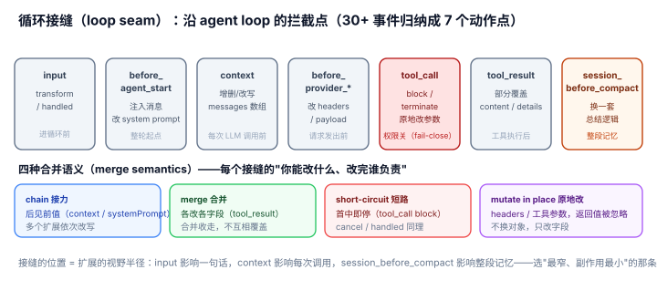

# 2.1 循环接缝（loop seam）：在既定节点上拦截 / 改写

## 现象是什么

pi 的 agent 循环是一条有固定节点的流水线。扩展可以在这些节点上**拦截（intercept）、改写（rewrite）、短路（short-circuit）**流动中的数据，而不需要改循环本身。`docs/extensions.md` 的 lifecycle 图列了 30+ 个事件，但按"动作类型"归纳，其实只有几类：

| 节点 | 事件 | 扩展能做的动作 |
|---|---|---|
| 输入进来 | `input` | `transform`（改写文本）/ `handled`（自己处理，跳过 LLM） |
| agent 启动前 | `before_agent_start` | 注入（inject）消息、改写 system prompt |
| 每轮发 LLM 前 | `context` | 增删/改写整个消息数组 |
| provider 请求前 | `before_provider_headers` / `before_provider_request` | 改 headers / 替换 payload |
| 工具执行前 | `tool_call` | 改参数（原地改 `event.input`）、`block`、`terminate` |
| 工具执行后 | `tool_result` | 部分覆盖 content / details / isError |
| 消息定稿 | `message_end` | 替换整个 message（role 不变） |
| compaction 前 | `session_before_compact` | 取消，或**换一套总结逻辑** |
| session 换/分/切 | `session_before_switch/fork/tree` | `cancel` 短路 |



## 核心矛盾是什么

**"能拦截"和"拦截得安全"互相拉扯。** 拦截点太多，扩展就能乱改核心数据（比如把消息数组删空、把 tool_call 全 block）；拦截点太少，扩展又插不进关键逻辑。关键在于：**每个接缝要规定清楚"你能改什么、改完谁负责、异常怎么办"。**

pi 的处理不是"统一 pub/sub"，而是**每个接缝有各自的合并语义（merge semantics）**（这个在 `agent/04-Harness/4.4` 里讲得细，这里只点出对扩充思路的意义）：

- **chain**（`context`、`before_provider_request`、`before_agent_start` 的 systemPrompt）：后面的 handler 看到前面改过的值——让多个扩展**接力改写**。
- **merge**（`tool_result`、`before_agent_start` 的 message 注入）：各自改各自字段，合并收走。
- **short-circuit**（`tool_call` 的 `block`、`session_before_*` 的 `cancel`、`input` 的 `handled`）：第一个命中即停。
- **mutate in place**（`before_provider_headers`、`tool_call` 的参数）：原地改，返回值被忽略。

## 扩充思路是什么

### 判断一：拦截接缝把"护栏（guard / guardrail）"从核里解耦了出来（硬事实）

`permission-gate.ts` 只有 34 行，核心逻辑是：

```typescript
pi.on("tool_call", async (event, ctx) => {
	if (event.toolName !== "bash") return undefined;
	if (dangerousPatterns.some((p) => p.test(command))) {
		const choice = await ctx.ui.select(`Dangerous command: ${command}. Allow?`, ["Yes", "No"]);
		if (choice !== "Yes") return { block: true, reason: "Blocked by user" };
	}
	return undefined;
});
```

**关键：** 危险命令的识别、要不要弹窗、弹什么窗、默认放行还是默认阻断——这些全是扩展的偏好。核只提供"`tool_call` 可以 block"这个**接缝**，不内置任何一条护栏规则。

这正是"护栏偏好"被赶出核的原因：一个公司要"`rm -rf` 一律 block"，另一个要"`sudo` 弹窗确认"，第三个要"静默放行只记日志"。核若内置其中一种，就替所有人做了决定。做成接缝，护栏成了**可插拔的偏好（pluggable preference）**。

### 判断二：`input` 接缝让扩展在"进入循环之前"就能接管（硬事实）

`input-transform.ts`（43 行）演示了输入这条缝的三种动作：

```typescript
pi.on("input", async (event, ctx) => {
	if (event.text.startsWith("?quick ")) return { action: "transform", text: `Respond briefly: ${query}` };
	if (event.text === "ping") { ctx.ui.notify("pong", "info"); return { action: "handled" }; }
	return { action: "continue" };
});
```

`transform` 在 skill/template 展开**之前**改写输入，`handled` 让"ping"这类输入根本不进 LLM。这条缝的存在意味着：**"用户敲了什么"到"LLM 收到什么"之间，是一段开放的、可编程的空间**，扩展可以塞入缩写展开、命令路由、本地即时响应等任意逻辑。

### 判断三：compaction 接缝让"记忆策略（compaction strategy）"成为可替换模块（硬事实 + 解释）

`custom-compaction.ts`（117 行）演示了最重的接缝之一——`session_before_compact` 能**整个换掉默认总结逻辑**：

```typescript
pi.on("session_before_compact", async (event, ctx) => {
	const { preparation } = event;
	const model = ctx.modelRegistry.find("google", "gemini-2.5-flash");
	const response = await ctx.modelRegistry.complete(model, { messages: summaryMessages }, { signal });
	return { compaction: { summary, firstKeptEntryId, tokensBefore, usage } };
});
```

这个示例用 Gemini Flash（更便宜）总结**全部**消息、丢掉所有旧轮次只留 summary——和默认"保留最近 20k token"策略完全不同。**记忆怎么压缩，是高度依赖偏好的工作流**（成本敏感的用户换便宜模型、长任务用户要更长摘要），所以它是接缝不是核。

### 判断四：接缝的"位置"就是扩充的"视野边界（blast radius）"（解释）

看一条缝在循环里的位置，就知道扩展能影响多大范围：

- `input` → 影响"这一句话进不进 LLM"
- `before_agent_start` → 影响"这一整轮 agent 的初始上下文"
- `context` → 影响"每一次 LLM 调用前的消息"
- `tool_call` → 影响"某一个工具执行前"
- `session_before_compact` → 影响"整段记忆怎么压缩"

**核把这些不同粒度（granularity）的节点都暴露出来，扩展就能选"影响最窄、副作用最小"的那一条缝**去挂逻辑。permission-gate 挂在 `tool_call`（只影响单个工具），而不是挂在 `context`（影响所有消息）——选窄缝是"护栏尽量少打扰"的关键。

## 影响是什么

1. **"行为护栏"与"工作流"这两类最难内置的东西，被接缝统一收编了**。核不用决定"危险命令是什么"，只决定"`tool_call` 可以被 block"。
2. **接缝让扩展能"就地改（mutate in place）"而不是"事后补"**。`context` 能在发 LLM 前删消息，`before_provider_request` 能在请求发出前改 payload——这是"事后清洗"做不到的。
3. **代价是每个接缝的合并语义必须精确定义**（硬事实）。chain / merge / short-circuit / mutate 四种语义如果搞混，扩展之间会互相踩。这是"接缝密集"的隐性复杂度，已在 `agent/4.4` 有完整表格。

## 源码/示例锚点

- `permission-gate.ts`：`tool_call` + `block`（护栏解耦的最小示范）
- `input-transform.ts`：`input` + `transform`/`handled`（进入循环前的接管）
- `custom-compaction.ts`：`session_before_compact` 返回 `{ compaction }`（记忆策略可替换）
- `plan-mode/index.ts`：`context` 过滤 stale 消息 + `before_agent_start` 注入 plan 指令 + `tool_call` 拦 bash（一个扩展同时占多条缝）
- `pirate.ts`：`before_agent_start` 追加 system prompt（最轻的接缝用法）
- 合并语义权威表：`../../agent/04-Harness/4.4_Extension_Runner.md`（emit 系列方法表）

## 最小例证是什么

**例证 1（护栏是偏好不是核）：** `permission-gate.ts` 里 34 行全是偏好——pattern 列表、弹窗文案、非 UI 模式默认 block。核代码里没有任何 "rm -rf" 字样。证明"护栏规则"被彻底赶出了核。

**例证 2（同一条缝、不同粒度）：** 对比 `permission-gate.ts`（挂在 `tool_call`）和 `pirate.ts`（挂在 `before_agent_start`）——前者影响单个工具，后者影响整轮。同一个 `pi.on(...)` 语法，挂的缝不同，视野半径差一个数量级。

**例证 3（短路语义真实存在）：** `input-transform.ts` 敲 `ping` 返回 `{ action: "handled" }`，pi 不调 LLM 直接回 "pong"。如果这条缝没有 short-circuit 语义，`ping` 会作为普通 prompt 进 LLM。证明接缝的"语义"（不只是"能订阅"）决定了它能干什么。

可观察信号：例证 1 证明护栏被解耦；例证 2 证明接缝有"粒度"维度；例证 3 证明接缝的合并语义（merge semantics）是实打实的行为契约（behavioral contract）。三者同成立，才说"循环接缝"是扩充的第一条轴。
