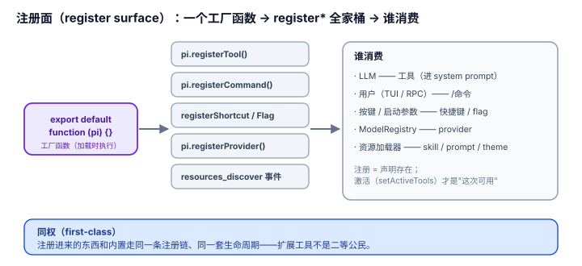

# 2.2 注册面（register surface）：往循环里加东西

## 现象是什么

第二条扩充轴是"加东西"——扩展往循环里注册**新的可调用对象（callable object）**，让 agent 能调、用户能敲、宿主能配。`ExtensionAPI` 的 register 全家桶：

| 注册什么 | API | 谁消费 | 示例 |
|---|---|---|---|
| 工具（LLM 可调） | `pi.registerTool()` | LLM | `hello.ts`、`todo.ts`、`dynamic-tools.ts` |
| 命令（`/xxx`） | `pi.registerCommand()` | 用户（TUI/RPC） | `preset.ts`、`send-user-message.ts` |
| 快捷键 | `pi.registerShortcut()` | 用户按键 | `preset.ts`（`Ctrl+Shift+U`） |
| CLI flag | `pi.registerFlag()` | 启动参数 | `plan-mode/`（`--plan`）、`ssh.ts`（`--ssh`） |
| provider（模型后端） | `pi.registerProvider()` | ModelRegistry | `custom-provider-anthropic/` |
| 资源（skill/prompt/theme） | `resources_discover` 事件 | 资源加载器 | `dynamic-resources/` |



## 核心矛盾是什么

**"能加东西"和"加进来的东西要不要和核里的东西同权（first-class）"互相拉扯。** 如果一个扩展注册的工具和内置工具不是同权（比如在 system prompt 里降级显示、或不能拦截），那"加工具"就是二等公民（second-class citizen），很多能力做不出来。pi 的选择是：**注册进来的东西，和核里的东西走同一条注册链（registration chain）、享有同一套生命周期**——工具同权、命令同权、provider 可覆盖内置。

## 扩充思路是什么

### 判断一：`registerTool` 是"加能力"的主干，且工具的"元数据（metadata）"决定它在核里的地位（硬事实）

`hello.ts` 是最小工具，26 行，但已经露出工具定义的完整形状：

```typescript
const helloTool = defineTool({
	name: "hello",
	label: "Hello",
	description: "A simple greeting tool",
	parameters: Type.Object({ name: Type.String(...) }),
	async execute(_id, params, ...) {
		return { content: [{ type: "text", text: `Hello, ${params.name}!` }], details: {...} };
	},
});
export default function (pi) { pi.registerTool(helloTool); }
```

工具的"元数据"字段决定它怎么被核对待（`docs/extensions.md` 详述）：

- `description` → LLM 看的能力说明
- `promptSnippet` → 进 `Available tools` 一行的开关
- `promptGuidelines` → 进 system prompt `Guidelines` 段的条件 bullet
- `parameters`（TypeBox schema）→ 校验 + 传给 LLM 的参数 schema
- `renderCall` / `renderResult` → TUI 长相（见 [2.3](./2.3_presentation.md)）

**关键：** 一个工具想"被 LLM 看见、被 LLM 正确使用"，全靠这些元数据，而不是靠"改核"。这让"加能力"降级成了"填一张表"。

### 判断二：工具可动态加载（deferred / dynamic tool loading）——"能力"本身可以按需出现（硬事实）

`dynamic-tools.ts` 和 `docs/extensions.md` 的 search-tool 示例演示了：**先注册一大批工具但只激活 loader 一个，等 loader 执行时再 `pi.setActiveTools([...])` 把匹配的工具激活**。配合 Anthropic `defer_loading` / OpenAI `tool_search`，扩展能做出"工具太多时按需加载"的能力。

这解决的是"能力膨胀"的老问题：核不想内置 todo、web、search 一堆工具（会撑爆 system prompt），但又想要"要什么有什么"。答案是**把注册（register）和激活（activate）分开**——注册是"声明存在"，激活是"这次对话可用"。极简核 + 动态激活 = 能力既不在核里、又能按需长出来。

### 判断三：命令/快捷键/flag 是同一能力的三种入口（entry point）（硬事实 + 解释）

看 `preset.ts`：一个"切换 preset"的能力，同时注册了三种入口：

```typescript
pi.registerFlag("preset", {...});              // --preset plan（启动时）
pi.registerCommand("preset", {...});           // /preset（运行时）
pi.registerShortcut(Key.ctrlShift("u"), {...}); // Ctrl+Shift+U（按键）
```

**同一个逻辑，三个触发面（trigger surface）。** 这揭示了一个扩充思路：**"能力（capability）"和"入口（entry point）"是正交（orthogonal）的**——扩展写一次逻辑，用 register 全家桶把它暴露到 CLI、命令、按键三个面。核不必为"每个能力怎么触达"设计三套机制，一个 register 就够了。

### 判断四：`registerProvider` 是"后端接入（backend integration）"的开放口——核不枚举模型世界（硬事实）

`custom-provider-anthropic/index.ts`（611 行）演示了把一整个新 provider 塞进核：自定义 API id、自定义 `streamSimple`（逐块解析 Anthropic 流）、OAuth（`/login`）、环境变量 key。`ssh.ts` 则演示了另一个方向——不改 provider，改工具的 `operations` 接口（`ReadOperations`/`BashOperations`/…），把 read/bash/edit/write 的"在哪里执行"从本地换成 SSH 远程。

两条路合起来说明：**"世界有多大"（多少个模型 provider、多少种远程执行后端）是一个开放集（open set），核不可能枚举完。** 所以核只定接口（`Provider`、`*Operations`），让扩展把新的后端"插（plug in）"进来。这是"接入是开放集、所以必须是扩展"这条判据（见 [1.1](../01-Core/1.1_minimal_core.md)）的落点。

### 判断五：资源注册把 skill/prompt/theme 也纳入同一条扩充轴（硬事实）

`dynamic-resources/index.ts` 只有 15 行：

```typescript
pi.on("resources_discover", () => ({
	skillPaths: [join(baseDir, "SKILL.md")],
	promptPaths: [join(baseDir, "dynamic.md")],
	themePaths: [join(baseDir, "dynamic.json")],
}));
```

一个扩展可以**顺带（incidentally）**贡献 skill、prompt 模板、theme，而不是只能贡献工具。这印证了 `harness/01-Architecture/1.2` 的判断：skill/prompt/theme 这些在别家是独立协议通道的东西，在 pi 里是**同一条 extension 通道里的一个事件返回值**。统一口子的"一个扩展全拿"在这里看得最清楚。

## 影响是什么

1. **"加能力"从"改 pi"变成"填表 + 写 execute"**。`hello.ts` 26 行就是一个完整工具；`dynamic-resources/` 15 行就贡献三类资源。加能力的成本被压到"写一个函数"。
2. **能力和入口正交**，一个逻辑能同时暴露成 flag/command/shortcut 三种触发面，核不重复造轮子。
3. **后端接入是开放集**，provider 和 operations 两个口把"模型世界"和"执行世界"都留给了扩展。这是极简核在"世界会变大"这件事上的诚实。
4. **代价是注册面本身在膨胀**（硬事实）。register 全家桶已有 6 类，`ExtensionAPI` 50+ 成员。这正是 `harness/3.1` 说的"连 hook 点都要审"的由来——统一口子省了认知成本，但单点接口会越攒越大。

## 源码/示例锚点

- `hello.ts`：最小工具，26 行（`defineTool` + `registerTool`）
- `todo.ts`：带状态、带渲染、带命令的完整工具（`StringEnum`、`details`、`renderResult`）
- `dynamic-tools.ts` + `docs/extensions.md`（search-tool 示例）：注册/激活分离，动态加载
- `preset.ts`：flag + command + shortcut 三入口同逻辑
- `custom-provider-anthropic/index.ts`：`registerProvider` + `streamSimple` + `oauth`
- `ssh.ts`：`createReadTool(cwd, { operations })` 换执行后端
- `dynamic-resources/index.ts`：`resources_discover` 贡献 skill/prompt/theme

## 最小例证是什么

**例证 1（同权）：** 注册的 `hello` 工具和内置 `read` 一样，出现在 `pi.getAllTools()` 里、能被 `pi.setActiveTools()` 开关、能被 `tool_call` 拦截。扩展工具不是二等公民——这是"加能力"能做出 plan-mode、todo 这些正经功能的前提。

**例证 2（能力/入口正交）：** `preset.ts` 里 `applyPreset()` 只写一次，被 `/preset`、`--preset`、`Ctrl+Shift+U` 三个入口调用。数一下：如果这三个入口要三套注册机制，作者要写三遍。一个 `register*` 家族 = 一次逻辑、N 个面。

**例证 3（开放集不枚举）：** `custom-provider-anthropic/` 注册了一个核里不存在的 provider id（`custom-anthropic`）和 API id（`custom-anthropic-api`）。核没有任何 `if (provider === "custom-anthropic")` 分支——它是纯扩展插进来的。证明"模型世界是开放集"这条判据真实成立。

可观察信号：例证 1 证明注册物与内置同权；例证 2 证明"能力"与"入口"正交；例证 3 证明注册面是开放集。三者同成立，才说"注册"是扩充的第二条轴。
