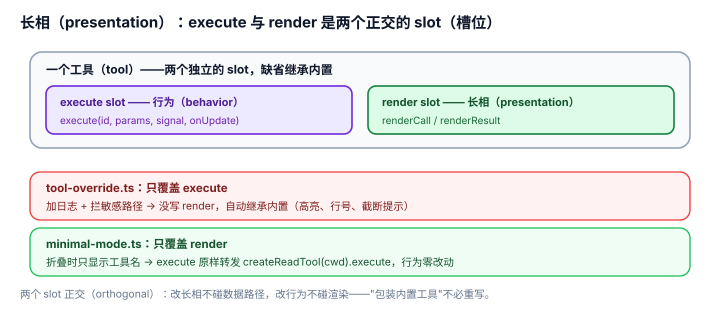

# 2.3 长相（presentation）：改变循环的显示

## 现象是什么

第三条扩充轴是"长相"——扩展可以改变 pi **显示什么、怎么显示**，而不碰背后的行为。这条轴覆盖的范围比"换主题"大得多：

| 改什么 | API | 示例 |
|---|---|---|
| 工具的调用/结果渲染 | 工具的 `renderCall` / `renderResult` | `minimal-mode.ts`、`built-in-tool-renderer.ts`、`todo.ts` |
| 消息渲染 | `pi.registerMessageRenderer()` | `message-renderer.ts` |
| 非 LLM 条目渲染 | `pi.registerEntryRenderer()` | `entry-renderer.ts` |
| Markdown 变换 | `pi.registerMarkdownTransformer()` | `docs/extensions.md` 的 `-->`→`→` 例子 |
| footer / header | `ctx.ui.setFooter()` / `setHeader()` | `custom-footer.ts`、`custom-header.ts` |
| 编辑器本体 | `ctx.ui.setEditorComponent()` | `modal-editor.ts`（vim 模式）、`rainbow-editor.ts` |
| 整块 overlay | `ctx.ui.custom()` / overlay | `snake.ts`、`tic-tac-toe.ts`、`doom-overlay/` |



## 核心矛盾是什么

**"显示"和"行为"必须能分开改。** 如果改一个工具的长相就必须重写它的执行逻辑，那"只想要更紧凑的显示"就要承担"重新实现 read"的全部风险。pi 的答案是：**工具的执行 override 和渲染 override 是两个独立的 slot（槽位）**——改长相不必重写行为，改行为也不必重写长相。

`docs/extensions.md` 原文："Built-in renderer inheritance is resolved per slot. Execution override and rendering override are independent."（内置渲染器按 slot 继承，执行覆盖与渲染覆盖相互独立。）

## 扩充思路是什么

### 判断一：`minimal-mode.ts` 是"只改长相、行为原样"的教科书（硬事实）

`minimal-mode.ts`（426 行）覆盖全部 7 个内置工具，但每一个都是同一个套路：

```typescript
pi.registerTool({
	name: "read",
	parameters: getBuiltInTools(process.cwd()).read.parameters,   // 复用内置 schema
	async execute(id, params, signal, onUpdate, ctx) {
		return getBuiltInTools(ctx.cwd).read.execute(id, params, signal, onUpdate); // 复用内置执行
	},
	renderCall(args, theme, _) { /* 自定义：紧凑显示路径 */ },
	renderResult(result, { expanded }, theme, _) {
		if (!expanded) return new Text("", 0, 0);  // collapsed 时不显示输出
		/* expanded 时才显示完整输出 */
	},
});
```

**关键：** 执行用 `createReadTool(ctx.cwd).execute` 原样转发，只重写 `renderCall`/`renderResult`。整个"minimal mode"（折叠时只显示工具名、不显示输出）就是**纯渲染层的改动**，执行路径一行没碰。

这解释了为什么 7 个内置工具必须是"可复用工厂（factory）"（`createReadTool` 等，见 [1.1](../01-Core/1.1_minimal_core.md) 判断二）：**如果工具是黑盒（black box），长相就改不了。**

### 判断二：渲染 override 是"分 slot"的，缺省就继承内置（硬事实）

`tool-override.ts` 覆盖了 `read` 的**执行**（加日志 + 拦敏感路径），但**故意不写** `renderCall`/`renderResult`。注释说：

> "Since no custom renderCall/renderResult are provided, the built-in renderer is used automatically (syntax highlighting, line numbers, truncation warnings)."

也就是说，覆盖执行时，渲染自动回落到内置；覆盖渲染时，执行自动回落到内置。**两个 slot 各改各的，缺省继承。** 这让"包装（wrap）内置工具做日志/访问控制"（`tool-override.ts`）和"只改显示风格"（`minimal-mode.ts`）成为两个正交（orthogonal）、可独立做的动作，而不是一个"必须全量重写"的动作。

### 判断三：`custom-footer.ts` 证明"长相"可以读到核里藏起来的数据（硬事实）

`custom-footer.ts` 的 `ctx.ui.setFooter()` 回调拿到一个 `footerData`，里面有 `getGitBranch()`——注释明确说这是"not otherwise accessible"（否则扩展拿不到 git branch）。footer 里还能遍历 `ctx.sessionManager.getBranch()` 统计 token/cost。

这说明**"长相"接缝不是纯装饰（cosmetic）**：它把一些**只对 UI 有意义、不对 LLM 有意义**的数据（git branch、token 统计）暴露给了扩展，让扩展能自建状态栏，而不需要核为每个可能的 footer 元素开一个 API。核只给一个 `setFooter(renderFn)` + 一个 `footerData` 钩子，footer 长什么样是扩展的事。

### 判断四：编辑器、overlay 是"长相"轴的深水区（deep end）（硬事实 + 解释）

`modal-editor.ts`（vim 模态编辑）和 `rainbow-editor.ts`（彩虹动画）用了 `ctx.ui.setEditorComponent()` 换掉整个输入编辑器；`snake.ts`、`tic-tac-toe.ts`、`doom-overlay/` 用 overlay 在终端上跑完整交互界面（游戏、实时渲染）。

这些例子证明：**"长相"可以深到"替换 pi 的整个交互组件"**。但关键还是那句——它们改的是 `ctx.ui` 这一层的组件，不是 agent 循环。一个 snake 游戏 overlay 和 agent 循环可以同时存在、互不干扰。长相轴的最高点，就是"在 pi 的 TUI 里塞进一个自己的小程序"。

## 影响是什么

1. **"显示偏好"被彻底赶出了核**。紧凑还是展开、footer 显示 token 还是 git branch、编辑器是普通还是 vim——全是扩展。核只提供"渲染 slot 可以覆盖"这个接缝。
2. **执行和渲染正交（orthogonal），降低了"包装内置工具"的风险**（硬事实）。`tool-override.ts` 能只加审计不改 UI，`minimal-mode.ts` 能只改 UI 不碰执行。两件最常被"包装"的需求，都不需要重写工具逻辑。
3. **长相轴是"极简核"最直观的体现**：pi 的默认 TUI 可以很素，因为所有花活（游戏、动画、vim 编辑）都是扩展，不加载就不存在。

## 源码/示例锚点

- `minimal-mode.ts`：只覆盖 `renderCall`/`renderResult`，执行原样转发（执行/渲染正交的教科书）
- `tool-override.ts`：只覆盖 `execute`，渲染自动继承内置（正交的反方向）
- `custom-footer.ts`：`ctx.ui.setFooter()` + `footerData.getGitBranch()`（长相接缝暴露 UI-only 数据）
- `todo.ts`：工具的 `renderResult` + `/todos` 命令的自定义 `Component`（自定义渲染 + 键盘）
- `message-renderer.ts` / `entry-renderer.ts`：消息/条目级渲染
- `modal-editor.ts` / `rainbow-editor.ts`：`setEditorComponent()` 换编辑器
- `snake.ts` / `doom-overlay/`：overlay 里跑完整交互程序

## 最小例证是什么

**例证 1（执行/渲染正交）：** 对比 `minimal-mode.ts`（改渲染不改执行）和 `tool-override.ts`（改执行不改渲染）——两者分别独立覆盖一个 slot，另一个 slot 自动继承内置。如果两个 slot 不是独立的，"包装 read 加日志"就不得不同时重写 read 的渲染。

**例证 2（改长相零行为风险）：** `minimal-mode.ts` 的 `read.execute` 就是 `createReadTool(ctx.cwd).read.execute(...)` 一行转发。这意味着"minimal mode"崩了最多是显示难看，文件读取行为完全不变。长相轴的改动**不接触数据路径**。

**例证 3（长相读到隐藏数据）：** `custom-footer.ts` 用 `footerData.getGitBranch()` 拿到 git branch，用 `ctx.sessionManager.getBranch()` 算 token。这两样数据不经过 LLM、也不在普通 `ctx` 上——是"长相"接缝专门暴露的。证明长相轴有自己的一片数据面，不是纯装饰。

可观察信号：例证 1 证明渲染/执行是两个正交 slot；例证 2 证明改长相零行为风险；例证 3 证明长相轴有专属数据。三者同成立，才说"长相"是扩充的第三条轴。
