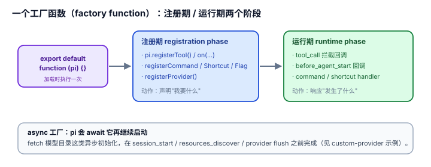

# 3.1 一个工厂函数（factory function）：扩充的语法只有一种

## 现象是什么

**凡走 `core/extensions` 的扩展**——不管它是 26 行的 `hello.ts` 还是 611 行的 `custom-provider-anthropic/`——都是同一个形状：

```typescript
export default function (pi: ExtensionAPI) {
	// 在这里注册一切：工具、命令、快捷键、flag、provider、事件处理器……
}
```

一个**默认导出的工厂函数**，接收一个 `pi` 对象（`ExtensionAPI`），在函数体内完成所有注册。没有配置文件、没有 manifest 必需的字段、没有"插件类要继承的基类"。`docs/extensions.md` 开头就点明："An extension exports a default factory function that receives `ExtensionAPI`."



## 核心矛盾是什么

**"扩充面很宽"（工具、命令、provider、渲染、护栏……）和"心智模型要窄"互相拉扯。** 如果每种能力类型都是一种新的插件形态（一个 YAML 配置、一个类、一个协议），作者的认知成本随能力类型线性涨。pi 的解法是：**把所有扩充动作压成"往 `pi` 上挂东西"这一种语法**。

## 扩充思路是什么

### 判断一："一个工厂 + 一个对象"是统一注入点的**语法**体现（硬事实 + 解释）

`harness/01-Architecture/1.2` 论证了"统一注入点"是取舍；这里补它的**语法侧**：统一注入点之所以"省认知成本"，是因为它把 50+ 个 API 成员收敛成**一个对象的方法调用**，把 N 种注册形态收敛成**一个工厂函数**。

读 `plan-mode/index.ts`（390 行）和 `hello.ts`（26 行）——两者用的是同一套语法：

```typescript
pi.registerFlag(...)      // plan-mode 用
pi.registerCommand(...)   // 两个都用
pi.registerShortcut(...)  // plan-mode 用
pi.registerTool(...)      // hello 用
pi.on("tool_call", ...)   // plan-mode 用
pi.appendEntry(...)       // plan-mode 用
```

**没有任何一个示例需要 import 一个"Extension 基类"或写一段 manifest 声明"我是插件"**。作者的唯一心智模型是："拿到 `pi`，把东西挂上去。"

### 判断二：工厂的同步/异步，决定了它和启动流程的关系（硬事实）

`docs/extensions.md` 明确：工厂可以是 async 的，"pi awaits it before continuing startup"。这意味着**异步初始化**（如 `custom-provider-anthropic` 里异步取模型目录、或 `docs/extensions.md` 里 fetch `localhost:1234/v1/models`）能在 `session_start`、`resources_discover`、provider flush 之前完成。

**关键：** 工厂是"启动时的一段可编程代码"，不是一个"被解析的声明"。作者可以在工厂里 fetch、读文件、算东西，再决定注册什么。这让"扩充"从"填静态配置"升级到"跑一段初始化逻辑"。

### 判断三：工厂是"注册期（registration phase）"，之后是"运行期（runtime phase）"——两个阶段边界清晰（解释）

工厂函数体只在加载时执行一次，用来**注册**；之后 agent 循环里，扩展通过**已注册的 handler 回调**参与运行。这个"注册期 / 运行期"的分界，是理解整个扩充模型的关键：

- 工厂里做的是 `pi.registerXxx()` / `pi.on(...)`——**声明"我要什么"**。
- handler 里做的是 `return { block: true }` / `ctx.ui.notify()` / `pi.sendMessage()`——**响应"发生了什么"**。

一个扩展的完整生命就是"启动时声明一堆钩子，运行时被这些钩子回调"。没有这个清晰分界，"什么时候能 register、什么时候 register 会生效"就会乱（这正是 [3.3](./3.3_safety_guards.md) 两阶段绑定要解决的问题）。

## 影响是什么

1. **学 pi 扩展的成本被压到一个函数签名**。会写 `export default (pi) => {...}`，就会写扩展；剩下的只是"挂什么"的查表问题。
2. **扩展天然可分发**。单文件是扩展、目录是扩展、npm 包也是扩展（`with-deps/`、`package.json` 的 `pi.extensions` 字段）——因为"一个工厂函数"这个形状对三种形态都成立，没有"单文件扩展"和"包扩展"是两套东西的问题。
3. **代价是"类型安全"的压力全压在一个 `pi` 对象上**（硬事实）。50+ 成员、30+ 事件、每个事件的 handler 签名和返回值都不同，`ExtensionAPI` 的类型定义是扩展系统里最复杂的一份。统一语法的"省"，是以"这一个接口必须极精确"为代价的。

## 源码/示例锚点

- `docs/extensions.md`："An extension exports a default factory function that receives ExtensionAPI" + async 工厂的 await 语义
- `hello.ts`（26 行）与 `plan-mode/index.ts`（390 行）：同一套工厂语法的最小/最大对照
- `custom-provider-anthropic/index.ts`：工厂里 `registerProvider`（启动期注册）
- `with-deps/index.ts`：工厂里 `import ms from "ms"` + `registerTool`（包形态也是同一个工厂）

## 最小例证是什么

**例证 1（语法唯一）：** 拿 `hello.ts` 和 `plan-mode/index.ts` 并排看——前者只有 `pi.registerTool()` 一处，后者有 `registerFlag`/`registerCommand`/`registerShortcut`/`on`/`appendEntry` 六种，但**都是"往 `pi` 上挂"这一个语法**。作者从 hello 到 plan-mode 不需要学第二套插件范式。

**例证 2（异步初始化）：** `docs/extensions.md` 的 async 工厂示例里 `await fetch("http://localhost:1234/v1/models")` 然后 `pi.registerProvider(...)`。这个 fetch 在 `session_start` 之前完成——工厂是"跑逻辑"不是"填声明"，所以能动态决定注册什么模型。

**例证 3（三种分发形态同一形状）：** `hello.ts`（单文件）、`custom-provider-anthropic/`（目录）、`with-deps/`（npm 包，有 `package.json`）——三者最终都是"一个默认导出工厂"。分发形态变了，语法没变。这证明"一个工厂"是贯穿三种形态的不变量。

可观察信号：例证 1 证明语法唯一；例证 2 证明工厂是代码不是声明；例证 3 证明语法对三种分发形态都成立。三者同成立，才说"一个工厂函数"是扩充的第一套路。

---

## 边界（v0.85.1 追加）：这条论断只覆盖第一条扩展轴

上面那句"每一个扩展都是同一个形状"在 v0.85.1 起**需要加限定**：v0.85 **引入了第二条、平行的扩展轴**——`packages/chord` 的 **facet 插件**。它的形状不是"一个工厂 + 一个 `pi` 对象"：

- **没有** `export default function (pi: ExtensionAPI)`，**没有** `ExtensionAPI`；
- 一个包里有**多个互不相连的 entry**：`contract.ts`（service token + JSON DTO）+ `session.ts` + `tui.ts`；
- 连接它们的是 **shared service ID + wire contract**，而不是一个聚合的 JavaScript 对象。

出处（`packages/agent/docs/plugins.md:57`，原文）：*"Their shared service IDs and wire contracts connect them, **not an aggregate JavaScript object or a `definePlugin()` wrapper**."*

活证据：`packages/coding-agent/examples/plugins/pi-example-plugin/`（`src/contract.ts` / `src/session.ts` / `src/tui.ts`）。

**所以本文的论断收窄为：凡走 `core/extensions` 的扩展，都是同一个工厂形状。** 这一条对 `examples/extensions/` 下的扩展（86 个 `.ts`/`.js` 源文件，v0.85.1 零改动）仍然逐字成立；`ExtensionFactory`（`core/extensions/types.ts:1588`）与 `examples/extensions/` 都未动。

第二条轴的完整介绍（含术语碰撞、"规格 vs 现状"的判定）见 [`../02-Expansion/2.5_second_axis_facets.md`](../02-Expansion/2.5_second_axis_facets.md)。**术语警告**：`plugins.md` 里的 "extension" 指"分发 facet 的包"（`plugins.md` 鸟瞰图第 3 层），与本文的 `ExtensionAPI` 扩展**同名不同物**；该文档 `:949` 还把它用作第三种意思（"the extension layer"）。本文（以及本目录其它篇）说"扩展"时，一律指 `core/extensions` 那一条轴。
