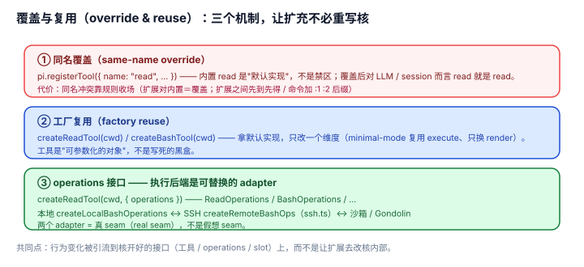

# 3.2 覆盖（override）与复用（reuse）：扩充不能逼作者重写核

## 现象是什么

"靠扩展长能力"有一个隐含的坑：**如果扩展想改动核里某个东西的一小部分，却必须把整个东西重写一遍，那"扩展"就只是"把核的代码搬到扩展里改"**，既危险又重复。pi 用三个机制把这个坑填掉：

1. **同名覆盖（same-name override）**：注册和内置同名的工具，覆盖内置。
2. **工厂复用**：`defineTool` / `createReadTool` / `createBashTool` / … 拿到内置实现，只改一个 slice。
3. **operations 接口**：把工具的"在哪里执行"抽成接口，本地 / SSH / 沙箱各自实现。

（渲染侧还有独立的 **slot 分离**——执行和渲染是两个独立 slot——那是 presentation 维度的接缝，另见 [2.3](../02-Expansion/2.3_presentation.md)，不属于覆盖/复用这个套路，故不计数。）



## 核心矛盾是什么

**"覆盖"要有精确的粒度。** 覆盖太粗（只能整个替换），改一小点就要重写全部；覆盖太细（每个内部函数都可替换），接口就爆炸、且扩展会耦合核内部实现。pi 的答案是：**在"整工具"这个粒度上覆盖，在"执行后端"和"渲染"这两个维度上切开**——够粗到稳定，够细到有用。

## 扩充思路是什么

### 判断一：同名覆盖（same-name override）= "核的工具是默认值，不是禁区"（硬事实）

`tool-override.ts` 注册 `name: "read"` 的工具，直接替换内置 read；`docs/extensions.md` 明确："Extensions can override built-in tools by registering a tool with the same name."

这背后的思路是：**内置工具不是"核的私有实现"，而是"核提供的第一版默认实现"**。扩展想加审计、加拦截、加访问控制，不是"在 read 外面包一层"，而是"用同名注册换掉 read"。对 LLM 和 session 逻辑而言，被换掉后的 read 就是 read。

### 判断二：工厂复用让"改一点点"不必重写（硬事实）

`minimal-mode.ts` 想只改渲染，于是：

```typescript
import { createReadTool } from "@earendil-works/pi-coding-agent";
const tools = getBuiltInTools(ctx.cwd);  // createReadTool(cwd) 等 8 个
return tools.read.execute(id, params, signal, onUpdate);  // 复用内置执行
```

`ssh.ts` 想只改"在哪里执行"，于是：

```typescript
const tool = createReadTool(localCwd, { operations: createRemoteReadOps(...) });
return tool.execute(id, params, signal, onUpdate);
```

**关键：** 内置工具是**工厂产出的、可参数化的对象**，不是写死的函数。`createReadTool(cwd, { operations })` 暴露了"执行后端"这个参数，`registerTool({ ...tool, execute })` 暴露了"整工具可换"这个粒度。核把"8 个工具的默认实现"做成了**可复用的积木**，而不是**不可动的黑盒**（这回到 [1.1](../01-Core/1.1_minimal_core.md) 判断二：工具必须在核里且可复用）。

### 判断三：operations 接口 = "执行后端"是一个被识别出来的变化轴（硬事实 + 解释）

`ssh.ts` 里 `ReadOperations` / `WriteOperations` / `EditOperations` / `BashOperations` 每个接口只有几个方法（`readFile` / `access` / `detectImageMimeType`…），本地实现和 SSH 实现是同一个接口的两个 adapter。

`harness/01-Architecture/1.1` 用"真 seam 检验（real-seam test）"论证过：**一个接口有没有第二个 adapter，决定它是真 seam（real seam）还是假想 seam（imagined seam）**。`operations` 接口有两个真实 adapter——本地（`createLocalBashOperations`）和 SSH（`ssh.ts` 的 `createRemoteBashOps`）——所以它是一个**真 seam**，不是拍脑袋抽象出来的。

这对扩充思路的意义：**核识别出了"工具的执行会变"（本地 / 远程 / 沙箱）这条变化轴，并把它做成接口**。于是"换执行后端"从"改工具代码"变成"给 operations 传一个新 adapter"。`gondolin/`、`sandbox/` 走的是同一条路——它们本质都是"给 8 个工具的 operations 换实现"。

### 判断四：这套覆盖/复用机制，是"核不进工作流、但工作流能改核行为"的桥梁（解释）

plan-mode 要"只读"，靠的是 `setActiveTools`（切工具集）+ `tool_call` 拦截（拦 bash），而不是覆盖 8 个工具。todo 要"记住列表"，靠的是 `details`（见 [2.4](../02-Expansion/2.4_persistence.md)）。ssh 要"远程执行"，靠的是 operations。

**这些例子的共同点是：它们"改核行为"时，改的是核暴露出来的接口，不是核的实现。** 同名覆盖换"工具"，operations 换"执行后端"，slot 换"渲染"——每一处都是"核开好的口子"。这就是"极简核"能保持极简的机制原因：**行为变化被引流到有限的几个接口上，而不是让扩展去改核内部。**

## 影响是什么

1. **"包装内置工具"是最常见的扩展需求之一，而这套机制让它零风险**（硬事实）。`tool-override.ts` 加审计不改渲染，`minimal-mode.ts` 改渲染不改执行——两件最常做的事都不用重写工具。
2. **operations 是"执行后端"这一变化轴的显式建模**。本地、SSH、沙箱、Gondolin 微 VM 是同一接口的不同 adapter，扩展生态里可以长出一个"执行后端"的品类，而核不用为每个后端改一行。
3. **代价是"覆盖"的同名冲突要靠规则收场**（硬事实）。同名覆盖要分两层看：**扩展对内置**——扩展同名注册 `set()` 覆盖内置（`agent-session.ts`，扩展胜）；**扩展对扩展**——`getAllRegisteredTools()` 是"同名先到先得"（`extensions/runner.ts:450`，先注册胜）。命令重名加 `:1`/`:2` 后缀细则见 `agent/4.4`，是"允许覆盖"必须付的账。

## 源码/示例锚点

- `tool-override.ts`：同名注册 `name: "read"` 覆盖内置，且注释说明"不写 render 就继承内置渲染"
- `minimal-mode.ts`：`getBuiltInTools(ctx.cwd).read.execute(...)`（`getBuiltInTools` 是 `createReadTool(cwd)` 等工厂的本地包装）复用执行、只改渲染
- `ssh.ts`：`createReadTool(cwd, { operations: createRemoteReadOps(...) })` 换执行后端
- `gondolin/index.ts` / `sandbox/`：同一 operations 思路的另两个 adapter
- `docs/extensions.md`："Overriding Built-in Tools" 一节：同名覆盖 + "Built-in renderer inheritance is resolved per slot"
- 真 seam 检验：`../../harness/01-Architecture/1.1_three_tier_seams.md`

## 最小例证是什么

**例证 1（同名覆盖是默认值不是禁区）：** `tool-override.ts` 里 `pi.registerTool({ name: "read", ... })`——没有"解除内置注册"这一步，也没有"声明我要覆盖"的 flag，同名就是覆盖（扩展对内置，后注册者覆盖内置）。而扩展之间同名的工具，`getAllRegisteredTools()` 按"先到先得"去重（`runner.ts:450`），先注册的扩展胜。

**例证 2（复用 = 只改一个维度）：** `minimal-mode.ts` 改渲染时，`execute` 是 `getBuiltInTools(ctx.cwd).read.execute(...)`（`getBuiltInTools` 是 `createReadTool(cwd)` 等的本地包装）一行；`ssh.ts` 改执行时，是 `createReadTool(cwd, { operations })`。**两者各只改一个维度，另一个维度靠工厂复用拿默认值**——没有一行是"重写 read 的读文件逻辑"。

**例证 3（真 seam 有两个 adapter）：** `BashOperations` 接口在 `ssh.ts` 里有 `createRemoteBashOps`，在 `docs/extensions.md` 里有 `createLocalBashOperations`。同一个接口、两个真实实现 = 真 seam。证明 operations 不是为 SSH 这个例子单开的后门，而是被识别的变化轴。

可观察信号：例证 1 证明覆盖的粒度是"整工具"；例证 2 证明复用让"改一个维度"不必重写其余；例证 3 证明 operations 是真 seam。三者同成立，才说"覆盖与复用"是扩充的第二套路。
