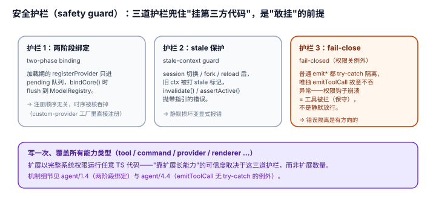

# 3.3 安全护栏（safety guard）："敢挂第三方代码"的前提

## 现象是什么

pi 的扩展是**以你完整系统权限运行的任意 TypeScript 代码**（`docs/extensions.md` 直接警告："Extensions run with your full system permissions and can execute arbitrary code."）。要让用户敢挂第三方扩展、且一个坏扩展不拖垮宿主，靠三道路径上的护栏：

1. **两阶段绑定（two-phase binding）**：扩展加载早于系统就绪，`registerProvider` 这类依赖 ModelRegistry 的调用先排队、后生效。
2. **stale 保护（stale-context guard）**：session 切换/fork/reload 后，旧 context 的调用直接抛错，防止写错 session。
3. **fail-close（fail-closed）**：`tool_call` 这类权限关（permission gate）的 handler 异常**不吞**，而是阻断工具执行。
4. **失败 factory 状态丢弃（v0.84.3，#8424）**：加载期注册（flag/pending provider/事件订阅）都是暂态，factory 失败时 `discard()` 清空暂态并让之后的所有 API 访问抛错——一个"加载失败"的扩展不会留下半初始化状态继续被调用。
5. **`user_bash` fail-closed（v0.86.0，#9068）**：命令执行前的 `user_bash` 事件同样是权限关——handler 抛错或返回非法值都会**中止命令**（不再回退到本地 shell 执行），只有返回 `undefined` 才放行（`runner.ts:1056-1085`）。

机制细节在 `agent/01-Anatomy/1.4` 和 `agent/04-Harness/4.4` 已写全，本节只回答：**这三道护栏对"扩充思路"意味着什么。**

## 核心矛盾是什么

**"扩展要在系统最早期加载"和"系统那时还没就绪"是死结；"一个坏扩展不该拖垮宿主"和"权限关必须 fail-close"是另一对死结。** 极简核敢把这么多能力交给第三方，前提是这三道护栏把死结解开了——否则"靠扩展长能力"就是"靠扩展长事故"。

## 扩充思路是什么

### 判断一：两阶段绑定（two-phase binding）= "扩展可以在任何早期时刻注册，而不用知道系统好了没"（硬事实 + 解释）

扩展的工厂函数在系统早期就执行了，那时 `ModelRegistry` 还不存在。如果作者在工厂里调 `pi.registerProvider("anthropic", {...})` 立即生效，就会撞上"registry 还没建好"。

pi 的解法（`agent/1.4` 详述）：加载阶段 `registerProvider` 进 pending 队列，`bindCore()` 时统一 flush。**对扩展作者而言，这意味着"注册"这个动作是**顺序无关**的——在工厂里注册、在命令 handler 里注册，语义都正确，只是前者排队、后者立即。** 作者不需要学"provider 要晚点注册、工具要早点注册"这种时序知识。

**这对扩充的意义：** 极简核把"系统就绪的时序"从作者手里拿走了。作者只管"我要注册 X"，不管"现在注册 X 合不合时宜"。扩充的**时序复杂性被核吞掉**。

### 判断二：stale 保护（stale-context guard）= "挂第三方代码"时，核替作者挡下最阴的 bug（硬事实 + 解释）

session 切换/fork/reload 后，如果扩展手里还攥着旧 `ctx`，用它写 session 会写错地方。pi 让旧 context 变 stale，之后任何调用都抛带指引的错误（`invalidate()` / `assertActive()`）。

**对扩充的意义：** 这是"让扩展能碰 session"（能力）和"不让扩展写坏 session"（安全）之间的护栏。没有它，`send-user-message.ts` 这种"命令里发消息"的扩展，在 session 切换的边界会静默地往错误 session 写数据——作者根本意识不到。护栏把"静默损坏"变成"显式报错"。

### 判断三：fail-close = 错误隔离是有方向的（硬事实）

`agent/4.4` 的关键事实：普通事件的 handler 异常被 catch、只记 error、不影响别的扩展；但 `emitToolCall()` **没有 try-catch**，handler 异常直接向上抛、阻断工具执行。

**为什么 `tool_call` 特殊？** 因为它是权限关——"拦危险命令"的扩展崩了，最安全的默认是**不放行**，而不是"假装没崩继续执行命令"。`permission-gate.ts`、`plan-mode/` 的 bash 拦截都挂在这条缝上。fail-close 意味着：**一个权限扩展崩了，结果是"命令被拦"（保守安全），而不是"命令被放"（危险）。**

> **警示（v0.85.x–0.86.x，#9068）**：`user_bash` 现在与 `tool_call` 同属 fail-close 家族，且语义更严：`emitUserBash()`（`runner.ts:1056-1085`）里 handler 抛错 → `emitError` 后 **re-throw 中止命令**；返回非法值（不是恰好 `{ operations }` 或 `{ result }` 之一，见 `extensions/types.ts:1140` 的 `UserBashEventResult`）同样 throw 中止；**不调用后续 handler、不回退本地执行**。旧版 fail-open（hook 崩了就回退本地 shell）已被修复——写拦截示例时，"放行"信号只有 `undefined`，`return {}` / `return null` / 吞掉异常都是 abort。

**对扩充的意义：** 错误隔离不是"一刀切都隔离"，而是**按"这处出错该不该保守"分方向**。普通事件（改 system prompt、改渲染）崩了就崩了，隔离掉；权限关（拦工具）崩了必须 fail-close。这种"方向性"是"敢把权限交给扩展"的核心。

### 判断四：三道护栏合起来，是"极简核"能被信任的隐形资产（解释）

回想 `harness/01-Architecture/1.2` 的判断：统一注入点的 locality 收益，在于两阶段绑定、stale 保护、fail-close **写一次、覆盖所有能力类型**。这里补它的另一面：

**这三道护栏不是"某个扩展类型的特性"，是"所有扩展共享的信任底座"。** 一个 `todo` 工具、一个 `permission-gate` 护栏、一个 `custom-provider`，都靠同一套"排队注册 / stale 保护 / 按方向隔离"运行。正因为底座只有一套、且被写对了，极简核才敢对第三方说"随便挂"。

## 影响是什么

1. **"靠扩展长能力"的可信度，取决于这三道护栏而非扩展数量**。护栏在，70+ 扩展是资产；护栏不在，70+ 扩展是 70+ 个潜在事故源。
2. **时序和生命周期被核吞掉，作者聚焦"行为"**。作者不用管"什么时候系统就绪""session 切了怎么办""崩了该放行还是拦截"——这些是核的职责，作者只写"我要注册什么、要拦什么"。
3. **代价是护栏本身成为核的一部分、且必须持续维护**（硬事实）。`loader.ts` / `runner.ts` 加起来超过 2000 行（806 + 1286 = 2092），大半是护栏。极简核"极简"的是**功能面**，不是**代码量**——它把省下来的功能复杂度，换成了"托管第三方代码"的复杂度。

## 源码/示例锚点

- `agent/01-Anatomy/1.4_Extension_System.md`：两阶段绑定（矛盾一）、stale 保护（矛盾三）的机制
- `agent/04-Harness/4.4_Extension_Runner.md`：`bindCore`（L314）、`invalidate`/`assertActive`（L543/L552）、`emitToolCall` 无 try-catch 的 fail-close 例外
- `permission-gate.ts`：挂在 `tool_call`（fail-close 缝）上的护栏示例
- `runner.ts:1056-1085` + `extensions/types.ts:1140`：`emitUserBash()` fail-closed 与 `UserBashEventResult` 的严格形状（v0.86.0）
- `custom-provider-anthropic/index.ts`：工厂里 `registerProvider`（走 pending 队列的典型）
- `docs/extensions.md`：开篇安全警告 "Extensions run with your full system permissions"

## 最小例证是什么

**例证 1（顺序无关）：** `custom-provider-anthropic/index.ts` 在工厂函数里直接 `pi.registerProvider("custom-anthropic", {...})`——作者没写任何"等 registry 就绪"的逻辑，注册照样生效。两阶段绑定把时序吞掉了。

**例证 2（fail-close 的方向）：** 在 `permission-gate.ts` 的 `tool_call` handler 里故意 `throw`，然后让模型跑一条 `rm -rf`——工具调用以错误结束（被拦），而不是被放行。把同一个 `throw` 移到 `before_agent_start` handler（普通事件），agent 照常跑，只有该扩展收到一条 error。**同一个异常，两种命运 = 错误隔离的方向性。**

**例证 3（stale 显式化）：** 想象一个扩展在 `session_before_switch` 里存了 `ctx`，切换后还用旧的 `pi.sendUserMessage(...)`——它会抛"stale context"错误，而不是把消息悄悄写进旧 session。护栏把"静默损坏"变成"显式报错"。

可观察信号：例证 1 证明时序复杂性被核吞掉；例证 2 证明错误隔离有方向；例证 3 证明 stale 被显式化。三者同成立，才说"安全护栏"是扩充的第三套路、也是"敢挂第三方"的前提。
