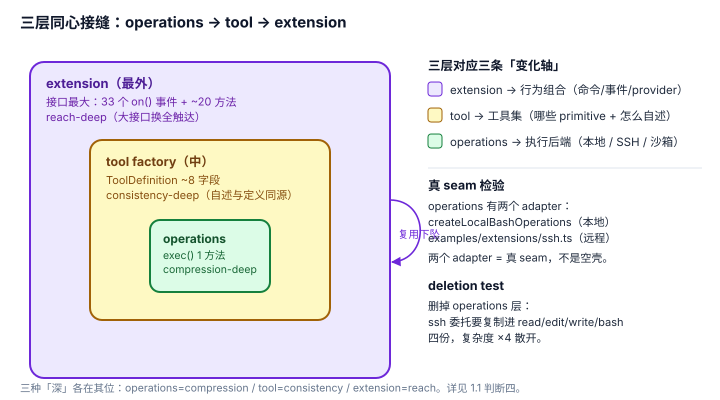

# 1.1 三层接缝：pi 的扩展面不是"一堆 hook"，是三条各自裁准的变化轴

## 现象是什么

pi 给第三方"加能力"的入口不是平的，而是三层同心接缝。从外到内：

1. **extension**（`ExtensionAPI`）：`export default (pi) => { pi.on(...); pi.registerTool(...); }` —— 34 个 `on()` 事件重载 + 约 20 个方法（`extensions/types.ts:1232` 起；v0.84.3 新增 `session_compact_failed`、PowerShell 工具事件变体）。
2. **tool factory**（`createReadTool` / `createBashTool` 等）：接收 `options`（其中含 `operations` 和 `promptSnippet` 来源），返回 `AgentTool`（`tools/read.ts:209`、`tools/bash.ts:529`）。
3. **operations**（`ReadOperations` / `BashOperations` / `EditOperations` 等）：每个工具的一个小接口，比如 `BashOperations.exec(command, cwd, {onData, signal, timeout, env})`（`tools/bash.ts:71`）。

三层是**复用下坠**：extension 的 `user_bash` 事件能返回一个自定义 `BashOperations`（`extensions/types.ts:1119`），把最外层能力一路落到最内层。

## 核心矛盾是什么

1. **要在三条不同的"变化轴"上开放，但每条轴的调用方学习预算不同。** 换执行后端（本地/远程）、换工具集（内置/自定义）、换行为组合（事件/命令/provider）是三类完全不同的改动，却常被混进一个插件系统。
2. **接口越小越深，但越小越不通用。** operations 接口极小（一个 `exec`），但只能改"执行"这一件事；extension 接口极大（50+ 成员），但能触达整个运行时。把谁做小、把谁做大，是设计决策不是风格偏好。

## 设计判断是什么

### 判断一：三层分别对应三条变化轴，seam 恰好放在"会变的地方"（硬事实 + 解释）

| 层 | 变化轴（什么会变） | 接口形状 | 藏的复杂度 |
|---|---|---|---|
| operations | **执行后端**（本地 shell / SSH / 沙箱） | 极小（1 个方法） | 进程 spawn、流式输出、超时、env、shell 配置、截断 |
| tool | **工具集**（哪些 primitive、怎么对 LLM 自述） | 中（`ToolDefinition` ~8 字段 + `execute`） | schema、promptSnippet、参数校验、执行模式 |
| extension | **行为组合**（命令/事件/provider/UI/消息） | 极大（34 事件 + ~20 方法） | 生命周期、事件扇出、两阶段绑定、失效保护 |

**这是 seam 放置原则的正确示范**：把 seam 放在"实现会因 adapter 不同而变化"的边界上，而不是随手按类名切。`BashOperations` 只切出"命令在哪执行"这一件事，所以它小；`ExtensionAPI` 要覆盖"任何运行时行为"这一整类，所以它大。大小不同不是 bug，是调用方不同。

### 判断二：operations 是经典深模块，而且有第二个 adapter——真 seam（硬事实）

- 接口极小：`exec(command, cwd, {onData, signal, timeout, env}) => {exitCode}`（`bash.ts:71`）。调用方只学一个方法。
- 实现极深：`createLocalBashOperations`（`bash.ts:158`）背后是 shell 选择（`getShellConfig`）、stdin/args 两种命令传输、`detached` 进程组、流式 `onData`、超时解析（`resolveTimeoutMs`）、cwd 存在性校验。
- **两个 adapter**：`createLocalBashOperations`（本地）+ `examples/extensions/ssh.ts`（远程）。"一个 adapter 是假想 seam，两个是真 seam"——这条是真 seam，不是为未来预留的空壳。

**depth 判定**：这是教科书级的深模块——海量进程管理复杂度藏在一个 `exec` 后面，调用方和测试都只穿过这一个方法。

### 判断三：tool factory 的深度不在"藏实现"，而在"把自述和定义同源"（硬事实，延伸见 4.2）

`createReadToolDefinition(cwd, options)` 返回的 `ToolDefinition` 同时带着 `promptSnippet` 和 `promptGuidelines`（`read.ts:219-220`），再由 `wrapToolDefinition`（`tool-definition-wrapper.ts:5`）包成 `AgentTool`。

**这里的深度是另一种**：不是"小接口藏大实现"，而是"把两个本会漂移的事实（工具能干什么 + 它对 LLM 怎么描述自己）锁在同一个对象里"。一个 `registerTool` 调用同时完成"注册能力"和"注册自述"，LLM 侧的 "Available tools" 段落永远不可能和真实工具集脱节。这条的完整论证在 [4.2](../04-Self-Description/4.2_tool_prompt_contract.md)。

### 判断四：extension 接口是刻意做大的，它的"深"是 reach 不是 compression（解释，这是最容易被误读的一点）

`ExtensionAPI` 有 34 个 `on()` 重载 + ~20 个方法，**不是深模块**——用 Ousterhout 的标准它是"大接口"。但这里大是**对的**：

- 它的调用方是"写扩展的人"，每人**学一次**就获得整个运行时的触达面。学习成本是固定的、一次性的；省掉接口成员不会省成本，只会逼扩展作者绕路（例如自己 fork 进程、自己解析 session 文件）。
- 真正该"小"的是**每次调用都要记的**接口（operations 的 `exec`）；而 extension 的成员是**按需查的字典**（要加命令查 `registerCommand`，要拦工具查 `tool_call`），大字典不构成认知负担。

**推论**：评价"结构优秀"不能只看"接口小不小"。pi 的三层各自按"调用频率 × 学习预算"裁接口大小——operations 极小而 extension 极大，都在正确的位置。这才是"深邃"，而不是"它分层了所以好"。

### 判断五：deletion test 证明 operations 层赚回了存在（解释）

想象删掉 `BashOperations` 这个接缝、让工具各自硬编码本地执行。那么 `ssh.ts` 要委托远端，就得**在 read/edit/write/bash 四个工具里各重写一遍"怎么在远端跑命令"**——进程管理的复杂度从一处（`createLocalBashOperations`）散到 N 个调用方。反过来，保留这层，一次 `BashOperations` 替换让 ssh.ts 以几十行委托全部工具。**复杂度在删除后重新出现在 N 处 = 它赚回了存在**，这就是 locality（改一次，处处生效）和 leverage（一个实现还清 N 个调用方）的具体化。

## 影响是什么

1. **"容易扩充"是真的，但理由不是"hook 多"。** 是三条变化轴各自有一条裁准了接口大小的 seam，第三方的改动落点明确：改后端换 operations，加能力写 tool/extension，不用猜。
2. **三层不是冗余，是复用下坠。** 外层（extension）能落到内层（operations），意味着高级能力和底层执行解耦，ssh 扩展和权限 gate 扩展互不感知。
3. **评价要分清三种"深"。** operations 是 compression-deep（小接口藏大实现），tool 是 consistency-deep（自述与定义同源），extension 是 reach-deep（大接口换全触达）。混为一谈就看不到门道。

## 源码锚点是什么

- `packages/coding-agent/src/core/tools/bash.ts`：`BashOperations`（L62）、`createLocalBashOperations`（L88）、`createBashToolDefinition`（L322，`options.operations` + `promptSnippet`）
- `packages/coding-agent/src/core/tools/read.ts`：`ReadOperations`（L49）、`defaultReadOperations`（L58）、`createReadToolDefinition`（L209，`promptSnippet` L219）
- `packages/coding-agent/src/core/tools/edit.ts`：`EditOperations`（L85）、`defaultEditOperations`（L94）
- `packages/coding-agent/src/core/tools/tool-definition-wrapper.ts`：`wrapToolDefinition`（L5）——tool 层到外层运行时的桥
- `packages/coding-agent/src/core/extensions/types.ts`：`ExtensionAPI`（L1232，34 个 `on` 重载 + 方法族）、`UserBashEventResult.operations`（L1119，外层落到内层的证明）
- `packages/coding-agent/examples/extensions/ssh.ts`：operations 层的第二个 adapter（真 seam 证据）

## 最小例证是什么

**例证 1（真 seam 检验）：** 数 `BashOperations` 的实现。`tools/bash.ts` 里有 `createLocalBashOperations`（本地），`examples/extensions/ssh.ts` 提供第二个（远程）。两个 adapter → 真 seam；反例是只有 `defaultReadOperations` 一个实现、无人替换的接口——那才是假想 seam。

**例证 2（deletion test）：** 看 `ssh.ts` 的体量——它不重写 read/edit/write/bash，只换 `operations`。删掉 operations 层后，ssh.ts 的"远端执行"逻辑必须复制进四个工具，复杂度 ×4 地散开。这个"删掉会散开"就是 locality 的反面证据。

**例证 3（三层的接口大小梯度）：** 直接看三个接口的成员数——`BashOperations` 1 个方法，`ToolDefinition` ~8 字段，`ExtensionAPI` 34 事件 + ~20 方法。梯度是"调用频率递减、一次性学习递增"的映射，不是随意。

可观察信号：例证 1 成立 → seam 是真的不是摆饰；例证 2 成立 → locality/leverage 真实存在；例证 3 成立 → "深"有三种、且各在其位。三个同时成立，才能下"结构优秀"的结论，而不是空喊"分层就是好"。
