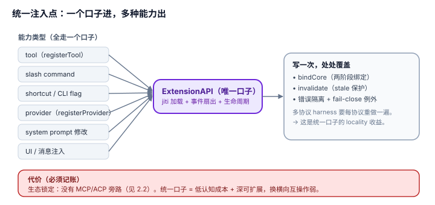

# 1.2 统一注入点：一个口子进，多种能力出——这是取舍，不是免费午餐

## 现象是什么

pi 的第三方能力注入只有**一个口子**：`ExtensionAPI`。tool、slash command、键盘快捷键、CLI flag、provider、system prompt 修改、自定义 UI、消息注入、扩展间通信，全部挂在同一个 `pi` 对象上（`extensions/types.ts:1198`），走同一套 jiti 加载 + 事件扇出 + 生命周期。

对照另一类 harness 的设计：每种能力类型各有一条协议通道（skill 文件、MCP server、ACP、slash command 定义、theme 文件……各自独立发现、独立加载、独立隔离）。`agent/01-Anatomy/1.4_Extension_System.md` 已点出这个对照（"不像 OpenCode 有 Skill/MCP/ACP 等多条协议通道"）。

## 核心矛盾是什么

1. **一个口子 = 一次认知成本 + 一套生命周期；但也 = 生态锁定 + 这个口子必须足够深。** 口子浅了，某类能力就进不来；口子深了，接口就大（见 [1.1](./1.1_three_tier_seams.md) 判断四）。
2. **多协议 = 各取最优、能互操作；但也 = N 套认知模型 + N 套加载/隔离/生命周期，宿主要把"托管第三方代码"这件最难的事做 N 遍。**

## 设计判断是什么

### 判断一：pi 真正的取舍不是"统一 vs 分散"，而是把"托管第三方代码"这件最难的事只做一遍（解释）

一个口子的实质，是**把 load → bind → 事件扇出 → 错误隔离 → 失效保护这条流水线写成一次，然后让所有能力类型都从它上面过**。tool 和 command 和 provider 的区别，只是"注册进去的对象形状不同"，不是"各自有一套加载器"。

**locality 收益在 harness 层**：两阶段绑定（`bindCore`）、stale context 保护（`invalidate`）、fail-close 隔离（`tool_call` 例外）这些跨能力类型都要有的护栏，写一次就覆盖 tool/command/provider/shortcut 全部。反例是多协议 harness——每加一条协议，就要为它重新解决一遍"第三方代码在系统就绪前加载怎么办""session 切换后悬空怎么办""一个坏插件怎么不拖垮宿主"。

### 判断二：design-it-twice——如果 pi 改成多协议会烂在哪（解释）

假设 pi 把 tool 走 extension、skill 走 `SKILL.md`、provider 走 MCP、slash command 走独立文件。会发生：

1. **认知成本 ×N**：第三方要学"加工具写 extension、加知识写 skill、加模型走 MCP"，三套心智、三套调试方式。
2. **护栏 ×N**：`bindCore` 式的两阶段绑定、`invalidate` 式的失效保护，要在 skill 加载器、MCP 客户端、command 解析器里各实现一遍——要么漏，要么重复。
3. **跨能力组合断掉**：pi 现在能做到"一个 extension 同时注册一个 tool + 一个 command + 拦 `tool_call` 做权限 + 改 system prompt"（见 `docs/extensions.md` 的 permission-gate 例子）。多协议下，这种"一个插件横跨工具/命令/护栏"的组合要跨三个系统拼，作者得自己维护三者的一致性。

### 判断三：但统一口子的代价是真实的，必须记账（硬事实 + 解释）

- **生态锁定**：pi 没有 MCP/ACP（见 [2.2](../02-Boundaries/2.2_no_interop_protocol.md)）。一个 MCP 工具要进 pi，得有人为它写一个 pi extension 的适配层，而不是即插即用。
- **口子必须深**：`ExtensionAPI` 之所以 50+ 成员，正是因为"所有能力类型都从这一个口子过"——它必须覆盖每种能力类型的注册和每种事件的拦截。统一口子的"省"在认知和护栏，"贵"在单点接口的体积和锁定性。

### 判断四：这是可辩护的设计选择，不是"pi 没做 MCP 所以落后"（评价）

统一注入点和多协议是**两条路，各自在某个维度上最优**：

| | 统一注入点（pi） | 多协议（对照） |
|---|---|---|
| 第三方认知成本 | 低（学一次） | 高（学 N 套） |
| 宿主护栏实现 | 写一次，处处覆盖 | 每协议重做 |
| 跨能力组合 | 天然（一个 extension 全拿） | 难（跨系统拼接） |
| 生态互操作 | 锁在自家 API | 好（MCP/ACP 通用） |

**结论**：pi 押的是"深可扩展 + 低认知成本"，代价是"横向互操作弱"。对"自己生态内快速长能力"这是对的；对"无缝接外部工具生态"它是短板。两个目标不可兼得，pi 明确选了前者——这是设计判断，不是遗漏。

## 影响是什么

1. **"统一注入点"是 pi 扩展系统能被第三方快速上手的原因**，但它同时是生态边界（见 [2.2](../02-Boundaries/2.2_no_interop_protocol.md)）。评价时两者要一起看。
2. **护栏的 locality 是隐性资产。** 两阶段绑定、失效保护、fail-close 只写一次，却覆盖所有能力类型——这是多协议 harness 要付出 N 倍成本才有的东西。
3. **这个取舍决定了 pi 的定位**：它是"自洽的 agent 平台 + 自己的扩展生态"，不是"MCP 的另一个宿主"。用它的人要么接受这个生态边界，要么自己写适配层。

## 源码锚点是什么

- `packages/coding-agent/src/core/extensions/types.ts`：`ExtensionAPI`（L1198）——唯一注入口的完整形态；`UserBashEventResult.operations`（L1083）——外层落到内层的证据
- `packages/coding-agent/src/core/extensions/runner.ts`：`bindCore`（L314）、`invalidate`（L543）——写一次、覆盖全部能力类型的护栏
- `packages/coding-agent/src/core/extensions/loader.ts`：jiti 加载 + 工厂调用——唯一加载路径
- `packages/coding-agent/docs/extensions.md`：一个 extension 横跨 tool/command/护栏的组合示例（permission-gate 等）
- 对照来源回指：`../../agent/01-Anatomy/1.4_Extension_System.md`（"统一能力注入点"的原始判断）

## 最小例证是什么

**例证 1（一个口子覆盖多能力）：** 看 `docs/extensions.md` 的 `permission-gate.ts`——同一个 extension 里既 `pi.on("tool_call", ...)` 做权限拦截，又 `pi.registerCommand(...)` 加命令。多协议下这要跨 skill 系统 + MCP 系统 + command 系统拼接；pi 里是一个文件内三行。

**例证 2（护栏只写一次）：** 在 `runner.ts` 里找 `bindCore` 和 `invalidate`——它们是**一次实现**，不是 per-tool / per-command / per-provider 各一份。数一下如果拆成多协议，这两处要复制多少份。

**例证 3（锁定的实锤）：** grep `packages/coding-agent/src` 和 `packages/agent/src` 找 `mcp` / `acp`——只有 vendored `highlight.min.js` 和图片工具误匹配，没有实现。证明统一口子确实没留 MCP/ACP 的旁路（锁定是真实的，见 [2.2](../02-Boundaries/2.2_no_interop_protocol.md)）。

可观察信号：例证 1 成立 → 统一口子的"跨能力组合"优势真实；例证 2 成立 → 护栏 locality 真实；例证 3 成立 → 锁定代价真实。三者同看，才能说清这是"取舍"而不是"单方面更好"。
