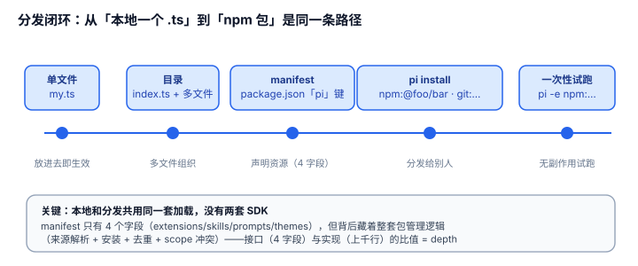

# 1.3 分发闭环：从"本地一个 .ts"到"npm 包"是同一条路径，不是两套心智

## 现象是什么

pi 的扩展从诞生到被陌生人安装，路径是**连续的**：

```
本地单文件 ~/.pi/agent/extensions/my.ts        ← 放进去即生效
   └─ 目录 + index.ts                          ← 多文件
        └─ package.json 里写 "pi" manifest      ← 声明资源
             └─ pi install npm:@foo/bar@1.0.0   ← 分发给别人
                  └─ pi -e npm:@foo/bar         ← 一次性试跑（npx 式）
```

每一步都是上一步的自然延伸，没有"本地插件"和"已发布插件"两套 SDK 的分裂。`docs/packages.md` 完整写了这条链。



## 核心矛盾是什么

1. **本地插件要"零配置即用"，分发插件要"可声明、可安装、可版本化"。** 两者通常用不同机制（本地目录 vs 包管理器），导致作者"本地调试用 A、发布用 B"。
2. **分发要解决的是四个独立问题：打包（包里有什么）、发现（装到哪、怎么找）、安装（怎么落到磁盘、怎么热重载）、版本（怎么 pin）。** 这四件事若各自一套，认知成本就上去了。

## 设计判断是什么

### 判断一：`pi` manifest 是"一个目录"和"一个可分发的资源包"之间的 seam，接口极小（硬事实）

`package.json` 的 `pi` 字段只有四个 string 数组（`extensions`/`skills`/`prompts`/`themes`），由 `readPiManifest`（`core/pi-manifest.ts:17`）解析。没有 manifest 时回退到 `index.ts`/`index.js`。

**深度**：这 4 个字段背后藏着"npm 包 / git 仓库 / 本地目录 / 原始 URL 四种来源的解析 + 安装 + 去重 + scope 冲突裁决"这一整套包管理逻辑（`core/package-manager.ts`）。**接口（4 字段）和实现（包管理）的比值就是 depth**——第三方作者只写 4 个路径，剩下全由 harness 接管。这是 1.1 里"compression-deep"的又一个实例。

### 判断二：本地和分发共用同一套加载，没有第二套心智（硬事实）

`loader.ts` 的 `resolveExtensionEntries` 读 manifest 拿到入口，再交给 jiti 加载；本地目录和 `pi install` 装进来的包**最终都变成"一个解析后的绝对路径"，走同一条加载链**。`pi install` 做的事只是"把 npm/git 包落到 settings 里声明的目录"，之后 `discoverAndLoadExtensions` 对本地和已安装包一视同仁。

**这是"连续梯度"的机制基础**：不是"本地走目录扫描、分发走另一套 loader"，而是"分发只是提前把文件放到目录扫描会发现的位置"。作者的心智从头到尾只有"一个能被发现的路径"。

### 判断三：`-e` 一次性试跑是采纳摩擦的关键减法（硬事实 + 解释）

`pi -e npm:@foo/bar` 装到临时目录、仅当前 run 有效。这等价于 `npx` 之于 npm——**把"试一个陌生扩展"的成本从"install + 卸载 + 清理 settings"降到"跑一次"**。

对"开源吸纳新东西"这很关键：第三方扩展被采纳的阻力主要不在写，而在"陌生人不愿意 install 一个会留痕、要清理的东西"。`-e` 把第一次接触变成无副作用。

### 判断四：安装是"包管理"不是"文件拷贝"，project/global scope 是设计亮点（硬事实）

`pi install`/`remove`/`list`/`update` 是完整命令集；`-l` 写项目 settings（`.pi/settings.json`，可随团队共享），默认写用户 settings（`~/.pi/agent/settings.json`）；项目启动且 trust 后自动装缺失的包。

**这个设计的深意**：把"哪些扩展/包"变成**项目可版本化、可共享的配置**，而不是每个开发者机器上的隐式状态。一个 repo 通过 `.pi/settings.json` 声明它需要的 pi 包，队友 clone 后 trust 即自动装齐——这接近"依赖清单"的地位。

## 影响是什么

1. **结构优秀（1.1）+ 统一注入点（1.2）只有配上分发闭环，才构成"能规模化吸纳"的完整回路。** 没有 1.3，前两者停在"能写扩展但发不出去"的演示级。
2. **连续梯度意味着生态冷启动成本低。** 作者从"给自己写个 .ts"起步，不需要为了发布而重写、换 SDK、学包格式。
3. **manifest 的 4 字段是"扩展能力 → 分发"的单一闸口。** 未来若要加版本契约（见 [2.4](../02-Boundaries/2.4_no_version_contract.md)）、依赖声明、资源过滤，落点就是这里——seam 已经放好了。

## 源码锚点是什么

- `packages/coding-agent/src/core/pi-manifest.ts`：`PiManifest`（L4）、`readPiManifest`（L17）——4 字段的资源声明
- `packages/coding-agent/src/core/package-manager.ts`：`pi install`/`remove`/`list`/`update` 的包管理入口（`install` 方法 + `SourceScope` 模型）
- `packages/coding-agent/src/core/extensions/loader.ts`：`resolveExtensionEntries`（L679）——manifest → 入口路径
- `packages/coding-agent/docs/packages.md`：分发链的完整文档（install 命令、四种来源、scope 与去重）

## 最小例证是什么

**例证 1（连续梯度）：** 建一个含 `index.ts` 的扩展目录，先放 `~/.pi/agent/extensions/` 看 `/reload` 生效；再给它的 `package.json` 加 `"pi": { "extensions": ["./index.ts"] }`，`pi install /path/to/that/dir`——两次走的是同一套加载，观察到的行为一致。证明没有两套 SDK。

**例证 2（manifest 接口 vs 实现）：** 看 `pi-manifest.ts`——接口 4 个字段、约 30 行；再看 `package-manager.ts`——实现上千行。这个比值就是 depth：作者付 4 个路径，harness 接管来源解析/安装/去重/scope。

**例证 3（-e 无副作用）：** `pi -e npm:@foo/bar` 跑一次，然后检查 `~/.pi/agent/settings.json`——没有新增 packages 条目（装进了临时目录）。证明"试跑"不污染全局配置，采纳摩擦被抹掉。

可观察信号：例证 1 成立 → "连续梯度"真实（不是两套心智）；例证 2 成立 → manifest 是 deep seam；例证 3 成立 → 采纳摩擦被刻意降低。三者同看，才能下"分发是闭环、能规模化"的结论。
