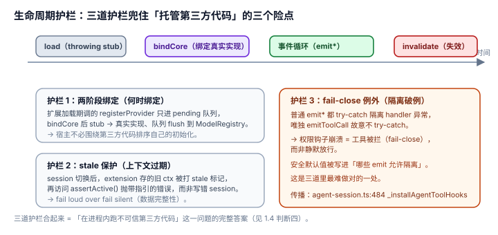

# 1.4 生命周期护栏：两阶段绑定、stale 保护、fail-close——为什么"能放心挂第三方代码"

## 现象是什么

扩展是**跑在宿主进程里、拥有完整权限**的第三方 TS 代码（`docs/extensions.md` 明说）。它有三个生命周期险点，pi 各用一道护栏兜住：

1. 扩展在系统初始化早期加载，但它要调的 `ModelRegistry` / `SessionManager` 那时还不存在 → **两阶段绑定**。
2. 扩展在 `session_before_switch` 里存下的 context，session 切换后指向旧 session → **stale 保护**。
3. 一个扩展的 handler 崩溃，不该拖垮别的扩展；但权限钩子崩溃，绝不能静默放行 → **fail-close 例外**。

这三道护栏的机制在 `agent/04-Harness/4.4_Extension_Runner.md` 已详述，本节只评"为什么它们让托管第三方代码成立"。

## 核心矛盾是什么

任何"在进程里跑第三方代码"的系统都要回答三个问题：

1. **何时绑定**：第三方代码注册的是"意图"（我要拦 tool_call、我要加 provider），但真正执行时依赖的对象可能还不存在。谁等谁？
2. **上下文过期怎么办**：第三方代码手里握着宿主对象（session、model、UI）。宿主换 session 后，这些对象变成了指向旧状态的悬空引用。是静默写错，还是报错？
3. **隔离允许在哪破例**：绝大多数情况要隔离（坏插件不连坐），但安全关键路径上，隔离反而危险（权限检查崩了若被吞掉 = 放行）。

## 设计判断是什么

### 判断一：两阶段绑定 = 让宿主"不必围绕第三方代码排序自己的初始化"（硬事实 + 解释）

`bindCore`（`runner.ts:314`）之前，`ExtensionAPI` 的所有 action 是 throwing stub；扩展加载期调用 `registerProvider` 只进 pending 队列。`bindCore` 后 stub 换成真实实现、队列 flush 到 `ModelRegistry`。

**深意**：这是"声明意图 / 后绑定"模式在插件系统里的正确应用。宿主不用因为"扩展可能想注册 provider"而把 `ModelRegistry` 提前建好；扩展也不用因为"系统没就绪"而延迟注册。**两边都不等对方，靠一个 bind 时点解耦。** 反例是"加载即调用真实对象"的朴素设计——那会逼宿主把初始化顺序倒过来迁就第三方，或者逼扩展作者写"等 system ready"的轮询。

### 判断二：stale 保护 = 宁可 fail loudly，不可写错 session（硬事实 + 解释）

`invalidate`（`runner.ts:543`）在 session 替换时给 context 打 stale 标记；`assertActive`（`runner.ts:552`）在每个 getter 前检查，失效后访问抛带指引的错误。

**深意**：这是**数据完整性**决策，不是防御性编程洁癖。扩展在 `session_before_switch` 存了 `ctx.sessionManager` 引用，切换后如果还能用，就会把新消息写进旧 session 文件——静默数据损坏。pi 选择"让悬空引用立刻炸"，把 bug 从"写错数据"变成"当场报错"。**这个取舍（fail loud over fail silent）对写错 session 这种不可逆错误是唯一正确的选择。**

### 判断三：fail-close 例外 = 把安全决策嵌进错误处理架构（硬事实，这是最微妙的一处）

普通 `emit*()` 都 try-catch 隔离 handler 异常；唯独 `emitToolCall`（`runner.ts:932`）**故意不加 try-catch**，异常一路传到 `agent-session.ts:479` 的 `_installAgentToolHooks`，该 tool call 以错误收场。

**深意**：错误隔离有一个不该破例的破例。`tool_call` 是权限闸（permission-gate 就在这里拦 `rm -rf`），它的语义是"handler 说放行才放行"。如果这个 handler 崩溃被 try-catch 吞掉、然后放行工具，等于**权限系统故障时默认放行**。pi 反其道：**权限钩子故障 = 工具被拦**（fail-close）。这是把"权限系统的安全默认值"直接写进了"哪些 emit 允许隔离"这个结构决策里。

### 判断四：三道护栏合起来，回答的是"托管第三方代码"的同一张问卷（评价）

| 问题 | 朴素插件系统 | pi |
|---|---|---|
| 何时绑定 | 加载即调用（逼宿主迁就初始化顺序） | 两阶段：stub → bindCore |
| 上下文过期 | 悬空引用静默写错 | invalidate + assertActive 当场炸 |
| 隔离破例 | 要么全隔离要么全不隔离 | 普通隔离，权限钩子 fail-close |

**结论**：这三道不是零散补丁，是"在进程内跑不可信第三方代码"这一问题的完整答案。它们存在的意义在 [2.1](../02-Boundaries/2.1_no_sandbox.md) 会更清楚——正因为无沙箱，这些**进程内的**护栏就成了唯一防线。

## 影响是什么

1. **"能放心挂第三方代码"不是靠沙箱，而是靠这三道进程内护栏。** 它们把"扩展会遇到的三种时序陷阱"都转成了"明确报错/明确拦截"，而不是静默损坏。
2. **这是成熟插件系统的标志。** 一个只支持"加载 + 调用"的插件系统，第一次 session 切换就会踩 stale 引用；pi 把这个坑填在了 harness 层，所有扩展受益，不需要每个作者自己防。
3. **fail-close 例外是最难做对的一处**，因为它要求设计者区分"哪些 hook 是权限关、哪些是增强关"。pi 做对了：只有 `tool_call` 一个 fail-close，其余隔离。

## 源码锚点是什么

- `packages/coding-agent/src/core/extensions/runner.ts`：`bindCore`（L314）、`invalidate`（L543）、`assertActive`（L552）、`emitToolCall`（L932，无 try-catch 的例外）
- `packages/coding-agent/src/core/agent-session.ts`：`_installAgentToolHooks`（L479）——emitToolCall 异常的 fail-close 传播路径
- `packages/coding-agent/docs/extensions.md`：扩展拥有完整系统权限的声明（"full system permissions"）
- 机制细节回指：`../../agent/04-Harness/4.4_Extension_Runner.md`

## 最小例证是什么

**例证 1（两阶段绑定）：** 在扩展 factory 里调 `pi.registerProvider(...)`，观察它**不是立即生效**（进 pending 队列），`bindCore` 后才出现在 `ModelRegistry`。证明"声明意图"和"真正绑定"是两个时点，宿主初始化顺序不被第三方绑架。

**例证 2（stale 保护）：** 在 `session_before_switch` 里存 `const sm = ctx.sessionManager`，切换 session 后访问 `sm` —— 抛带指引的错误，而不是静默写进旧 session。证明 fail-loud 决策真实存在。

**例证 3（fail-close）：** 在 `tool_call` handler 里故意 `throw new Error("boom")` 再让模型跑一条 bash——这次 tool call 以错误结束（被拦），而把同样的 throw 移到 `before_agent_start` handler 则 agent 照常跑。同一句 throw、两种命运，差异就是 fail-close 边界的物理位置（`4.4_Extension_Runner.md` 的"错误隔离"一节有同一实验）。

可观察信号：例证 1 → 时序解耦真实；例证 2 → 数据完整性护栏真实；例证 3 → 安全默认值（fail-close）真实。三者同成立，才能说"托管第三方代码"这件事在进程内被认真做完了。
