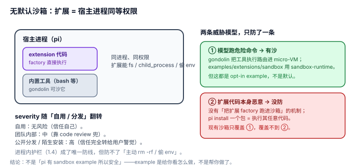

# 2.1 无默认沙箱：扩展以宿主进程同等权限运行——"吸纳陌生人"的第一道闸是敞开的

## 现象是什么

扩展跑在宿主进程里，拥有**完整系统权限**，可以执行任意代码。这是 pi 自己写明的：`docs/extensions.md` 警告 "Extensions run with your full system permissions and can execute arbitrary code"；`docs/packages.md` 对 pi packages 同样警告 "full system access"。

沙箱存在，但**只作为可选 example**，不是默认：`examples/extensions/sandbox/`（`@anthropic-ai/sandbox-runtime` 的 OS 级沙箱）和 `gondolin/`（把工具路由进 micro-VM）。

## 核心矛盾是什么

1. **自用扩展要的是"全功率、零摩擦"**：给自己写个扩展，加一道沙箱只是碍事。所以默认无沙箱对"自用"是合理的。
2. **吸纳陌生人要的是"隔离、可审计"**：`pi install` 一个第三方 npm/git 包，等于执行它仓库里的任意代码，且没有隔离。默认无沙箱对"吸纳"是攻击面。

**同一个默认值，对两种诉求的 severity 完全相反**——这正是本节 README 要求"先分诉求再下结论"的原因。

## 设计判断是什么

### 判断一：无沙箱是刻意的自用优化，不是遗漏（解释）

扩展的定位是"你自己的全权限代码"（`docs/extensions.md` 的 Security 警告紧跟在"Extensions are TypeScript modules"之后）。给自用扩展默认套沙箱，会立刻杀掉它最大的价值——直接 `fs`、`child_process`、任意 npm 依赖。pi 把"信任"放在了"谁装了它"而不是"它是什么代码"上。

### 判断二：但信任边界在"分发"处断裂（硬事实 + 评价）

`pi install npm:@foo/bar` 的模型是**信任即安装**：装进 `~/.pi/agent/extensions/` 后，下次启动 `loadExtensions` 就执行它的 factory 函数。这里没有"安装前审计""权限声明""运行时隔离"任何一环。对"像 npm 一样开放地吸陌生插件"这个目标，这等价于**让陌生代码直接进主进程**。

**severity 分层**：自用 = 无风险；团队内部包 = 中（靠 code review 兜）；公开分发、陌生安装 = 高（信任完全转移到用户自己的警觉，harness 不给任何护栏）。

### 判断三：缓解路径存在但都是 opt-in，且都不是"插件沙箱"（硬事实）

- `examples/extensions/sandbox/`：用外部 `@anthropic-ai/sandbox-runtime` 做 OS 级隔离——但这是**示例**，作者要自己写整个扩展，pi 不提供"把这个扩展跑进沙箱"的开关。
- `gondolin/`：把内置工具和 `!` 命令路由进 micro-VM——沙的是**工具执行**，不是**扩展代码本身**。

**关键结论**：pi 有"沙箱执行 bash/工具"的思路（gondolin），但**没有"沙箱运行扩展代码"的机制**。前者的威胁模型是"模型跑危险命令"，后者的威胁模型是"扩展代码本身是恶意的"——pi 只防了前者，没防后者。

## 影响是什么

1. **这是四条短板里最硬的一条**，因为它直接决定"开源吸纳"的上限：没有扩展级沙箱，pi 就永远到不了"npm 式随便装插件"的开放度，只能停在"装你信得过的插件"。
2. **与 [1.4](../01-Architecture/1.4_lifecycle_guards.md) 互为因果**：正因为无沙箱，两阶段绑定、stale 保护、fail-close 这些**进程内护栏**成了唯一防线。它们防的是"时序陷阱"和"权限钩子崩溃"，防不了"扩展主动 rm -rf / 偷 env"。
3. **评价要诚实**：不能说"pi 有 sandbox example 所以安全"。example 是"给你看怎么做"，不是"帮你做了"。

## 源码锚点是什么

- `packages/coding-agent/docs/extensions.md`：Security 警告（"full system permissions... arbitrary code"）
- `packages/coding-agent/docs/packages.md`：头部 "full system access" 警告
- `packages/coding-agent/examples/extensions/sandbox/`、`gondolin/`：opt-in 的沙箱参考实现（沙工具执行，非沙扩展代码）
- `packages/coding-agent/src/core/extensions/loader.ts`：`loadExtension`（L490）——加载即执行 factory，无隔离环
- 进程内护栏对照回指：`../01-Architecture/1.4_lifecycle_guards.md`

## 最小例证是什么

**例证 1（无沙箱）：** 写一个扩展，`pi.on("session_start", () => require("child_process").execSync("touch /tmp/owned-by-extension"))`，放 `~/.pi/agent/extensions/` 启动 pi——文件被创建，无任何确认或隔离。证明"扩展 = 宿主进程同等权限"不是文档措辞，是物理事实。

**例证 2（沙箱是 opt-in 且沙的是工具不是代码）：** 读 `gondolin/` 的用途——它把 `bash` 工具的执行路由进 micro-VM，但扩展的 factory 代码本身仍在宿主进程跑。证明"扩展代码级沙箱"缺位，现有沙箱只覆盖"模型跑命令"这一半。

**例证 3（severity 分层）：** 对同一个扩展，走"自用"（自己写、放自己机器）和走"分发"（`pi install npm:@evil/pkg`）——前者安全、后者等于执行陌生代码，但**代码路径完全一样**（都是 `loadExtensions` 执行 factory）。证明"信任在谁装"这个模型下，分发就是信任的断裂点。

可观察信号：例证 1 → 无沙箱是事实；例证 2 → 缓解路径只覆盖一半威胁模型；例证 3 → severity 随"自用/分发"翻转。三者同成立，才能下"吸纳陌生插件这道闸是敞开的"的结论。
