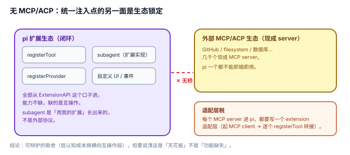

# 2.2 无 MCP/ACP：统一注入点的另一面是生态锁定

## 现象是什么

pi 的源码里**没有 MCP（Model Context Protocol）也没有 ACP（Agent Client Protocol）的实现**——grep `packages/coding-agent/src` 和 `packages/agent/src` 只有 vendored `highlight.min.js`、图片工具与 interactive-mode 里的子串误匹配。

`examples/extensions/subagent/` 里的 subagent 是**用 pi 自己的 extension 系统搭的**（一个扩展工厂 + 注册工具 + 事件），不是外部协议。

## 核心矛盾是什么

1. **统一注入点（[1.2](../01-Architecture/1.2_single_injection.md)）要"所有能力走一个口子"；而 MCP/ACP 的价值是"跨 harness 的通用口子"。** 两者在原理上互相排斥：统一注入点把生态拉向自己，MCP/ACP 把生态拉向互通。
2. **深可扩展（自家生态内）vs 横向互操作（跨生态）。** 一个 MCP 工具要进 pi，得有人为它写一个 pi extension 的适配层；而一个 pi 扩展也出不了 pi。

## 设计判断是什么

### 判断一：锁定的代价是"适配层税"，不是"功能缺失"（硬事实 + 解释）

pi 不缺能力——extension 系统能注册 tool、能拦事件、能注册 provider，MCP 能给的（外部工具）pi 也能给。缺的是**互操作**：外部 MCP 生态里现成的几千个 server，pi 一个都不能即插即用，每个都要有人写适配。

**severity 分层**：自用/团队 = 无感（本来就在自家生态里写 extension）；吸纳外部工具生态 = 高（每次引入都要付适配层税，且适配层是维护负担）。

### 判断二：subagent 是"extension 内实现"，证明 pi 的答案是"别用协议，用我的扩展"（硬事实）

`examples/extensions/subagent/` 的 subagent 用 pi 的 `registerTool` + 隔离 context window 实现，没有走任何外部协议。这印证 [1.2](../01-Architecture/1.2_single_injection.md) 的判断——pi 押的是"统一口子深到能自己长出 subagent"，而不是"兼容别人的协议"。

**这是可辩护的，但要知道它押了什么**：押"pi 扩展生态自己长出够用的工具"，弃"白嫖 MCP 生态现成工具"。

### 判断三：这个取舍不是 bug，但它是"吸纳新东西"的隐形天花板（评价）

统一注入点（1.2 判断四）已经记账了 tradeoff 表，本节把它落到具体后果：

| | 统一口子（pi） | MCP/ACP 兼容 |
|---|---|---|
| 自家生态成长速度 | 快（学一次，全触达） | 需适配 |
| 外部工具即插即用 | 无 | 有 |
| 适配层维护负担 | 无（原生） | 有（每工具一适配） |

**结论**：pi 用"低认知成本 + 深可扩展"换了"无外部互操作"。对"自己想快速长能力"是净赚；对"想当 MCP 生态的宿主"是净亏。两个定位不可兼得，pi 明确选了前者。

## 影响是什么

1. **"开源吸纳新东西"在 pi 里被窄化为"吸纳写 pi extension 的新东西"。** 外部生态（尤其 MCP 的 server 仓库）不直接流入。
2. **如果要补互操作，落点很清楚**：在 extension 系统里加一个"协议 adapter"（MCP client 作为 provider/tool 来源），而不是另起一套协议——这保持统一口子不破。但当前没有。
3. **评价要放到一起看**：这条和 [1.2](../01-Architecture/1.2_single_injection.md) 是同一枚硬币的两面，不能只夸"统一口子"而不记账"锁定"。

## 源码锚点是什么

- `packages/coding-agent/examples/extensions/subagent/`：subagent 是 extension 实现，非外部协议（`index.ts` + `agents.ts`）
- grep 证据：`packages/coding-agent/src` 与 `packages/agent/src` 无 MCP/ACP 实现（仅 vendored 误匹配）
- `packages/coding-agent/src/core/extensions/types.ts`：`ExtensionAPI`（L1252）——唯一注入口，无协议旁路
- 对照回指：`../01-Architecture/1.2_single_injection.md`

## 最小例证是什么

**例证 1（无实现）：** `grep -ril "mcp\|acp" packages/coding-agent/src packages/agent/src`——结果只有 `export-html/vendor/highlight.min.js`、`tool-result-images.ts` 和 `modes/interactive/interactive-mode.ts`（子串误匹配），没有实现文件。证明"无 MCP/ACP"是源码事实。

**例证 2（subagent 是扩展）：** 打开 `examples/extensions/subagent/index.ts`——它是 `export default (pi) => { pi.registerTool(...); }` 的 extension 工厂，没有任何 MCP/ACP client。证明 pi 的"多 agent"答案是扩展，不是协议。

**例证 3（适配层税）：** 找一个现成 MCP server（比如 GitHub MCP），问：它要进 pi 得怎么接？答案是"写一个 extension，在 factory 里起 MCP client、把它的 tools 逐个 `pi.registerTool` 转接"。没有即插即用。这个"每个 server 都要写一遍"就是适配层税。

可观察信号：例证 1 → 锁定是事实；例证 2 → pi 的方向是"用我的扩展"；例证 3 → 引入外部工具的边际成本真实。三者同成立，才能说"互操作是天花板而非 bug"。
