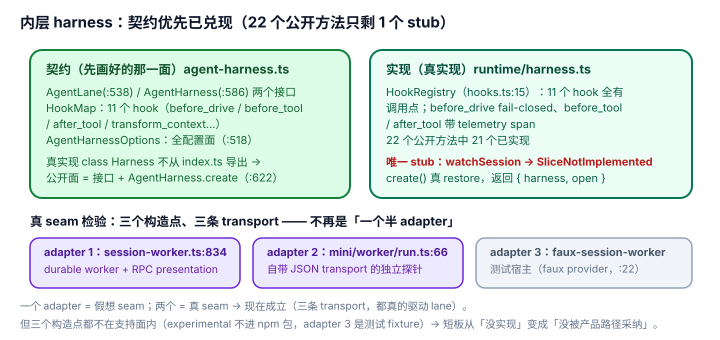

# 2.3 内层 harness：契约优先策略已经兑现，短板从"没实现"换成"只被 experimental 消费 + 契约仍在重画"

> **基线**：pi-mono `v0.85.1`（upstream tag `d981de122`，merge `e3aa42f46`），源码锚点对应工作树。本篇 2026-09-10 **整篇重写**：旧标题「AgentLane 半成品：library-first 的契约已经画好，实现还是骨架」的两半立论都被 upstream 反证——`UnavailableRegistry` 在源码树**零命中**、`HarnessNotImplemented` 在 `packages/*/src` **零命中**、`packages/coding-agent/src/server/` **目录整个不存在**。背景见 [`../../_change_log/0006-v0.84.4-to-v0.85.1.md`](../../_change_log/0006-v0.84.4-to-v0.85.1.md)。

## 现象是什么

`packages/agent` 的内层 harness 在 v0.84.4 是"多数操作抛 `HarnessNotImplemented` 的 508 行骨架"。**v0.85.1 它不是骨架了**：

- `AgentHarness` 不再是 class，而是工厂对象 `const AgentHarness = { create: createAgentHarness }`（`agent-harness.ts:622`）。
- 真实现是 `class Harness<TContext> implements AgentHarness<TContext>`（`runtime/harness.ts:29`），**不从 `index.ts` 导出**——宿主只能经 `AgentHarness.create()` 拿到 `AgentHarness<TContext>` 接口。
- `AgentHarness` 接口的 **22 个方法（`agent-harness.ts:586-612`）只剩 1 个未实现**：`watchSession` 抛 `SliceNotImplemented`（`runtime/harness.ts:305-307`）。
- hook 从"任何注册即 throw"换成真注册表 `HookRegistry`（`hooks.ts:15`），`HookMap` 的 11 个 hook（`agent-harness.ts:430-500`）**全部**有非注册表调用点。
- 真实 consumer 从"唯一的 stub"换成**三个会跑的构造点**（两个在 `coding-agent/src/experimental/`，一个在测试 fixture）。

## 核心矛盾是什么

1. **"先把契约画完再填实现"要花时间，而文档承诺是即时的。** 契约优先是个真策略，也有真窗口期：在兑现之前的那段，README 的"library-first"字面会超前于代码。v0.84.x 正是这个窗口。本文上一版把进行中的策略读成了"半成品"——需要记账的是**评价时点**，不是 pi 的设计。
2. **"能跑" vs "被支持"。** 内层 harness 现在真的能跑完整 turn，但唯一消费路径是 `coding-agent/src/experimental/`——它不在 npm 包、不在 standalone binary 里（`package.json` 的 `files` 排除 `dist/experimental`），只能从 repo checkout 起。
3. **契约兑现得越彻底，契约变化的成本越高。** 三轮重画（v0.83 泛型 `AgentHarness<TContext>` → v0.84 lane 骨架 → v0.85 真实现）说明内层 API 还在高速演进——而这恰是 [2.4](./2.4_no_version_contract.md) 的"无版本契约"成本。**兑现反而把这条短板抬高了**，不是降低了。

## 设计判断是什么

### 判断一：契约优先兑现了，而且兑现的**形状**比"把方法填满"更说明设计意图（硬事实）

兑现最硬的物证不是"不再抛错"，是 `create()` 开始真的做 restore：`createAgentHarness()`（`runtime/harness.ts:375-408`）先 `restoreSession()`，再从恢复出的 durable operation state 推出 `open: OpenOperation[]`（`:390-403`），返回 `{ harness, open }`。**durable 恢复真的接上了，不是 spec 里的一句话。** 两条 experimental 路径对 `open` 的用法不同（硬事实）：mini 在 worker 启动时用 `open` **主动**为每个残留操作装 drive（`mini/worker/run.ts:96-99`，注释原文 "install a new process-local drive for every operation left open by the previous worker"）；`session-worker.ts:834-845` 只取 `harness`，把恢复暴露成 `AgentController.resume` 服务方法（`services/agent-controller.ts:49`、`services/agent-controller-provider.ts:44-45`）供 presentation 调用。

hook 侧的对照更直白：`HookRegistry`（`hooks.ts:15`）的 11 个 hook 全部有调用点，且不是装饰——`before_drive` 走 `runWithGate` 且 **fail-closed**（`drive.ts:37` 调用、`hooks.ts:94` / `invokeAllFailClosed` `:409-423`：处理器抛错即重新抛出）、`before_tool`/`after_tool` **每个注册一个 telemetry span**（`hooks.ts:370-403`，`:376` 的 `startHarnessSpan("pi.harness.hook", …)`）、`transform_context`（`drive/generation.ts:192`）、`before_compaction`/`before_navigation`（`drive/structural.ts:648`/`:619`）。

**解释（设计意图）**：真正兑现的不只是实现，而是**"契约导出、实现不导出"的形状**。`Harness` 类不在 `agent/src/index.ts` 的导出面里（该文件只从 runtime 导出 `reduceLaneSnapshot`，`index.ts:77`），exports map 里 `./harness/context`、`./harness/session`、`./harness/env/nodejs` 三条子路径都被 `forbid: ["harness/runtime/", "harness/execution/", …]` 挡住（`scripts/check-entry-graphs.mjs:38-41`）。**seam 的形状是公开的，runtime 是私有的。** 这解释了 v0.85 为什么能把 runtime1→runtime2→runtime 整体换两轮而外部无感：`00-runtime1-removal.md` 的 Delete 清单删掉 `harness/runtime/**`、`restore.ts` 与 4 个旧测试套件，而 `agent/src/index.ts` 的净变化只有 `+14/−7`——**没有任何外部代码 import 过 runtime**。

### 判断二：真 seam 检验现在**通过**了——三个 adapter，不是"一个半"（硬事实 + 解释）

[1.1](../01-Architecture/1.1_three_tier_seams.md) 的判据是"一个 adapter = 假想 seam，两个 = 真 seam"。数 `AgentHarness.create()` 的构造点：

- `experimental/session-worker.ts:834`——durable worker 持 lane，presentation 走 RPC service 目录（`:849` 取 `lane("main")`、`:855` 调 `setActiveTools`）。
- `experimental/mini/worker/run.ts:66`——**独立探针**，自带 newline-delimited JSON transport 与自研 frame，和 chord 那套是两条栈（`mini/README.md` 自述）。
- `test/fixtures/faux-session-worker.ts:22`——faux provider 测试宿主。

三个构造点、三条 transport，而且**都真的在驱动 lane**：`lane.prompt/steer/followUp/compact/abort` 有实现调用（`mini/worker/lane-service.ts:73-90`），`lane.watch()` 有三个 consumer（`lane-service.ts:43`、`experimental/services/transcript-provider.ts:74`、`mini/tui/session.ts:80`）；lane 级 `watch()` 是实现了的（`runtime/lane.ts:1705`），未实现的只是 session 级聚合。

**deletion test 也翻面了**：v0.84.4 删掉 `AgentHarness` 的代价 ≈ 0（没人跑）；v0.85.1 删掉它，experimental 的 durable 执行基座整个消失——`Agent` 类给不了 restore、lane、operation state。这个"删掉会散开"（locality 的反面证据）就是它现在赚回存在的证明。

### 判断三：三条仍在的短板——但性质变了（硬事实 + 评价）

1. **唯一未实现的方法是 `watchSession`。** `runtime/harness.ts:305-307` 抛 `SliceNotImplemented("watchSession")`；spec 自己点名（`docs/harness.md:147` R12、`:1080`、`:1303`）。**注意粒度**：`SessionSnapshot` 现在只是 `{ lanes: LaneInfo[]; faulted: boolean }`（`agent-harness.ts:250-253`），spec 说 R12 还要决定"是否维持这么小"。**这是"没想清楚要不要的东西"，不是"没做的东西"**——严重度与 v0.84.4 的"22 个操作全经 `unavailable()` reject"不是一个量级。
2. **只有 experimental 消费。** `experimental/` 在 v0.84.4 文件数为 0，v0.85.1 有 47 个文件；它不在 npm 包（`files` 排除 `dist/experimental`）、`./experimental/plugin` 子路径只有 `{"source": …}`（source-only），入口是 `PI_EXPERIMENTAL=1 ./pi-test.sh server` 或直接跑 `mini/main.ts`。**产品路径仍然不消费 `AgentHarness`**：`core/sdk.ts` 的 `createAgentSession()` → `AgentSession` 这条线上，`packages/coding-agent/src/core/` 对 `AgentHarness`/`AgentLane` **零引用**（grep 确认）。所以旧判断二"可用的面在 coding-agent 层"**局部仍然成立**，但原因变了：不是"agent 层跑不起来"，而是"agent 层的 harness 还没被产品路径采纳"。
3. **契约仍在高速重画。** v0.83 泛型 → v0.84 lane 骨架 → v0.85 真实现，外加 runtime 在一个 release 周期内被整体换掉两轮。对第三方是真实的内层 API 不稳定（详见 [2.4](./2.4_no_version_contract.md)）。

**severity 分层（本节规则）**：自用 / CLI·TUI 产品路径 = **无影响**（那条路走 `createAgentSession()`，`core/sdk.ts` 与 RPC 面本次逐字节未变）；想用 agent 包自组 harness 的宿主 = **中**（能跑，但消费路径是 dev-only / source-only，得跟着 repo 走）；把内层 API 当长期依赖做产品的 = **高**（无版本契约，且内层 API 一个 release 内改过两轮）。

**缓解路径（本节规则）**：pi 留了两个口子但都不是承诺——`AgentHarness.create()` 是唯一公开构造口（实现私有，等于官方承认"实现会变"）；`experimental/mini` 是一个自成体系、自带 transport 的**宿主范例**（"It exists to exercise the harness from a real client and to find out what an RPC-shaped presentation actually needs from it"）。范例 ≠ 支持面。

### 判断四：design-it-twice——v0.85 把 harness 与 lane 拆开是对的，而且被类型测试锁死（解释）

v0.84 的形状是 `AgentHarness implements AgentLane` 且 `name = "main"`：harness 自己就是那条 lane，"多 lane"没有位置。v0.85 拆成两个互不重叠的接口，并且**用类型级断言当护栏**：`types.test.ts:461` 断言 `Extract<keyof AgentHarness, keyof AgentLane>` 等于 `never`，`:463-488` 再断言两边的内部方法（`session`/`models`/`hooks`/`activeDrive`/`command`/`settleOperation`/…）都不外漏。**如果换回 v0.84 的接口设计会烂在哪**：`harness.lane("main")` 这个"多 lane 是默认、不是特例"的表达将无处安放，`lanes()`/`watchSession`（session 级聚合）也会和 lane 级方法混在同一张接口上，宿主无法只面向"多路复用器"编程。

## 影响是什么

1. **library-first 的第二层承诺已兑现，选型结论要跟着改。** 旧说法"agent 包级嵌入是未来可直用、不是现在可用"**作废**；但要说清**支持级别**——它跑在 experimental 路径上，不是 supported SDK，"能用"和"承诺兼容"仍是两件事。
2. **和 [2.4](./2.4_no_version_contract.md) 的联动在 v0.85.1 更强了，不是更弱。** 契约兑现的代价是契约变化更值钱：注意区分两层 API——公开面几乎不变（`agent/src/index.ts` 净 `+14/−7`），而 `AgentLane` 的**每个方法都多了一个尾参 `context: Context`**、`AgentHarness` 不再是 lane、`peekAction`/`executeAction`/`runToCompletion`/`drive: "manual"` 全部删除。对已有宿主这是真 breaking，而 manifest 里仍然没有任何字段能让扩展声明"我要哪个 API 版本"。
3. **"契约优先"这个策略本身拿到了证据。** 从"契约优先 = 拖着不实现"到"契约优先 = 真的省了重画成本"（runtime 换两轮、外部零感知）。评价一个 design-first 的项目，时点很关键——这一条值得写进 [1.3](../01-Architecture/1.3_distribution_loop.md) 那句"结构在演进"里。

## 源码锚点是什么

- `packages/agent/src/harness/agent-harness.ts`：`AgentHarness` 工厂对象（`:622`）、`AgentHarnessConstructor`（`:614`）、`AgentHarness` 接口 22 个方法（`:586-612`）、`AgentLane` 接口（`:538`）、`Hooks`（`:512-514`）、`HookMap` 11 个 hook（`:430-500`）、`AgentHarnessOptions`（`:518`）、`SessionSnapshot`（`:250-253`）
- `packages/agent/src/harness/runtime/harness.ts`：`class Harness<TContext>`（`:29`，真实现）、`HookRegistry` 构造与 `handler_error` 上报（`:46-58`）、`watchSession` stub（`:305-307`）、`createAgentHarness()` 真 restore（`:375-408`，open 推导 `:390-403`）
- `packages/agent/src/harness/hooks.ts`：`HookRegistry`（`:15`）、`runWithGate`（`:44`）、`runToolWithGate`（`:58`）、`before_drive` fail-closed（`:94`/`:409-423`）、tool hook telemetry span（`:370-403`）
- `packages/coding-agent/src/experimental/session-worker.ts`：`createCodingAgentHarness()`（`:805`）、`AgentHarness.create()`（`:834`）、`lane("main")`（`:849`）、`setActiveTools`（`:855`）——**三个真实 consumer 之一，且不再是 stub**；恢复走 `AgentController.resume`（`services/agent-controller.ts:49`、`services/agent-controller-provider.ts:44-45`）
- `packages/coding-agent/src/experimental/mini/worker/run.ts`：`AgentHarness.create()`（`:66`）、`lane("main")`（`:78`）、open→resume 的 drive 安装（`:96-99`）
- `packages/agent/test/harness/types.test.ts`：接口不重叠的类型级封印（`:461`）与内部方法不外漏断言（`:463-488`）
- `scripts/check-entry-graphs.mjs`：exports map 的 entry budget 把 `harness/runtime/`、`harness/execution/` 挡在公开子路径之外（`:38-41`）
- `packages/agent/docs/harness.md`：§0.9 implementation-status 清单（`:141`）、R12 唯一公开方法 stub（`:147`/`:1080`）
- `packages/agent/docs/work-packages/00-runtime1-removal.md`：runtime1→runtime2→runtime 整体替换的记录（Delete 清单证明 runtime 可整体替换；状态已从 "Do not release while its execution path is incomplete" 变为 Complete）
- 已删除符号的墓碑（**不要作为现状引用**）：`UnavailableRegistry`、`HarnessNotImplemented`、`ActionInfo`、`SuspendedOperation`、`MissingIdentities`、`peekAction`/`executeAction`/`runToCompletion`、`coding-agent/src/server/`

## 最小例证是什么

**例证 1（stub 从一片塌缩到一个）：** `grep -rn "SliceNotImplemented" packages/agent/src` → 只有三处：定义 `runtime/types.ts:18`、re-export `agent-harness.ts:52`、抛出点 `runtime/harness.ts:306`（`watchSession`）。一个 release 周期里，22 个公开方法的未实现数从"几乎全部"降到 **1**。证明"契约优先"不是话术，是已经走完的路径。

**例证 2（真 seam 现在成立）：** 数 `AgentHarness.create()` 的构造点：`session-worker.ts:834`、`mini/worker/run.ts:66`、`faux-session-worker.ts:22`——三个、三条 transport。用 [1.1](../01-Architecture/1.1_three_tier_seams.md) 的判据（≥2 个 adapter = 真 seam），这个 seam 现在**通过**；旧文那句"唯一的 consumer 也是 stub"在 grep 下无法复现（`server/create-harness.ts` 路径已不存在）。

**例证 3（"能跑" ≠ "被支持"）：** `ls packages/coding-agent/src/experimental` 有 47 个文件，但 `packages/coding-agent/package.json` 的 `files` 明确排除 `dist/experimental`，且 `./experimental/plugin` 只导出 `{"source": …}`。内层 harness 能跑，但它的消费者进不了消费者安装闭包。证明短板已经从"没实现"迁移到"没被产品路径采纳"。

**例证 4（契约优先省下的钱）：** 看 `00-runtime1-removal.md` 的 Delete 清单——`harness/runtime/**` 整目录、`restore.ts`、4 个旧测试套件全删，而 `agent/src/index.ts` 净变化只有 `+14/−7`。**runtime 被整体换掉而外部无感**，这就是"契约先行 + 实现私有"的直接回报。

可观察信号：例证 1 → 实现已到位；例证 2 → seam 已经是真 seam；例证 3 → 支持级别仍未提升；例证 4 → 契约优先策略已被验证有效。四者同成立，才能说"契约优先已兑现，短板换了位置"——而不是笼统说"library-first 兑现了"。
