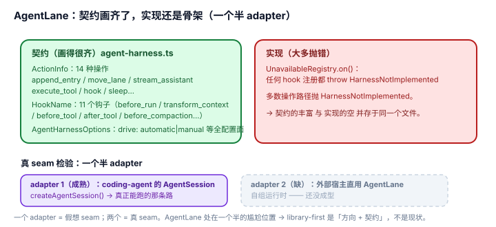

# 2.3 AgentLane 半成品：library-first 的契约已经画好，实现还是骨架

## 现象是什么

pi 宣称 library-first（`_digested/README.md`），但真正的内层 harness——`packages/agent` 里的 `AgentLane`——在 v0.84.2 是**设计好的契约 + 未完成的实现**：

- 契约极完整：`ActionInfo` 联合 14 种操作（append_entry / move_lane / try_finish_run / stream_assistant / execute_tool / fetch_deferred / hook / sleep…，`agent-harness.ts:182`）、`HookName` 11 个钩子（before_run / transform_context / before_request / before_tool / after_tool / before_compaction…，`L198`）、`AgentHarnessOptions` 全配置面（session/models/tools/systemPrompt/retry/compaction/steeringMode/followUpMode/toolExecution/drive: automatic|manual…，`L243`）。
- 实现却大多抛错：`UnavailableRegistry`（`L219`）对任何 hook 注册抛 `HarnessNotImplemented`（`L74`），`HarnessNotImplemented` 在多数操作路径被抛出。

## 核心矛盾是什么

1. **library-first 的承诺 vs 现状**：README 说"可以被其他产品嵌入的 agent 引擎"，但 `packages/agent` 的 harness 层跑不起一个完整 turn。
2. **"先画契约再填实现"的设计节奏 vs 外部宿主的当下需求**：契约画好说明设计意图清晰（好事），但外部宿主现在要嵌入，就只能走 `packages/coding-agent` 的 SDK，而非 agent 包的 harness。

## 设计判断是什么

### 判断一：这是"design-first"，不是"没做"——契约本身有信息量（硬事实 + 解释）

`ActionInfo` / `HookName` / `AgentHarnessOptions` 的完整度说明：**内层 harness 的 seam 位置和形状已经被想清楚了**，只是 adapter（真正能跑的实现）还没做完。

**用 [1.1](../01-Architecture/1.1_three_tier_seams.md) 的词汇**：这是一个**设计好的 seam，但真正的 adapter 还没成型**。注意"谁消费 AgentLane"这个检验：`AgentSession` 并**不**消费它——SDK 是直接在 `Agent` 类（`agent.ts`）之上组装的，走的是另一条路。AgentLane 唯一的代码级 consumer 是 `packages/coding-agent/src/server/create-harness.ts` 的 `createCodingAgentHarness()`（它会 `AgentHarness.create()` 并构造出 harness），但这个 consumer 自身也是 stub——它拿到的 harness 的 `prompt`/`skill`/`compact` 等操作全部 `Reject HarnessNotImplemented`。所以准确说法是：**AgentLane 是"唯一的 consumer 也是半成品"的假想 seam**，而不是"一个半 adapter"（后者会让人误以为 AgentSession 是它成熟的一侧）。

### 判断二：可用的面在 coding-agent 层，不在 agent 层（硬事实）

真正能嵌入的是 `packages/coding-agent` 的 SDK（`createAgentSession()`）+ extension 系统，不是 `packages/agent` 的 `AgentLane`。agent 包当前对外最有价值的是 `Agent` 类 + 消息类型 + session v4 存储（`agent/src/agent.ts`、`types.ts`、`harness/session/`），而不是 `AgentHarness`/`AgentLane` 这个 harness 骨架。

**severity 分层**：只想嵌 agent 运行时 = 中（有 SDK 可用，只是不是"纯 agent 包"那条路）；想要一个"自己定义 harness 行为、自己接 transport"的纯运行时 = 高（契约在，实现缺）。

### 判断三：这是演进中的过渡态，不应读成"pi 的 library-first 是假的"（评价）

`agent/README.md` 顶部警示已记录这次重构："`AgentHarness` 去泛型化重设计为 `AgentLane` 骨架（多数操作 `HarnessNotImplemented`）"。v0.83 曾有泛型 `AgentHarness<TContext>`，v0.84 重写成 `AgentLane` 骨架——**这是把旧接口推倒重画**，不是从零开始。

**诚实结论**：library-first 是**方向 + 已画好的契约**，不是**现状**。要评价"好不好二次开发"，得说"契约清晰、实现滞后"这八个字，而不是笼统说"支持嵌入"。

## 影响是什么

1. **外部宿主现在只有一条成熟路：coding-agent SDK。** agent 包的 harness 层是"未来可直用"，不是"现在可用"。选型时不能照 README 的 library-first 字面去做 agent 包级嵌入。
2. **契约本身就是 roadmap。** `AgentHarnessOptions` 的 `drive: "automatic" | "manual"`、`steeringMode`/`followUpMode`、`toolExecution: sequential|parallel` 这些字段，标出了内层 harness 想暴露给宿主的行为点——看懂契约就知道"等它填完会长成什么样"。
3. **和 [1.3](../01-Architecture/1.3_distribution_loop.md) 一样，这是"结构在演进"的证据。** 快速重构（v0.83 泛型 → v0.84 lane 骨架）带来可扩展性红利，也带来"内层 API 不稳定"的成本——直接联动 [2.4](./2.4_no_version_contract.md)。

## 源码锚点是什么

- `packages/agent/src/harness/agent-harness.ts`：`ActionInfo`（L182）、`HookName`（L198）、`Hooks`/`Events`（L211/L215）、`UnavailableRegistry`（L219，hook 注册抛 `HarnessNotImplemented`）、`AgentHarnessOptions`（L243）、`HarnessTool`（L237）、`HarnessNotImplemented`（L74）、`AgentHarness.create`（L347，仅对无既有 record 的空 session 不抛、其余操作经 `unavailable` reject）
- `packages/coding-agent/src/server/create-harness.ts`：`createCodingAgentHarness`——代码里唯一构造 `AgentHarness` 的地方（L153 调 `AgentHarness.create`），但其 harness 的操作是 stub
- `packages/agent/src/agent.ts`：`Agent` 类——agent 包当前可用的运行时核心（`AgentSession` 直连它，不经过 AgentLane）
- `packages/coding-agent/src/core/sdk.ts`：`createAgentSession`——外部宿主当前真正的嵌入入口
- 重构记录回指：`../../agent/README.md` 顶部警示、`../../_change_log/0003-v0.83.0-to-v0.84.2.md`

## 最小例证是什么

**例证 1（契约完整 + 实现骨架）：** 数 `ActionInfo` 的 member（14 种操作，15 个 kind 标签——`fetch_deferred|cancel_deferred` 并在一支）和 `HookName`（11 个）——契约画得很细；再看 `UnavailableRegistry.on()`（`L219`）——任何 hook 注册都 `throw HarnessNotImplemented`。同一个文件里"契约的丰富"和"实现的空"并存。

**例证 2（可用的在 coding-agent 层）：** 从 `@earendil-works/pi-agent-core` 拿 `AgentLane` 相关 API 试着 `run()` 一次 turn——多数路径抛 `HarnessNotImplemented`；换成 `@earendil-works/pi-coding-agent` 的 `createAgentSession()` 则能跑。证明可用面在 coding-agent 层。

**例证 3（seam 的 consumer 也是 stub）：** 用 [1.1](../01-Architecture/1.1_three_tier_seams.md) 的真 seam 检验——"谁消费 AgentLane 这个 seam"？不是 `AgentSession`（它直连 `Agent` 类）；代码里唯一构造 `AgentHarness` 的是 `createCodingAgentHarness()`（`coding-agent/src/server/create-harness.ts:153` 调 `AgentHarness.create()`），而这个 harness 的操作全是 stub（`prompt` 等 `Reject HarnessNotImplemented`）。一个"其唯一 consumer 也是半成品"的 seam，比"一个半 adapter"更接近现状——它还没有真正的 adapter。

可观察信号：例证 1 → 契约已画、实现滞后；例证 2 → 可用面在 SDK；例证 3 → 这个 seam 还没到"真 seam"。三者同成立，才能准确说"library-first 是方向 + 契约，不是现状"。
