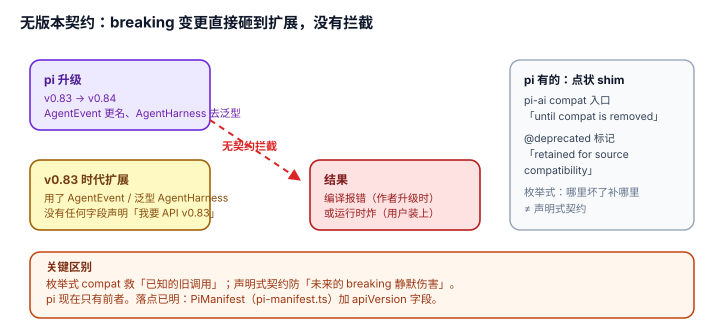

# 2.4 无显式版本契约：有零散的 compat shim，没有 extension API 的兼容承诺

## 现象是什么

`pi` manifest 只有 4 个 string 数组（`extensions`/`skills`/`prompts`/`themes`），**没有 `apiVersion` / `minVersion` / `engineVersion` 字段**（`pi-manifest.ts:4`）。npm/git 源里的 `@1.0.0` / `@v1` 是包的语义版本，不是"扩展 API 兼容哪个 harness 版本"的声明。

pi 有**局部的**兼容处理，但不是契约：`loader.ts` 把 `@earendil-works/pi-ai` 解析到 compat 入口（"strict superset of the old global API... until compat is removed"，`loader.ts:59-64`），`types.ts` 里有 `@deprecated` 字段标"Retained for source compatibility"（`types.ts:1540`）。这些是**点状的 shim**，覆盖 pi-ai 的旧 API，不覆盖 `ExtensionAPI` 的整体演进。

## 核心矛盾是什么

1. **快速演进（breaking 变更）vs 第三方扩展的稳定性。** pi 在 v0.83→v0.84 之间对 extension API 做了 breaking 变更（`AgentEvent` 更名、`AgentHarness` 去泛型化，见 `_change_log/0003`），但没有机制让扩展作者提前声明"我要求哪个 API 版本"。
2. **"兼容 shim 能给多少" vs "能承诺多少"。** 点状 shim（pi-ai compat 入口）能救几个旧调用，但救不了"整个 ExtensionAPI 变了"这种系统性 breaking——而后者恰恰是契约该管的。

## 设计判断是什么

### 判断一：无契约的后果是"静默失效或运行时报错"，且只有 CI/社区能发现（硬事实 + 评价）

一个 v0.83 时代写的扩展（用了 `AgentEvent` 或泛型 `AgentHarness<TContext>`），在 v0.84.2 上加载，结果只有两种：TS 编译报错（作者自己升级时发现）或运行时改名报错（用户装上才炸）。**pi 在"加载时"不会说"这个扩展是给旧 API 写的，请降级"**——因为没有任何字段能声明这个信息。

**severity 分层**：自用 = 低（作者自己跟着升级）；团队内部 = 中（升级 pi 时统一改一遍）；公开分发、陌生安装 = 高（第三方扩展作者无法承诺"兼容 pi ≥X"，用户升级 pi 后扩展可能炸）。

### 判断二：点状 shim 证明了"意识到了兼容问题"，但也暴露了它没上升到契约（硬事实 + 解释）

`loader.ts` 为 pi-ai 的旧全局 API 专门留了 compat 入口，`types.ts` 有 `@deprecated` 标记——**说明维护者确实在管理兼容**。但这套做法是**枚举式的**（哪里坏了补哪里），不是**声明式的**（扩展说"我要 API v2"，harness 检查后决定加载还是拒绝）。

**关键区别**：枚举式 compat 能救已知的旧调用，声明式契约能防止未来的 breaking 静默伤害。pi 现在只有前者。

### 判断三：这是"快速演进期"的典型代价，不是永久缺陷（评价）

v0.83→v0.84 的重构（[2.3](./2.3_agent_lane_contract_first.md) 记录的 AgentLane 重画）说明 pi 还处在**高速重构期**，此时加一个"API 版本契约"会立刻被自己的重构打破——契约的价值要等 API 稳定后才兑现。

**诚实结论**：现在是"演进优先、兼容后补"的阶段。这个阶段自有其合理性，但它意味着**第三方的扩展 API 稳定性没有承诺**，和 [1.3](../01-Architecture/1.3_distribution_loop.md) 里"manifest 是未来加契约的落点"相互印证——seam 放好了，契约没写。

## 影响是什么

1. **"能分发"（1.3）不等于"能稳定地分发"。** `pi install` 解决了安装，没解决"装完升级 pi 会不会炸"。缺契约，分发闭环就少最后一环。
2. **第三方作者承担了全部兼容成本。** 没有契约，作者要么锁死 pi 版本（脆弱），要么每次 pi 升级跟着改（累），要么放弃维护（生态烂）。
3. **落点已明**：如果未来加契约，位置就是 `PiManifest`（`pi-manifest.ts`）——加一个 `apiVersion`/`engines` 字段，`readPiManifest` 读、loader 检查。seam 在，缺字段。

## 源码锚点是什么

- `packages/coding-agent/src/core/pi-manifest.ts`：`PiManifest`（L4）——无 `apiVersion`/`minVersion` 字段的实锤
- `packages/coding-agent/src/core/extensions/loader.ts`：`VIRTUAL_MODULES` 中 pi-ai 解析到 compat 入口（L59-64）——点状 shim，非契约
- `packages/coding-agent/src/core/extensions/types.ts`：`@deprecated`（L1540）——枚举式兼容标记
- 演进记录回指：`../../_change_log/0003-v0.83.0-to-v0.84.2.md`、`../../agent/README.md` 顶部警示

## 最小例证是什么

**例证 1（无字段）：** 打开 `pi-manifest.ts`——`PiManifest` 的字段只有 `extensions`/`skills`/`prompts`/`themes`，没有 `apiVersion` 或任何版本字段。证明"扩展无法声明它要求哪个 harness API 版本"。

**例证 2（点状 shim vs 契约）：** 看 `loader.ts:59` 的注释——"keep working at runtime until compat is removed"。这是"给已知的旧调用续命"，不是"扩展声明 API 版本、harness 校验"。枚举式和声明式的区别就在这里。

**例证 3（breaking 已发生）：** 一个 v0.83 的扩展（用 `AgentEvent` 或泛型 `AgentHarness<TContext>`）在 v0.84.2 加载——报错或改名，且没有任何 manifest 字段能提前拦住。证明"无契约 → 静默/运行时炸，只有作者自己发现"。

可观察信号：例证 1 → 无声明字段；例证 2 → 只有枚举式 compat；例证 3 → breaking 演进无提前拦截。三者同成立，才能说"分发的稳定性缺最后一环（契约）"。
