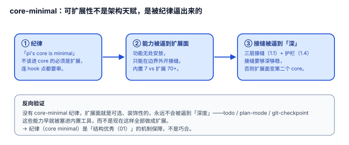

# 3.1 core-minimal：可扩展性不是架构天赋，是被纪律逼出来的

## 现象是什么

`CONTRIBUTING.md` 开篇第一段是哲学立场，不是客套：

> "pi's core is minimal. If your feature does not belong in the core, it should be an extension. PRs that bloat the core will likely be rejected. ... Even hook points for extensions however should be well considered and discussed to avoid adding unmaintainable bloat and complex interactions."

**core 要极小，不该进 core 的必须是扩展，连扩展的 hook 点都要审慎。** 这是纪律，不是口号。

## 核心矛盾是什么

1. **core minimal vs 社区想加功能。** 不设闸，PR 会把 core 撑成杂物堆；设闸太狠，贡献者流失。`CONTRIBUTING.md` 第一句话就定了立场。
2. **"能力要能被扩展" vs "扩展面本身也会膨胀"。** 把功能赶到扩展面去，扩展面就会变大、变复杂——所以连 hook 点都要审，防止"扩展面变成第二个 core"。

## 设计判断是什么

### 判断一：core-minimal 是 [01-Architecture](../01-Architecture/README.md) 三层接缝存在的**原因**，纪律和架构互为因果（解释）

正因为 core 极小，能力必须被**逼到扩展面**上去——operations / tool factory / extension 这三层接缝不是凭空设计的，是"不许进 core"这条纪律把功能赶到边界外时，自然长出来的接缝。

**因果链**：纪律（core minimal）→ 能力无处安放 → 必须在边界外开接缝 → 接缝要够深够稳 → [1.4](../01-Architecture/1.4_lifecycle_guards.md) 的护栏。反过来说，如果一个项目没有"core minimal"纪律，扩展面就是可选的、装饰性的，永远不会被逼到"深度"。

### 判断二：内置工具数量 vs 扩展数量的比例是这条纪律的直接物证（硬事实）

内置工具只有 7 个（`tools/index.ts` 的 `ToolName` 联合：read/bash/edit/write/grep/find/ls），而 `examples/extensions/` 有 70+ 个能力（todo、permission-gate、git-checkpoint、custom-provider、plan-mode、subagent……）全部做成了扩展。

**比例本身就是证据**：如果 core 不 minimal，这 70 个里会有一半被塞进内置工具。7 vs 70+ 不是偶然，是"不许进 core"执行了若干轮之后的结果。

### 判断三：连"扩展的 hook 点"都要审，说明纪律是两层的（硬事实 + 解释）

`CONTRIBUTING.md` 的后半句更狠："Even hook points for extensions should be well considered." 意思是：**不仅功能不许进 core，连"给扩展开个新口子"这件事本身也要审**。

这是深一层的纪律：它防的不是"功能膨胀"，而是**扩展面膨胀**——如果每个新功能都随手在 `ExtensionAPI` 上加一个 `registerXxx`，扩展面会变成第二个 core，[1.1](../01-Architecture/1.1_three_tier_seams.md) 里那个"大接口但按需查"的精致平衡就会被破坏。

### 判断四：这是可复用的策略，不只是 pi 的内部偏好（评价）

"core minimal + 能力逼到扩展面 + hook 点也审"是一条**开源平台通用的治理策略**。它回答的问题——"开源平台怎么长期保持核心小而可扩展、又不被 PR 撑破"——是所有想吸纳第三方贡献的 harness 都要面对的。pi 把答案写成了 `CONTRIBUTING.md` 第一段，并且执行了。

## 影响是什么

1. **"结构优秀"（01）不是运气，是被纪律逼出来的。** 评价 pi 的可扩展性时，若只看架构不看这条纪律，就漏了它的**机制保障**——没有 core-minimal，三层接缝迟早被 PR 撑破。
2. **这条纪律直接联动贡献门（3.3）。** core-minimal 是"该拒绝什么"，贡献门是"怎么自动拒绝"——前者定标准，后者自动化执行。
3. **对想复制 pi 的人，这是最值钱的一课**：可扩展架构的起点不是"设计好接缝"，是"先立一条不许膨胀的纪律"。

## 源码锚点是什么

- `CONTRIBUTING.md`：开篇 "pi's core is minimal" + "even hook points ... should be well considered"
- `packages/coding-agent/src/core/tools/index.ts`：`ToolName` 联合（L83）——内置工具只有 7 个
- `packages/coding-agent/examples/extensions/`：70+ 个扩展能力（对比 7 个内置）
- 因果链的另一端回指：`../01-Architecture/1.1_three_tier_seams.md`、`../01-Architecture/1.4_lifecycle_guards.md`

## 最小例证是什么

**例证 1（比例物证）：** 数 `tools/index.ts` 的 `ToolName` 联合 = 7 个；数 `examples/extensions/` 顶层 `.ts` 文件 + 子目录 = 70+ 个能力。7 vs 70+ 的比例就是"能力被逼到扩展面"的直接证据。

**例证 2（两层纪律）：** 重读 `CONTRIBUTING.md` 第一段的后半句——"even hook points for extensions should be well considered"。它否定的不只是"功能进 core"，还有"随手给扩展开新口子"。两层闸门。

**例证 3（因果链反向验证）：** 假设 pi 没有 core-minimal 纪律，`todo`、`plan-mode`、`git-checkpoint` 这些能力会不会进内置工具？看它们现在是扩展——说明纪律确实在执行，且执行了若干轮。反向验证纪律不是纸面声明。

可观察信号：例证 1 → 纪律落到了结构；例证 2 → 纪律是两层的；例证 3 → 纪律在执行而非声明。三者同成立，才能说"可扩展性是纪律逼出来的，不是架构天赋"。
