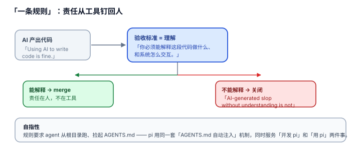

# 3.2 "一条规则"：AI 写码可以，不理解你交的东西就不行——责任从工具钉回人

## 现象是什么

`CONTRIBUTING.md` 里有一条名为 "The One Rule" 的规则，字数极少但位置显赫：

> "You must understand your code. If you cannot explain what your changes do and how they interact with the rest of the system, your PR will be closed. Using AI to write code is fine. Submitting AI-generated slop without understanding it is not."

配套一条操作要求：用 agent 就从 pi 根目录跑，让它自动捡起 `AGENTS.md`，且 agent 必须遵守 `AGENTS.md`。

## 核心矛盾是什么

1. **AI 写码的效率 vs AI slop 的质量。** AI 让"产出代码"的成本趋近于零，但"理解代码"的成本没有变。如果只收代码不收理解，仓库会被"能跑但不被任何人理解"的代码淹没。
2. **工具的能力 vs 人的责任。** 代码是 AI 生成的，但维护它的是人。规则要在"允许用 AI"和"不许甩锅给 AI"之间划一条清晰的线。

## 设计判断是什么

### 判断一：规则把"验收标准"从"代码能不能跑"提到"作者能不能解释"（硬事实 + 解释）

传统 PR 验收看"测试过不过、reviewer 认不认"。pi 加了一条前置且更硬的标准：**作者必须能解释这段代码做什么、和系统怎么交互**，否则关闭。

**深意**：这堵住的是 AI 时代最大的漏洞——"生成 → 贴 PR → 测试绿 → merge"，中间没有一个人真的读过代码。pi 把"理解"设为 merge 的必要条件，且是**作者自查**的（不是 reviewer 替你理解）。

### 判断二："用 agent 就让它捡 AGENTS.md"是自指性的——它用自己训练自己的开发 agent（硬事实 + 解释）

规则要求"run it from the pi root directory so it picks up AGENTS.md automatically"。这正好和 [04-Self-Description](../04-Self-Description/README.md) 的自描述机制闭环：pi 把 `AGENTS.md` 作为项目上下文注入（`resource-loader.ts`），所以开发 pi 的 agent 会读到 pi 的规则。

**这是自指的**：pi 既是"开发 agent 的 harness"，也是"被 agent 开发的代码库"，且它用同一套 `AGENTS.md` 机制同时服务这两件事。这比"写一份 CONTRIBUTING 给人看"更进一层——它把规则做成了机器可读、自动注入的。

### 判断三：这条规则是"软层"，贡献门（3.3）是"硬层"（解释）

"一条规则"是**价值观**（软约束，靠人自觉）；贡献门的 auto-close 是**机制**（硬约束，靠 workflow）。两者配合才完整：软层说"你要理解"，硬层说"不理解的 AI slop 连门都进不来"。单有软层会被 slop 淹没，单有硬层会误伤真贡献者。

### 判断四：这是"AI 时代开源治理"的一个可复用样本（评价）

"允许 AI + 责任到人 + 规则机器可读"这一组合，回答了所有被 AI 贡献淹没的项目要回答的问题。pi 的答案简洁且可抄：**不禁止 AI，禁止不理解；规则写给 agent 看，不写给人看。**

## 影响是什么

1. **它和 3.3（贡献门）一起构成 pi 的"AI 治理双闸"：一条规则 + 一道自动门。** 缺任何一闸，pi 都会被 AI 时代的贡献洪水冲垮。
2. **"规则机器可读"是隐性资产。** 因为规则写在 `AGENTS.md`、且 pi 会自动注入它，开发 pi 的 agent 不需要人转述规则——这比"写在 wiki 里没人看"强一个数量级。
3. **这条规则的可迁移性最高**：任何用 AI 开发的项目都可以直接抄这几十个字，不需要 pi 的架构。

## 源码锚点是什么

- `CONTRIBUTING.md`："The One Rule" 一节（理解代码 + AI 写码可以 + 用 agent 从根目录跑捡 AGENTS.md）
- `packages/coding-agent/src/core/resource-loader.ts`：`loadContextFileFromDir`（L71）——`AGENTS.md` 作为项目上下文注入的机制（规则机器可读的底层）
- `AGENTS.md`（仓库根）：规则全集——"一条规则"要求 agent 遵守的那份规则
- 硬层对照回指：`../03-Discipline/3.3_contribution_gate.md`

## 最小例证是什么

**例证 1（规则原文）：** 读 `CONTRIBUTING.md` 的 "The One Rule"——三个短句："understand your code" / "AI is fine" / "slop without understanding is not"。验收标准从"能跑"提到"能解释"。

**例证 2（自指闭环）：** 从 pi 根目录跑一个开发 pi 的 agent，观察它读到的 `<project_context>` 里有没有 `AGENTS.md` 内容——有，证明"规则机器可读、自动注入"是真的，不是文档里的一句承诺。

**例证 3（软硬分层）：** 对比"一条规则"（`CONTRIBUTING.md` 的文字）和贡献门（`.github/workflows/issue-gate.yml` 的 auto-close 脚本）——一个是价值观，一个是强制执行。两者缺一不可的论证见 [3.3](./3.3_contribution_gate.md)。

可观察信号：例证 1 → 标准是"理解"不是"能跑"；例证 2 → 规则机器可读；例证 3 → 软硬分层。三者同成立，才能说"AI 协作的责任被认真地从工具钉回了人"。
