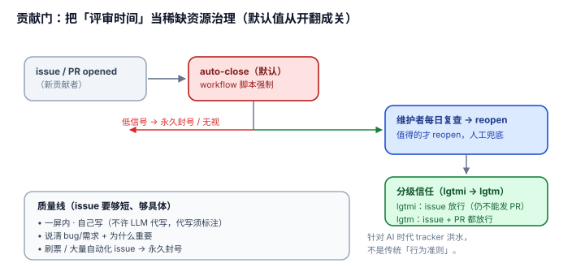

# 3.3 贡献门：auto-close + lgtm/lgtmi——把"评审时间"当稀缺资源治理的模型

## 现象是什么

pi 对 issue/PR 设了一道**自动化强制的门**，不是靠人盯：

- 新 issue/PR 默认 **auto-close**；白名单在 `.github/APPROVED_CONTRIBUTORS`，能力分级 `issue` / `pr`。
- 放行靠维护者回复 `lgtmi`（issue 放行）/ `lgtm`（issue+PR 放行），命令必须在回复开头（或末尾）。
- 周末（周五到周日）的 issue 不保证评审，紧急走 Discord。
- 无视规则两次、或自动化刷票、或大量 issue 灌水 → **永久封号**。
- 质量线：issue 必须用模板、一屏内、自己写（不许 LLM 代写，若代写须标注）、说清为什么重要。

执行落在 `.github/workflows/{issue-gate,pr-gate}.yml` 的 `github-script`，配 `issue-analysis.yml`、`issue-triage-labels.yml`、`remove-inprogress-on-close.yml` 做二次分诊。

## 核心矛盾是什么

1. **开放贡献 vs 维护者 burn-out。** AI 让"发 issue/PR"成本趋近于零，评审时间是常量。不设门，维护者被洪水淹没；设门太狠，真贡献者流失。
2. **自动化的效率 vs 误伤。** auto-close 是自动的、冷血的，可能误杀一个好 issue。所以必须有"每日人工复查 reopen"这一环兜底。

## 设计判断是什么

### 判断一：它把"维护者评审时间"显式地当成**稀缺资源**来治理（解释）

传统开源默认"开放 = 好事"，issue 越多越好。pi 反其道：**评审时间是稀缺的，低信号 issue 是在消耗它**。auto-close 不是"不欢迎"，是"给维护者一个缓冲区，让他们按自己的节奏 review tracker，再 reopen 值得的"（`CONTRIBUTING.md` FAQ 原话）。

**这是治理模型的转变**：从"来者不拒"到"先拒、再挑值得的 reopen"。默认值从"开"翻成"关"。

### 判断二：lgtm/lgtmi 是**分级信任**，不是一刀切（硬事实 + 解释）

- `lgtmi`（issue 放行）：你以后发 issue 不被 auto-close，但**仍不能发 PR**。
- `lgtm`（issue+PR 放行）：你以后 issue 和 PR 都不被 auto-close。

**深意**：信任是**分级积累**的——先证明你能提好 issue（lgtmi），再证明你能提好 PR（lgtm）。这比"人人平等、全靠 reviewer 逐条看"更省评审时间，也比"core 团队邀请制"更开放。它在"完全开放"和"完全封闭"之间造了一个阶梯。

### 判断三：它是**自动化强制**的，不是口头约定（硬事实）

`issue-gate.yml` / `pr-gate.yml` 用 `github-script` 检查作者是否在 `APPROVED_CONTRIBUTORS`、是否有对应 capability、是否是 trusted bot，不满足就 close。**"纪律被自动化强制"是本篇的核心判据**——它和 [3.1](./3.1_core_minimal.md) 的 core-minimal（价值观）不同，这里是机制。

### 判断四：这是针对 **AI 时代 tracker 洪水**设计的，不是传统"行为准则"（评价）

传统 CoC（Code of Conduct）管的是"人怎么说话"；这套门管的是"**AI 让发 issue 变成零成本后，怎么过滤掉低信号和 slop**"。`CONTRIBUTING.md` 的 FAQ 直接写了：AI 可以帮忙分组/总结/找缺失信息，但**不信任 AI 做最终维护者决策**；"automated slop, entitlement, and large volumes of low-effort reports are not [welcome]"。

**结论**：pi 在 AI 大规模生成 issue 成为现实之前，就把"反 slop"设计进了治理结构。这是一套**可复用的 AI 时代开源治理模型**，比任何"请友好发言"的 CoC 都更接近问题的本质。

## 影响是什么

1. **这是 pi 独有的、最值得抄的一篇。** 别的 harness 有 core-minimal、有测试纪律，但"auto-close + 分级 lgtm + 永久封号 + 自动化强制"这一整套 anti-AI-spam 治理，是 pi 对"AI 时代开源怎么活"给出的具体答案。
2. **它和 3.2（一条规则）是软硬两面**：一条规则是价值观（理解你的代码），贡献门是机制（不理解的 slop 进不来）。两者构成 pi 的 AI 治理双闸。
3. **治理模型直接保护了架构纪律（3.1）。** 没有贡献门挡着，core-minimal 会被"每个 PR 都想往 core 塞功能"的洪水冲垮——治理模型是架构纪律的守门人。

## 源码锚点是什么

- `CONTRIBUTING.md`：贡献门、lgtm/lgtmi、周末策略、永久封号、质量线、FAQ（为什么 auto-close）
- `.github/workflows/issue-gate.yml`：`APPROVED_CONTRIBUTORS` + `VALID_CAPABILITIES` + `TRUSTED_BOT_AUTHORS` 的 auto-close 脚本
- `.github/workflows/pr-gate.yml`：PR 侧同构的 gate
- `.github/workflows/issue-analysis.yml`、`issue-triage-labels.yml`：二次分诊
- 软层对照回指：`../03-Discipline/3.2_one_rule_ai.md`

## 最小例证是什么

**例证 1（分级信任）：** 读 `CONTRIBUTING.md` 的 "Contribution Gate" 一节——`lgtmi` 明确写 "does not grant rights to submit PRs. Only `lgtm` grants rights to submit PRs"。两级信任，一级一级放。

**例证 2（自动化强制）：** 看 `issue-gate.yml` 的脚本——未批准作者开 issue 会被 `github-script` 自动 close，且 `TRUSTED_BOT_AUTHORS` 白名单放行 dependabot/claude bot。证明"门"是机器执行的，不是人盯。

**例证 3（默认值翻转）：** 对比传统开源（issue 默认 open、靠人关）和 pi（issue 默认 auto-close、靠人 reopen）——同一个 `issue-gate.yml` 的 `on: issues: [opened]` 触发即关闭。默认值从"开"翻成"关"，这是治理模型的标志。

可观察信号：例证 1 → 信任分级积累；例证 2 → 自动化强制；例证 3 → 默认值翻转。三者同成立，才能说"这是一套治理模型，不是几条规则"。
