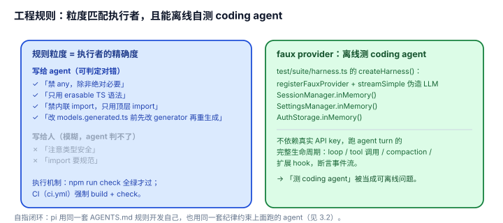

# 3.4 工程规则：规则写到 agent 能精确执行的程度，且用 faux provider 自测 coding agent

## 现象是什么

pi 的工程纪律有两个"不常见"的特征：

1. **`AGENTS.md` 是写给 agent 的，不是写给人看的**：细到"禁 `any`""只用 erasable TS 语法""禁内联 import""禁直接改 `models.generated.ts`（要改 generator 再重生成）""changelog 分区""git 多 session 并发只 stage 自己的文件""release 五步"。
2. **它有一套不调真实 LLM 就能测 coding agent 的测试 harness**：`test/suite/harness.ts` 的 `createHarness()` 用 `registerFauxProvider` + `streamSimple` 伪造模型响应，配 `SessionManager.inMemory()` / `SettingsManager.inMemory()` / `AuthStorage.inMemory()`，跑完一次 agent turn 的完整生命周期。

统一检查闸口是 `npm run check`（全绿才过）；测试分 `./test.sh`（非 e2e）和 vitest，e2e 要 endpoint/auth 环境变量才激活。**v0.85.1 起 check 链新增两个守卫**：`check:runtime-deps`、`check:entry-graphs`（`package.json:18`）——`&&` 链从 **7 步增到 9 步**。（口径提醒：按裸命令行数数是 7→9；按 `npm run` 子项口径是 5→7。这里用前者，因为它就是 `check` 脚本的实际步数。）

## 核心矛盾是什么

1. **规则要能被 agent 精确执行 vs 规则要人能读。** 写给 agent 的规则必须消除一切歧义（"不要用 any"比"注意类型安全"可执行得多），但太细又显得繁琐。
2. **测 coding agent 的真实成本 vs 覆盖度。** 真实 LLM 慢、贵、不稳定，不能进 CI 跑；但 agent 的核心逻辑（loop、tool 生命周期、compaction）不测就等于裸奔。

## 设计判断是什么

### 判断一：`AGENTS.md` 的精细度是"被 agent 开发"的必然产物（硬事实 + 解释）

pi 自己是**用 agent 开发的**（`CONTRIBUTING.md` 要求"用 agent 就从根目录跑，让它捡 `AGENTS.md`"，见 [3.2](./3.2_one_rule_ai.md)）。所以它的规则必须写到**agent 能无歧义执行**的程度：

- "禁 `any`" > "注意类型"（前者 agent 能自查，后者不能）
- "禁内联 import、只用顶层 import" > "import 要规范"
- "改 `models.generated.ts` 前先改 generator 再重生成" > "生成文件别手改"

**深意**：规则的粒度 = 执行者的精确度。给人看的规则可以模糊（人会自动补全语境），给 agent 看的规则必须每个动作都能判定对错。pi 的 `AGENTS.md` 就是"agent 可执行规则"的范本。

### 判断二：faux provider 测试 harness 把"测 coding agent"本身当成了一个工程问题来解（硬事实 + 解释）

`test/suite/harness.ts` 的 `createHarness()` 不依赖真实 API key：`registerFauxProvider` 伪造模型，`setResponses` 预设 LLM 的回复序列，然后驱动 `AgentSession` 跑 turn、tool 调用、compaction，断言事件流。

**深意**：这证明 pi 把"coding agent 的正确性"当成**可离线验证**的问题，而不是"要花钱跑真实模型才能测"。agent loop、tool 生命周期、扩展 hook、compaction 这些最难的逻辑，都能在无 token 的情况下回归。这是 coding harness 开发纪律里**最难也最值钱**的一块——大部分同类项目要么不测 agent 内核，要么只能测到"能启动"。

### 判断三：测试入口的分层是刻意的防误跑（硬事实）

`./test.sh`（仓库根）只跑非 e2e；e2e 测试**要 endpoint/auth 环境变量存在才激活**。这防止了"本地跑全量 vitest 误触发真实 API 调用"。规则本身也写进了 `AGENTS.md`（"Never run the full vitest suite directly: it includes e2e tests that activate when endpoint/auth env vars are present"）。

**深意**：这是"纪律的纪律"——连"怎么跑测试"都被规范化，防止 agent 或新人误跑出网络副作用。细节见真章。

### 判断四：这套规则是"自指"的——harness 用同一套纪律开发自己，也用同一套纪律约束上面跑的 agent（评价）

`AGENTS.md` 既是被注入给开发 pi 的 agent 的项目上下文（见 [04](../04-Self-Description/README.md)），也是给"用 pi 干活"的 agent 的规则。**同一个文件双向服务**，说明这套纪律体系是自洽的：pi 要求上面的 agent 遵守的，正是它要求开发 pi 的 agent 遵守的。

### 判断五（v0.85.1 新增物证）：纪律进一步脚本化——但"进 check 链"和"进 AGENTS.md"是两件事（硬事实 + 观察）

v0.85.1 加了三个新守卫脚本，各自有对等的 `check:*` 子脚本，但**接线位置不同**（`package.json:18-26`）：

| 脚本 | 检查什么 | 接线 |
|---|---|---|
| `scripts/check-runtime-deps.mjs`（script 名 `check:runtime-deps`，`package.json:21`） | 用 TS AST 解析每个源文件的每个非相对、非 builtin import specifier，检查它是否在该包 `package.json` 的 `dependencies`/`optionalDependencies`/`peerDependencies` 里——解决 monorepo 里靠 hoisting 从 devDependencies 偷 import 运行时依赖的问题 | **在 `npm run check` 链里**（`package.json:18`） |
| `scripts/check-entry-graphs.mjs`（script 名 `check:entry-graphs`，`package.json:26`） | 每个 `exports` 入口的模块图预算（见 [3.1](./3.1_core_minimal.md) 判断五） | **在 `npm run check` 链里**（`package.json:18`） |
| `scripts/coding-agent-consumer.mjs`（script 名 `check:package-install`，`package.json:22`） | tarball 级消费者冒烟：断言 dev-only 包（`pi-client`/`pi-protocol`/`pi-server`）不出现在外部消费者的安装闭包里 | **不在 check 链**——只被 `scripts/local-release.mjs` 直接 import 调用（`:7`、`:223`/`:231`） |

**判断**：前两条是"给 CI 看的规则要能脚本化"的正面实例。`check-runtime-deps.mjs` 尤其典型——它把"不许靠 hoisting 偷运行时依赖"这条平时只能在 review 时口头说的规则，变成了一条 AST 级的可判定断言：先构出该包允许的依赖名集合（`declared`，`.mjs:13-18` 只取 runtime 三类依赖，**不含 devDependencies**），再对每个 import/export/`require` 声明检查 specifier 是否落在这个集合里，`import type` 与 `export type` 显式跳过（`.mjs:30-56`）。第三条的接线差异也有信息量：**"每次提交跑"和"发布前跑"是两个档位**——tarball 冒烟要 pack + install，成本高，所以挂在 `local-release` 而不是 check 链。这是刻意的分级，不是遗漏。

**一个观察（硬事实）**：`AGENTS.md` 在 v0.84.4 → v0.85.1 之间**逐字节未改**（`git diff v0.84.4 v0.85.1 -- AGENTS.md` 输出为空；`CONTRIBUTING.md` 同为空），三个新守卫**一个都没写进 `AGENTS.md`**——它的 Commands 段仍然只说 `npm run check`。也就是说：**规则被脚本化了，但"agent 该知道有哪些规则"那一层没同步**。对一份"写给 agent 看"的规则文件（判断一），这是可观测的缺口：agent 跑 `npm run check` 会自动撞上守卫（好事），但它从 `AGENTS.md` 里读不到"为什么有这些守卫、新增守卫该往哪加"。

**评价**：这不是缺陷，是"文档 vs 自动化"的常见时差——规则一旦可执行，文档就不再是唯一入口。但它落在 [3.2](./3.2_one_rule_ai.md) 判断二"规则机器可读"主张的边界上：`AGENTS.md` 是规则全集这件事，在"规则持续新增"时会承受"文档滞后于自动化"的压力。判断四说的"给 CI 看的规则要能脚本化"本轮拿到了三个新实例；反过来，"脚本化的规则要回写到 agent 规则文件"这件事，pi 还没做。

## 影响是什么

1. **"策略、纪律"不仅存在，而且精细到可被 agent 执行、可被自动化验证。** 这是 `_digested/` 历史里最大的盲区之一——之前从没消化过"pi 怎么开发自己"。
2. **faux provider 测试 harness 是可复用的工程资产。** 任何想做 coding agent 的项目都该学这一手：不靠真实 token 也能回归 agent 内核。
3. **规则粒度与执行者匹配是方法论。** 给 agent 看的规则要能判定对错，给 CI 看的规则要能脚本化——pi 把两者都做了。

## 源码锚点是什么

- `AGENTS.md`（仓库根）：Code Quality（禁 any / erasable TS / 禁内联 import / 禁改 models.generated.ts）、Commands（`npm run check`、`./test.sh`）、Git 多 session 安全、release 流程
- `package.json`（仓库根）：`check` 链（L18，9 步）、`check:runtime-deps`（L21）、`check:package-install`（L22，**不在 check 链**，只在 `local-release` 里跑）、`check:entry-graphs`（L26）
- `scripts/check-runtime-deps.mjs`：TS AST 逐 import 校验运行时依赖声明（判断五）；`scripts/check-entry-graphs.mjs`：入口模块图预算；`scripts/coding-agent-consumer.mjs`：tarball 消费者冒烟（被 `scripts/local-release.mjs:7,223,231` 调用）
- `packages/coding-agent/test/suite/harness.ts`：`createHarness()`（L101）——faux provider + in-memory 三件套 + 事件收集
- `test.sh`（仓库根）：非 e2e 测试入口
- `.github/workflows/ci.yml`：`npm run build` + `npm run check` 的 CI 闸口
- 自指闭环回指：`../04-Self-Description/4.4_context_layers.md`、`../03-Discipline/3.2_one_rule_ai.md`

## 最小例证是什么

**例证 1（规则可判定对错）：** 对比 `AGENTS.md` 里的 "No `any` unless absolutely necessary" 和一句假想的"注意类型安全"——前者 agent 能 grep 自查，后者不能。pi 的规则全是前者这种可判定式。

**例证 2（无 token 测 agent）：** 读 `test/suite/harness.ts` 的 `createHarness()`——全程没有 API key，`registerFauxProvider` + `streamSimple` 伪造 LLM 响应，然后跑 `session` 一次完整 turn。证明"测 coding agent"被做成了可离线问题。

**例证 3（防误跑）：** 直接 `node vitest --run`（全量）和 `./test.sh` 的区别——前者会因 endpoint/auth 环境变量存在而激活 e2e，后者只跑非 e2e。`AGENTS.md` 明确禁止前者。证明"连怎么跑测试"都被规范化。

可观察信号：例证 1 → 规则粒度匹配执行者；例证 2 → agent 内核可离线回归；例证 3 → 测试入口分层防误跑。三者同成立，才能说"工程纪律精细且被自动化强制"。
