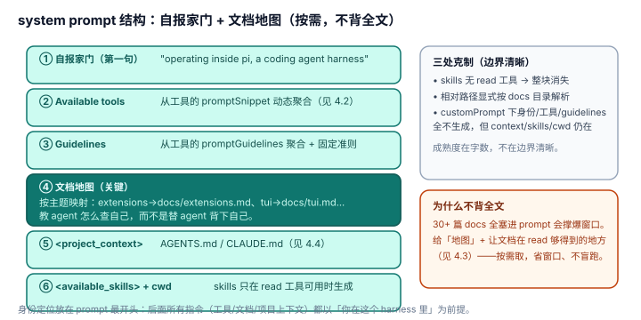

# 4.1 system prompt 自报家门：教 agent 怎么查自己，而不是替 agent 背下自己

## 现象是什么

pi 的 system prompt 第一句就自报家门（`system-prompt.ts:128`）：

> "You are an expert coding assistant operating inside pi, a coding agent harness."

随后是 `Available tools`（工具列表）、`Guidelines`（准则），再往后是一段**专门告诉 agent "pi 的文档在哪、什么时候读"**的指引（`system-prompt.ts:138-145`）：

> "Pi documentation (read only when the user asks about pi itself, its SDK, extensions, themes, skills, or TUI): Main documentation: ... Additional docs: ... Examples: ... When asked about: extensions (docs/extensions.md), themes (docs/themes.md), skills (docs/skills.md) ..."

它给的是**文档地图**，不是文档全文。

## 核心矛盾是什么

1. **给 agent 多少"关于自己"的信息 vs context 窗口成本。** 30+ 篇 docs 全塞进 system prompt 会撑爆窗口；不给又让 agent 盲跑。
2. **静态描述 vs 运行时可变。** 工具集会变（`refreshTools`、扩展动态注册）、guidelines 随工具聚合。自描述不能是一段写死的文本。

## 设计判断是什么

### 判断一：自报家门是第一句，身份先于一切（硬事实）

`system-prompt.ts:128` 的第一句同时做了两件事：告诉 agent "你是 coding agent"，告诉它 "你在 pi 这个 harness 里"。**身份定位放在 prompt 最开头**，因为后面所有指令（工具、文档、项目上下文）都以"你在这个 harness 里"为前提。

### 判断二：给"文档地图"而不是"文档全文"——这是自描述最成熟的一手（硬事实 + 解释）

pi 不把 30+ 篇 docs 塞进窗口，而是放进一段**按主题映射的文档地图**：问 extensions 读 `docs/extensions.md`、问 TUI 读 `docs/tui.md`、问 SDK 读 `docs/sdk.md`。

**深意**：这解决的是矛盾 1 的"按需"——**教 agent 怎么查自己，而不是替 agent 背下自己。** agent 需要时用 read 工具按地图去读，不需要时不占窗口。这比"把全部文档塞进 prompt"省窗口，比"完全不给文档"少盲跑。折中点选得准。

### 判断三：工具列表和 guidelines 是动态聚合的，不腐化（硬事实，延伸见 4.2）

`Available tools` 只列"提供了 snippet 的工具"（`system-prompt.ts:80-130`），guidelines 从工具的 `promptGuidelines` 聚合（`agent-session.ts:1037-1054`）。所以工具集变化时，prompt 里的工具列表和准则**自动跟着变**。

**这是自描述不腐化的底层机制**：pi 不手写一段"可用工具有 read/bash/edit/write"——那段话是从工具定义里长出来的。手写的会漂移，聚合的不会。完整论证在 [4.2](./4.2_tool_prompt_contract.md)。

### 判断四：自描述的边界也说得清楚（硬事实）

三处克制证明自描述不是"能多就多"：

- skills 块只在 read 工具可用时才生成（`system-prompt.ts:162-163`）——不给 agent 一个"能看列表但读不了"的空承诺。
- 文档指引明确"resolve docs/... under Additional docs ... not the current working directory"（`system-prompt.ts:142`）——消除相对路径歧义。
- `customPrompt` 路径下默认身份/工具/guidelines 全不生成，但 context files/skills/CWD 仍追加（`system-prompt.ts:46-72`）——调用方完全接管身份时也不丢上下文。

**深意**：自描述的成熟度不在字数，在**边界清晰**——哪些信息在什么条件下出现、相对路径怎么解析，都写进了逻辑。这是"说清楚"而不是"说得多"。

## 影响是什么

1. **对上面跑的 coding agent，pi 是一个"可自导航"的 harness。** agent 被明确告知"你是 agent、在 pi 里、有这些工具、pi 文档在这、按主题查"。这直接降低 agent 干活时的摩擦。
2. **"文档地图"模式是可复用的自描述范式**：任何 harness 都不该把全部文档塞进 prompt，而该塞一张地图 + 让文档在 read 工具够得着的地方（见 [4.3](./4.3_docs_in_package.md)）。
3. **动态聚合（判断三）是自描述不腐化的关键**，它和 [4.2](./4.2_tool_prompt_contract.md) 是同一件事的两面。

## 源码锚点是什么

- `packages/coding-agent/src/core/system-prompt.ts`：`buildSystemPrompt`（L28）、自报家门 + 文档地图（L128-145）、tools/guidelines 聚合（L80-130）、skills 闸门（L162-163）、custom prompt 分支（L46-72）
- `packages/coding-agent/src/core/agent-session.ts`：guidelines 聚合（L1037-1054）
- 机制细节回指：`../../agent/04-Harness/4.3_System_Prompt.md`

## 最小例证是什么

**例证 1（文档地图 vs 全文）：** 读 `system-prompt.ts:138-145`——它给的是 `docs/extensions.md` 这种**路径 + 主题映射**，不是 extensions.md 的正文。证明"教 agent 查"而非"替 agent 背"。

**例证 2（动态聚合）：** 把 `selectedTools` 改成 `["bash","edit","write"]`（去掉 read）再跑 `buildSystemPrompt`——`<available_skills>` 整块消失，但 "Available tools" 和文档指引仍在。证明工具列表和 skills 块是动态聚合，不是手写死文本。

**例证 3（边界清晰）：** 看 `customPrompt` 分支（`system-prompt.ts:46-72`）——默认身份/工具/guidelines 不生成，但 context files/skills/CWD 仍追加。证明"自描述在什么条件下退让"也被写清楚了。

可观察信号：例证 1 → 按需自述（省窗口）；例证 2 → 动态聚合（不腐化）；例证 3 → 边界清晰（说清楚而非说得多）。三者同成立，才能说"system prompt 把自己说清楚了"。
