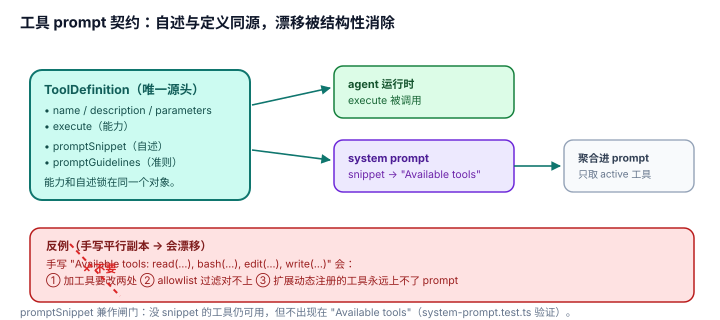

# 4.2 工具 prompt 契约：自描述与定义同源——"Available tools"永远不会漂移

## 现象是什么

每个工具的 LLM 自描述不是写在 system prompt 里，而是**作为字段挂在工具定义上**：

- `ToolDefinition` 有 `promptSnippet`（一行能力描述）和 `promptGuidelines`（使用准则），`extensions/types.ts:459/461`。
- 内置工具每个都挂了：`bash.ts:333`、`read.ts:219`、`edit.ts:326`、`write.ts:197`。
- 第三方扩展 `registerTool` 时同样可以带（`extensions/types.ts:459`，`examples/extensions/dynamic-tools.ts` 就是带 snippet + guidelines 的例子）。

这些字段由 `buildSystemPrompt` 聚合进 "Available tools" 和 "Guidelines"（`system-prompt.ts:80-130`，`agent-session.ts:1070-1081`）。

## 核心矛盾是什么

1. **工具集是运行时可变的**（`refreshTools`、扩展动态注册、allowlist 过滤），但 LLM 需要在每次请求前知道"现在有哪些工具、怎么用"。
2. **"工具能干什么"和"工具对 LLM 怎么自述"是两个本会漂移的事实。** 如果自述写在 prompt 组装代码里、能力写在工具实现里，改一处忘另一处，prompt 里的工具描述就 stale 了。

## 设计判断是什么

### 判断一：这是 single-source-of-truth 用在 agent 自描述上（硬事实 + 解释）

工具的**能力**（`execute`、`parameters`）和**自述**（`promptSnippet`、`promptGuidelines`）锁在同一个 `ToolDefinition` 对象里。`buildSystemPrompt` 从工具定义里**读** snippet，而不是维护一份平行的"工具描述文本"。

**深意**：这消灭了一整类漂移——"prompt 里说工具 A 能做 X，但工具 A 的实现其实早改成 Y 了"。当自述和能力同源时，改能力必然改自述（同一个对象），LLM 侧的 "Available tools" 段落**永远不可能和真实工具集脱节**。

### 判断二：这是 [1.1](../01-Architecture/1.1_three_tier_seams.md) 里"consistency-deep"的完整展开（解释）

`1.1_three_tier_seams.md` 判断三提到 tool factory 的深度是"把自述和定义同源"，本节把它展开成完整论证：

- **不腐化**：手写 prompt 工具列表会随工具演进变 stale；同源字段不会。
- **第三方零成本自述**：一个扩展作者 `registerTool({ name, description, parameters, promptSnippet, execute })`，它的工具就自动出现在 LLM 的 "Available tools" 里，**不需要作者去改任何 prompt 组装代码**。
- **可扩展性的隐性收益**：这呼应 [01-Architecture](../01-Architecture/README.md) 的"统一注入点"——能力注入和自述注入是同一次调用。

### 判断三：design-it-twice——如果自述不放在工具定义上会烂在哪（解释）

假设 pi 手写一段 system prompt："Available tools: read (read files), bash (run commands), edit (exact replace), write (overwrite)"。会发生：

1. **加工具要改两处**：工具注册代码 + 这段 prompt 文本，忘一处就漏。
2. **allowlist 过滤时对不上**：如果用户只启用 `read`+`bash`，手写的四行列表不会自动缩成两行，LLM 会看到不存在的工具。
3. **扩展动态注册的工具进不来**：手写列表只覆盖内置工具，扩展 `registerTool` 的工具永远上不了 prompt。

**pi 的同源设计一次解决三个**：加工具只改定义（snippet 自动进 prompt）、allowlist 自动反映（聚合只取 active 工具）、扩展工具自动可见。

### 判断四：`promptSnippet` 还承担"闸门"角色（硬事实）

`buildSystemPrompt` 只列"提供了 snippet 的工具"（`system-prompt.ts:80-130`），一个都没提供时显示 `(none)`。测试明确验证了这点（`system-prompt.test.ts`："omits custom tools from available tools section when promptSnippet is not provided"）。

**深意**：`promptSnippet` 不只是"描述"，它是"这个工具要不要在 prompt 里出现"的**开关**。没有 snippet 的工具仍然可用，但不出现在 "Available tools"——这是"自述"和"可见性"绑定的另一面。

## 影响是什么

1. **这是 pi 自描述里最深邃的一处**：它把"防止描述漂移"从"纪律要求"变成了"结构性不可能"——因为描述和能力同源，漂移在物理上被消除了，而不是靠人记得更新。
2. **第三方扩展的自述是免费的**：只要写 `promptSnippet`，工具就自动对 LLM 可见，不需要理解 system prompt 组装逻辑。
3. **这是可迁移的设计原则**：任何"给 agent 暴露动态能力集"的系统，都该把"能力自述"做成能力定义的一个字段，而不是单独维护一份列表。

## 源码锚点是什么

- `packages/coding-agent/src/core/extensions/types.ts`：`ToolDefinition.promptSnippet`/`promptGuidelines`（L459/461）
- `packages/coding-agent/src/core/tools/bash.ts`：`promptSnippet`/`promptGuidelines`（L333-334）；`read.ts:219`、`edit.ts:326`、`write.ts:197` 同构
- `packages/coding-agent/src/core/system-prompt.ts`：tools/guidelines 聚合（L80-130）——从定义读 snippet，非手写
- `packages/coding-agent/src/core/agent-session.ts`：guidelines 聚合（L1070-1081）
- `packages/coding-agent/test/system-prompt.test.ts`：无 snippet 时从 "Available tools" 省略的验证
- 三层接缝的"consistency-deep"回指：`../01-Architecture/1.1_three_tier_seams.md`

## 最小例证是什么

**例证 1（同源）：** 看 `bash.ts:333`——`promptSnippet` 是 `ShellToolConfig` 的一个字段，`createShellToolDefinition`/`createBashToolDefinition` 把它写进返回对象，和 `execute` 在同一个对象里。再看 `system-prompt.ts:80`——"Available tools" 从这些字段聚合。证明"自述"和"能力"同源，没有平行的第二份文本。

**例证 2（design-it-twice 的坏结果）：** 想象手写 "Available tools" 文本，然后用户 allowlist 只启用 `read`+`bash`——手写四行不会缩成两行。而 pi 的聚合版会自动缩（只取 active 工具的 snippet）。这个"自动缩"就是同源设计避免了 stale 的直接证据。

**例证 3（snippet 是闸门）：** 注册一个不带 `promptSnippet` 的自定义工具，跑 `buildSystemPrompt`——它不出现在 "Available tools"，但工具本身可用。证明 `promptSnippet` 兼作"是否对 LLM 自述"的开关。

可观察信号：例证 1 → 同源（不漂移）；例证 2 → 聚合版自动反映 allowlist（防 stale）；例证 3 → snippet 兼作可见性闸门。三者同成立，才能说"自描述和定义锁在一起、永不腐化"。
