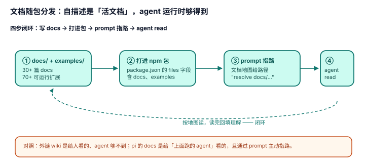

# 4.3 文档随包分发：自描述是"活文档"，agent 运行时够得到

## 现象是什么

pi 的 docs 和 examples 不是仓库里的摆设，而是**打进 npm 包、在 agent 运行时够得着**：

- `package.json` 的 `files` 字段明确包含 `docs`、`examples`（还有 `containerization.md`、`CHANGELOG.md`）。
- `docs/` 有 30+ 篇（extensions/sdk/tui/themes/skills/packages/rpc/security…），`examples/extensions/` 有 70+ 个可运行扩展。
- system prompt 的文档地图（`system-prompt.ts:138-145`）指向的正是这些**随包路径**。

## 核心矛盾是什么

1. **文档质量 vs 文档可达性。** 写得好但 agent 读不到 = 白写。可达性取决于"文档是不是在 read 工具够得到的地方 + prompt 有没有给对路径"。
2. **文档是"外链"还是"活文档"。** 指向 GitHub 的链接在离线/受限环境读不到；打进包的文档随安装一起落盘，永远够得到。

## 设计判断是什么

### 判断一：docs/examples 打进 `files` 是"可达性"的硬保证（硬事实）

`package.json` 的 `files` 字段决定 npm tarball 里有什么。pi 把 `docs` 和 `examples` 放进去，意味着**任何人 `npm install @earendil-works/pi-coding-agent` 后，本机就有完整文档和示例**，read 工具读的是本地文件，不是网络请求。

**深意**：这解决的是矛盾 2。自描述的质量不只看"写了多少文档"，还看"文档是不是 agent 运行时够得到"。pi 的答案是"打进包 + prompt 给路径"，形成闭环。

### 判断二：system prompt 的文档地图 + 随包文档 = 闭环（硬事实 + 解释）

[4.1](./4.1_system_prompt_self.md) 判断二说的"文档地图"要成立，前提是地图指向的文档**真的在 agent 够得着的地方**。`system-prompt.ts:142` 明确写"resolve docs/... under Additional docs ... not the current working directory"——因为 docs 在包的安装目录里，不在用户的 cwd。

**闭环**：prompt 给路径 → 路径指向随包 docs → read 工具能读 → agent 按地图查自己。缺"随包"这一环，地图就指向了不存在的文件。

### 判断三：examples 是"可运行的文档"，不是散文（硬事实 + 解释）

`examples/extensions/` 的 70+ 个扩展**都是能跑的真代码**（`pi -e examples/extensions/permission-gate.ts`），不是"文档里贴一段伪代码"。`examples/extensions/README.md` 是一张"按场景找实现"的表。

**深意**：对 coding agent 来说，可运行的 example 比散文文档信息密度高得多——agent 可以 read 一个真实扩展，直接看到 `registerTool`/`on("tool_call")` 的完整用法，甚至照着改。这是"自描述"里最实操的一层。

### 判断四：这是"harness 自己当自己的文档"的闭环（评价）

pi 没有把文档外包给一个外部 wiki，而是：**写 docs → 打进包 → prompt 指路径 → agent read**。整条链都在 harness 内部闭环。

**这和一个普通开源项目写 wiki 的区别**：wiki 是给人看的、agent 够不到；pi 的 docs 是给"上面跑的 agent"看的、且通过 prompt 主动指路。自描述的"自觉"就体现在这——它知道自己是 harness，知道自己上面会有 agent，所以把文档做成了 agent 可消费的形态。

## 影响是什么

1. **对 agent 来说，pi 是一个"自带说明书且告诉你说明书在哪"的工具。** 想深入就 read，路径已给。
2. **"随包"是自描述闭环的必要环节**：没有它，[4.1](./4.1_system_prompt_self.md) 的文档地图就断了。
3. **examples 的可运行性是隐性资产**：它把"扩展怎么写"从"读文档猜"变成"读真代码抄"，这是 coding agent 最擅长消费的形态。

## 源码锚点是什么

- `packages/coding-agent/package.json`：`files` 字段含 `docs`、`examples`
- `packages/coding-agent/src/core/system-prompt.ts`：文档地图（L138-145）+ 相对路径解析指引（L142）
- `packages/coding-agent/docs/`：30+ 篇文档（extensions/sdk/tui/themes/skills/packages/…）
- `packages/coding-agent/examples/extensions/README.md`：按场景找实现的索引
- 文档地图的机制回指：`../04-Self-Description/4.1_system_prompt_self.md`

## 最小例证是什么

**例证 1（随包可达）：** `npm pack` 看 `@earendil-works/pi-coding-agent` 的 tarball 内容——含 `docs/extensions.md` 和 `examples/extensions/`。证明 docs/examples 真的在包里，不是外链。

**例证 2（路径闭环）：** 看 `system-prompt.ts:138-145` 的文档指引，再对照 `package.json` 的 `files`——指引指向的 `docs/extensions.md` 等路径正是 `files` 打进去的路径。证明 prompt 地图指向的文件真实存在。

**例证 3（可运行 example）：** `pi -e examples/extensions/permission-gate.ts` 跑起来——它拦截危险 bash 命令。证明 examples 是可运行的真代码，不是文档里的伪代码片段。

可观察信号：例证 1 → docs 随包（可达）；例证 2 → prompt 路径闭环（不悬空）；例证 3 → examples 可运行（可抄）。三者同成立，才能说"自描述是活文档，agent 运行时够得到"。
