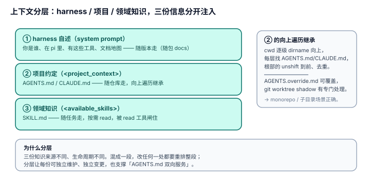

# 4.4 上下文分层：harness 自述 / 项目约定 / 领域知识，三份信息分开注入

## 现象是什么

agent 拿到的"关于自己处境的信息"不是一段大杂烩，而是三层分开注入：

1. **harness 自述**（system prompt）：你是谁、在 pi 里、有这些工具、pi 文档在哪——`system-prompt.ts:128-145`。
2. **项目约定**（`<project_context>` 块）：当前项目自己的 `AGENTS.md`/`CLAUDE.md`——`system-prompt.ts:160`（v0.86.1 重锚，旧 :153-158；`renderProjectContext` 生成）。
3. **领域知识**（`<available_skills>` + read 按需取）：`SKILL.md` 的领域指令——`system-prompt.ts:161-165`（v0.86.1 重锚，旧 :162-163）。

项目约定的发现逻辑在 `resource-loader.ts`：`loadProjectContextFiles`（L119）从 cwd 向上遍历到根，收集 `AGENTS.override.md` / `AGENTS.md` / `CLAUDE.md`（`loadContextFileFromDir` L71-72 的候选表），加上全局 agentDir 的一份，去重、处理 worktree shadow 后返回。

## 核心矛盾是什么

1. **harness 的知识 vs 项目的知识 vs 领域的知识，三种来源不同、生命周期不同。** harness 自述随版本走（随包 docs）；项目约定随仓库走（`AGENTS.md` 在 repo 里）；领域知识随任务走（skill 按需取）。混成一段，改任何一处都要重排整段。
2. **"项目怎么说自己" 要能在 cwd 任意深处生效。** agent 可能在 repo 的子目录里跑，但 repo 根部的 `AGENTS.md` 约定仍然要注入。

## 设计判断是什么

### 判断一：三种知识被分成三个独立的注入块，而不是拼进一段（硬事实）

`buildSystemPrompt` 的结构是顺序追加：身份+工具+文档地图 → `<project_context>`（`system-prompt.ts:160`）→ `<available_skills>`（`system-prompt.ts:161-165`）→ cwd。

**深意**：分层是**结构化**的——`<project_context>` 包一层，其内每个 `<project_instructions path="...">` 子元素带 `path` 属性（`coding-agent/src/core/system-prompt.ts:76`，v0.86.1 重锚）、`<available_skills>` 有 name/description/location 字段。agent 读到的是"三份可区分的结构化信息"，不是"一段混着 harness 说明、项目规则、领域知识的散文"。这对应 [04-README](../04-Self-Description/README.md) 的"分层"判据。

### 判断二：项目上下文是"向上遍历 + 去重"的继承语义（硬事实 + 解释）

`loadProjectContextFiles` 从 cwd 逐级 `dirname` 向上，每层找 `AGENTS.md`/`CLAUDE.md`，`unshift` 保证"根部的在前"，去重（`seenPaths`），还处理了 git worktree 的 shadow 情况（`findShadowedContextFile`）。

**深意**：这实现的是"约定继承"——repo 根部的 `AGENTS.md` 对任何子目录生效，且子目录可以有自己的 `AGENTS.override.md`（候选表里它排第一）来覆盖。**项目"怎么说自己"是分层继承的，不是只有 cwd 一层。** 这是解决矛盾 2 的机制。

### 判断三：harness 自述和项目约定被刻意分开——这呼应 [03-Discipline](../03-Discipline/README.md) 的"AGENTS.md 双向服务"（解释）

`AGENTS.md` 既是"开发 pi 时给 agent 的规则"（`CONTRIBUTING.md` 要求从根目录跑、捡起 `AGENTS.md`），也是"用 pi 干活时给 agent 的项目约定"（`resource-loader.ts` 注入 `<project_context>`）。**同一个文件双向服务**，靠的正是"harness 自述（system prompt）"和"项目约定（context files）"分层——如果混成一段，这个双向服务就做不到了。

### 判断四：skills 是"目录 + 按需取"的第三层，被 read 工具闸住（硬事实，机制见 `agent/04-Harness/4.2_Skills.md`）

skills 不进 prompt 正文，只进 `<available_skills>` 目录；agent 需要时用 read 工具读 `SKILL.md` 全文。且 skills 块只在 read 工具可用时才生成（`system-prompt.ts:161-165`，v0.86.1 重锚）。

**深意**：第三层（领域知识）的注入成本是**按需**的——目录占极小窗口，正文在 agent 决定用时才 read。这和 harness 自述的"文档地图"（4.1）是同一个"按需"哲学，用在知识上。

## 影响是什么

1. **agent 拿到的是三份结构化信息，不是一段大杂烩**：你是谁/在哪/有什么工具（harness）→ 这个项目有什么约定（project）→ 有哪些领域知识可用（skills）。分层让每份信息可独立维护、独立变更。
2. **"项目约定继承"让 pi 在 monorepo / 子目录场景下仍然正确**：cwd 在深处也能继承根部的 `AGENTS.md`，且子目录能 override。
3. **这呼应并放大了 [03-Discipline](../03-Discipline/README.md) 的自指性**：pi 用同一套 `AGENTS.md` 机制同时服务"开发 pi"和"用 pi"两个方向，靠的是分层的清晰。

## 源码锚点是什么

- `packages/coding-agent/src/core/resource-loader.ts`：`loadContextFileFromDir`（L71，候选表）、`loadProjectContextFiles`（L119，向上遍历 + 去重 + worktree shadow）、`findShadowedContextFile`（L101）
- `packages/coding-agent/src/core/system-prompt.ts`：`<project_context>` 追加（L153-158）、`<available_skills>` 闸门（L162-163）
- `packages/coding-agent/src/core/skills.ts`：`formatSkillsForPrompt`（L355）——skills 目录的生成
- 机制细节回指：`../../agent/04-Harness/4.2_Skills.md`、`../../agent/04-Harness/4.3_System_Prompt.md`
- 双向服务回指：`../03-Discipline/3.2_one_rule_ai.md`

## 最小例证是什么

**例证 1（三块分离）：** 看 `buildSystemPrompt` 的组装顺序——身份/工具/文档地图是一段，`<project_context>` 是独立块（带 `path` 属性），`<available_skills>` 是独立块（带 name/location）。三块结构化分离，不是拼进一段散文。

**例证 2（向上遍历继承）：** 在一个 repo 的子目录里启动 pi，看 system prompt 的 `<project_context>`——repo 根部的 `AGENTS.md` 内容出现在里面，尽管 cwd 在深处。证明"约定继承"不是只有 cwd 一层。

**例证 3（skills 按需）：** 把 `selectedTools` 去掉 read，`<available_skills>` 整块消失；加回 read，整块回来。证明第三层（领域知识）被 read 工具闸住，是按需注入的。

可观察信号：例证 1 → 分层结构化；例证 2 → 项目约定继承；例证 3 → 领域知识按需。三者同成立，才能说"harness/项目/领域三份信息分层注入、互不污染"。
