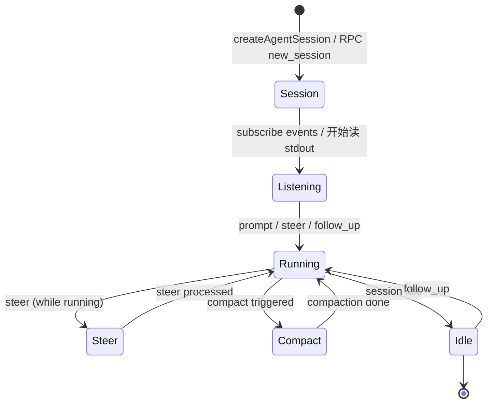

# 03 Runtime API：SDK/RPC 调用顺序

## 最小闭环

一个无 TUI harness 的最小闭环是：

1. 创建 Session（SDK `createAgentSession` 或 RPC `new_session`）。
2. 订阅事件（SDK `session.on("event", ...)` 或 RPC stdout 事件流）。
3. 发送 prompt（SDK `session.prompt()` 或 RPC `{"type":"prompt",...}`）。
4. 处理事件、权限和 compaction。
5. 等到 session idle。

这不是伪流程。pi-mono 自己的 interactive mode 也走类似路线：创建 AgentSession、订阅事件、通过 prompt/steer/followUp 发送用户输入、根据事件渲染 TUI。

## 1. SDK 路线：in-process

### 创建 session

```ts
import { createAgentSession } from "pi-mono/coding-agent"

const session = await createAgentSession({
  cwd: "/path/to/project",        // 项目目录
  model: myModel,                  // pi-ai Model 实例
  thinkingLevel: "medium",         // "off" | "low" | "medium" | "high"
  tools: ["read", "bash", "edit", "write"],  // 可选：工具白名单
  noTools: undefined,              // 可选："all" | "builtin"
  customTools: [],                 // 可选：自定义 ToolDefinition[]
})
```

`CreateAgentSessionOptions` 定义在 [`packages/coding-agent/src/core/sdk.ts`](../../packages/coding-agent/src/core/sdk.ts)，包含了 cwd、model、auth、tools、extension 等所有初始化参数。

### 发送 prompt

```ts
// 初始 prompt
const result = await session.prompt("fix the failing tests in src/auth.ts")

// 在当前 turn 中调整方向
await session.steer("use vitest, not jest")

// 新起一轮 follow-up
await session.followUp("also add tests for the edge case we discussed")

// 取消当前操作
await session.abort()
```

每个 prompt 调用返回的结果包含 `messageId`、`turnId` 等元信息。

### 订阅事件

```ts
session.on("event", (event: AgentEvent) => {
  switch (event.type) {
    case "message.updated":
      // 消息元信息更新
      break
    case "message.part.updated":
      // text, tool, reasoning 等 part 流式更新
      break
    case "turn.started":
      // 新 turn 开始
      break
    case "turn.ended":
      // turn 结束
      break
    case "tool.started":
      // 工具开始执行
      break
    case "tool.ended":
      // 工具执行完成
      break
    case "session.status":
      // 状态变化：running / idle / busy
      break
    case "session.error":
      // 错误事件
      break
  }
})
```

### session 管理操作

```ts
// Compaction
await session.compact()
await session.setAutoCompaction(true)

// Session 树
await session.fork(entryId)
await session.cloneSession()
await session.switchSession(sessionPath)

// 查询
const stats = await session.getSessionStats()     // tokens, 消息数
const msgs = await session.getMessages()           // 消息列表
const text = await session.getLastAssistantText()  // 最后 assistant 文本

// 导出
await session.exportHtml({ outputPath: "/tmp/session.html" })

// Bash 直接执行
const bashResult = await session.bash("npm test")
```

## 2. RPC 路线：subprocess

### 启动 agent

```bash
node dist/cli.js --mode rpc --provider anthropic --model claude-sonnet-4-6
```

进程启动后，通过 stdin 发送命令，stdout 读取响应。

RPC 客户端封装在 [`packages/coding-agent/src/modes/rpc/rpc-client.ts`](../../packages/coding-agent/src/modes/rpc/rpc-client.ts)，非 JS 宿主需要自己实现 JSONL 成帧。

### 基础调用序列

```
→ {"type":"prompt","message":"fix the failing tests in src/auth.ts"}
← {"type":"event","event":{"type":"turn.started",...}}
← {"type":"event","event":{"type":"message.updated",...}}
← {"type":"event","event":{"type":"message.part.updated","part":{"type":"text","text":"I'll start by reading the test file..."}}}
← {"type":"event","event":{"type":"tool.started","toolName":"read",...}}
← {"type":"event","event":{"type":"tool.ended","toolName":"read",...}}
← {"type":"event","event":{"type":"message.part.updated","part":{"type":"text","text":"Now I'll edit the file..."}}}
← {"type":"event","event":{"type":"tool.started","toolName":"edit",...}}
← {"type":"event","event":{"type":"tool.ended","toolName":"edit",...}}
← {"type":"event","event":{"type":"turn.ended",...}}
← {"type":"ended","id":null,"payload":{"messageId":"..."}}
```

### 调整方向（steer）

在 prompt 仍在执行时，可以发送 steer 调整 Agent 方向：

```
→ {"type":"steer","message":"use vitest, not jest"}
```

steer 不会新起 turn，而是在当前 turn 内注入修正指令。

### follow-up

当前轮完成后，起新轮：

```
→ {"type":"follow_up","message":"also add tests for the edge case"}
```

### abort

```
→ {"type":"abort"}
```

取消正在运行的 prompt/steer/follow_up。

### 状态查询

```
→ {"id":"req-1","type":"get_state"}
← {"type":"response","id":"req-1","payload":{"status":"running","sessionId":"...","...}}
```

### 模型管理

```
→ {"type":"get_available_models"}
← {"type":"response","payload":[{"provider":"anthropic","id":"claude-sonnet-4-6","contextWindow":200000,"reasoning":true},...]}

→ {"type":"set_model","provider":"openai","modelId":"gpt-5"}
→ {"type":"cycle_model"}
→ {"type":"set_thinking_level","level":"high"}
→ {"type":"cycle_thinking_level"}
```

### compaction

```
→ {"type":"compact","customInstructions":"focus on the auth module changes"}
→ {"type":"set_auto_compaction","enabled":true}
```

### session 操作

```
→ {"type":"new_session","parentSession":"path/to/session"}
→ {"type":"fork","entryId":"entry_abc123"}
→ {"type":"clone"}
→ {"type":"switch_session","sessionPath":"path/to/other"}
→ {"type":"set_session_name","name":"auth-fix"}
→ {"type":"get_session_stats"}
← {"type":"response","payload":{"tokenCount":45000,"messageCount":23,...}}

→ {"type":"export_html","outputPath":"/tmp/session.html"}
→ {"type":"get_messages"}
→ {"type":"get_last_assistant_text"}
```

### bash 直接执行

```
→ {"type":"bash","command":"npm test"}
← {"type":"event","event":{"type":"bash.output","stdout":"...","stderr":"..."}}
← {"type":"response","id":null,"payload":{"exitCode":0,"...}}
→ {"type":"abort_bash"}
```

### 队列模式

```
→ {"type":"set_steering_mode","mode":"one-at-a-time"}
→ {"type":"set_follow_up_mode","mode":"all"}
```

控制 steering 和 follow-up 是否串行化（`one-at-a-time`）还是并发处理（`all`）。

### 重试控制

```
→ {"type":"set_auto_retry","enabled":true}
→ {"type":"abort_retry"}
```

## 3. 完成判断

最稳的完成信号：

- SDK：`session.status` 变为 `"idle"`，或 prompt/steer/followUp 返回的 Promise resolve。
- RPC：收到 `{"type":"ended",...}` 消息。

## 最小状态机



## JSONL 成帧注意事项

跨语言实现 RPC client 时，记住：

- **只用 LF (`\n`) 分割记录**。不要用 `\r\n`、U+2028、U+2029 或任何其他分隔符。
- **每条命令/响应是一行**。多行文本（如代码）在 JSON 字符串内，LF 在 JSON 字符串内会被转义为 `\n`，不会破坏成帧。
- **没有消息长度前缀**。协议是纯粹的 JSONL。
- **stdin 和 stdout 是独立的**。可以同时写命令和读事件，不需要锁。

JSONL 实现参考：[`packages/coding-agent/src/modes/rpc/jsonl.ts`](../../packages/coding-agent/src/modes/rpc/jsonl.ts)
