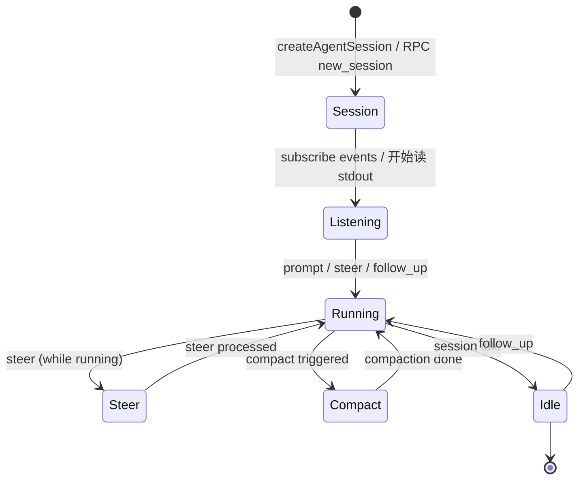

# 03 Runtime API：SDK/RPC 调用顺序

## 最小闭环

一个无 TUI harness 的最小闭环是：

1. 创建 Session（SDK `createAgentSession` 或 RPC `new_session`）。
2. 订阅事件（SDK `session.subscribe(listener)` 或 RPC stdout 事件流）。
3. 发送 prompt（SDK `session.prompt()` 或 RPC `{"type":"prompt",...}`）。
4. 处理事件、权限和 compaction。
5. 等到 session idle。

这不是伪流程。pi-mono 自己的 interactive mode 也走类似路线：创建 AgentSession、订阅事件、通过 prompt/steer/followUp 发送用户输入、根据事件渲染 TUI。

## 1. SDK 路线：in-process

### 创建 session

```ts
import { createAgentSession } from "@earendil-works/pi-coding-agent"

const { session } = await createAgentSession({  // 返回 { session, extensionsResult, modelFallbackMessage? }，需解构
  cwd: "/path/to/project",        // 项目目录
  model: myModel,                  // pi-ai Model 实例
  thinkingLevel: "medium",         // "off" | "minimal" | "low" | "medium" | "high" | "xhigh" | "max"
  scopedModels: [                  // 可选：Ctrl+P 模型轮换范围
    { model: opusModel, thinkingLevel: "xhigh" },
    { model: haikuModel },
  ],
  tools: ["read", "bash", "edit", "write"],  // 可选：工具白名单
  excludeTools: ["bash"],          // 可选：工具黑名单（在 tools 之后应用）
  noTools: undefined,              // 可选："all" | "builtin"（默认工具抑制模式）
  customTools: [],                 // 可选：自定义 ToolDefinition[]
  modelRuntime: myRuntime,         // 可选：统一的 model/auth runtime（替代旧 authStorage + modelRegistry）
  sessionStartEvent: myMetadata,   // 可选：session 启动时传给 extension 的元数据
})
```

`CreateAgentSessionOptions` 定义在 [`packages/coding-agent/src/core/sdk.ts`](../../packages/coding-agent/src/core/sdk.ts)（sdk.ts:41）。返回 `{ session, extensionsResult, modelFallbackMessage? }`（sdk.ts:96-99），要解构出 `session`。v0.75.3→v0.83.0 的重要变化：**`modelRuntime` 替代了旧的 `authStorage` + `modelRegistry`**（`ModelRegistry` 仍在，但已降级为暴露给 extension 的同步 facade，见 [`agent/05-Infra/5.2_AI_Auth_Subsystem.md`](../agent/05-Infra/5.2_AI_Auth_Subsystem.md)）；新增 `scopedModels`、`excludeTools`、`sessionStartEvent`。

### 发送 prompt

```ts
// 初始 prompt
await session.prompt("fix the failing tests in src/auth.ts")  // prompt() 返回 void

// 在当前 turn 中调整方向
await session.steer("use vitest, not jest")

// 新起一轮 follow-up
await session.followUp("also add tests for the edge case we discussed")

// 取消当前操作
await session.abort()
```

（旧版文档说 prompt 返回含 `messageId`/`turnId` 的结果——v0.86.1 的 `AgentSession.prompt()` 签名是 `Promise<void>`（agent-session.ts:1296），不返回这些；消息 id 从 `message_start`/`message_end` 事件里拿。）

### 订阅事件

```ts
// 订阅：AgentSession.subscribe(listener)（agent-session.ts:893），返回取消函数；
// 注意没有 EventEmitter 风格的 .on("event", ...)。SDK 订阅拿到的是完整 AgentSessionEvent
// （message_update 带累积 message）；JSON/RPC wire 上会被 toJsonEvent() 裁成纯 delta。
session.subscribe((event: AgentSessionEvent) => {
  switch (event.type) {
    case "message_start":
      // 一条消息开始（user/assistant/toolResult 都有）
      break
    case "message_update":
      // assistant 流式更新：event.assistantMessageEvent 是单个 delta
      break
    case "message_end":
      // 消息定稿（权威版本）
      break
    case "turn_start":
      // 新 turn 开始
      break
    case "turn_end":
      // turn 结束（带 message + toolResults）
      break
    case "tool_execution_start":
      // 工具开始执行
      break
    case "tool_execution_update":
      // 长运行工具的中间输出（partialResult）
      break
    case "tool_execution_end":
      // 工具执行完成（result + isError）
      break
    case "agent_settled":
      // agent run 完全结束（v0.83.0 新增，与 agent_end 并存，不是替代）
      // agent_end 仍是 run 边界（带 willRetry）；agent_settled 在其后、无 pending retries/compactions/continuations 时触发
      // 用于 idle 检测
      break
    case "bash_execution_update":
      // bash 执行过程中的流式输出更新（v0.83.0 新增）
      break
    case "queue_update":
      // steering / followUp 队列变化
      break
    case "auto_retry_start":
    case "auto_retry_end":
      // provider 错误自动重试（v0.84 常见，注意 agent_end 的 willRetry）
      break
  }
})
```

### session 管理操作

> 方法名已对照 v0.86.1 源码逐条核对（`agent-session.ts`）。两处名称差异：**`bash()` 实际是 `executeBash()`**（`agent-session.ts:3125`，带 `onChunk` 回调、`operations` 可插拔）；**`cloneSession()` 不存在**——SDK 层 fork 在 `session.sessionManager` 上（RPC 的 `clone` 走 `runtimeHost.fork(leafId, { position: "at" })`，rpc-mode.ts:616-631）。

```ts
// Compaction
await session.compact()                      // agent-session.ts:2089
await session.setAutoCompactionEnabled(true) // 注意：不是 setAutoCompaction
await session.abortBranchSummary()           // 取消 branch summary（agent-session.ts:2258）

// Session 树
await session.sessionManager.fork(entryId)   // SDK 层 fork 在 SessionManager 上
await session.sessionManager.fork(session.sessionManager.getLeafId(), { position: "at" }) // 等价 RPC clone
await session.sessionManager.switchSession(sessionPath)   // 等价 RPC switch_session
session.setSessionName("auth-fix")          // 命名 session（agent-session.ts:3233）

// 查询
const stats = await session.getSessionStats()     // tokens, 消息数（agent-session.ts:3479）
const msgs = session.messages                     // getter：消息列表（agent-session.ts:1045），无 getMessages()
const text = session.getLastAssistantText()       // 最后 assistant 文本（agent-session.ts:3648）
const usage = session.getContextUsage()            // context 窗口使用情况（agent-session.ts:3533）
const forkMsgs = session.getUserMessagesForForking() // fork 候选消息（agent-session.ts:3457）
void session.prompt(text, { images, streamingBehavior: "steer" })  // PromptOptions（agent-session.ts:253）

// 队列
const cleared = session.clearQueue()         // v0.84.4 新增（agent-session.ts:1727）：清空 steering/followUp，返回被清掉的文本

// 导出
await session.exportToHtml({ outputPath: "/tmp/session.html" }) // 实际方法名 exportToHtml
await session.exportToJsonl("/tmp/session.jsonl")  // 返回 string（agent-session.ts:3610）

// Bash 直接执行
const bashResult = await session.executeBash("npm test")  // 方法名是 executeBash，不是 bash（agent-session.ts:3125）

// 工具管理
const allTools = session.getAllTools()            // 所有已注册工具
const active = session.getActiveToolNames()       // 当前激活的工具名列表
session.setActiveToolsByName(["read", "write"])   // 动态切换工具（v0.83.0 新增）

// 模型管理
session.setScopedModels([                         // 设置模型轮换范围（v0.83.0 新增）
  { model: opusModel, thinkingLevel: "xhigh" },
])

// 扩展
session.hasExtensionHandlers("project_trust")     // 检查扩展是否处理某事件（v0.83.0 新增）

// 收尾
session.dispose()                                  // 取消所有运行 + 断开 agent + 清空 listeners（agent-session.ts:917）
```

（再核对一次：SDK 侧事件用 `session.subscribe()`；模型读取用 `session.state`/`session.model`/`session.thinkingLevel` getter；所有"方法级"列举以上面注释的行号为准。）

## 2. RPC 路线：subprocess

### 启动 agent

```bash
node dist/cli.js --mode rpc --provider anthropic --model claude-sonnet-4-6
```

进程启动后，通过 stdin 发送命令，stdout 读取响应。

RPC 客户端封装在 [`packages/coding-agent/src/modes/rpc/rpc-client.ts`](../../packages/coding-agent/src/modes/rpc/rpc-client.ts)，非 JS 宿主需要自己实现 JSONL 成帧。

### 基础调用序列

```
→ {"type":"prompt","message":"fix the failing tests in src/auth.ts"}
← {"type":"event","event":{"type":"turn_start",...}}
← {"type":"event","event":{"type":"message_start","message":{...}}}
← {"type":"event","event":{"type":"message_update","usage":{...},"assistantMessageEvent":{"type":"text_delta","contentIndex":0,"delta":"I'll start by reading the test file..."}}}
← {"type":"event","event":{"type":"tool_execution_start","toolCallId":"...","toolName":"read",...}}
← {"type":"event","event":{"type":"tool_execution_end","toolCallId":"...","toolName":"read",...}}
← {"type":"event","event":{"type":"message_update","usage":{...},"assistantMessageEvent":{"type":"text_delta","contentIndex":0,"delta":"Now I'll edit the file..."}}}
← {"type":"event","event":{"type":"tool_execution_start","toolCallId":"...","toolName":"edit",...}}
← {"type":"event","event":{"type":"tool_execution_end","toolCallId":"...","toolName":"edit",...}}
← {"type":"event","event":{"type":"turn_end",...}}
← {"type":"event","event":{"type":"agent_settled"}}   // 一轮 prompt 的完成信号
```

> 注意：**没有 `{"type":"ended",...}` 顶级消息**（旧文档有，v0.84.2 源码无）；完成信号就是 `agent_settled` 事件。

注意 `message_update` 的 wire 形态：**v0.84.0 起只带 delta**（`usage` + `assistantMessageEvent`），没有累积 `message` 字段。需要 partial 消息的宿主必须在 `message_start` 和 `message_end` 之间自己拼 delta——详见 [04 Event Model](./04-event-model.md)。

### 调整方向（steer）

在 prompt 仍在执行时，可以发送 steer 调整 Agent 方向：

```
→ {"type":"steer","message":"use vitest, not jest"}
```

steer 不会新起 turn，而是在当前 turn 内注入修正指令。

### follow-up

当前轮完成后，起新轮：

```
→ {"type":"follow_up","message":"also add tests for the edge case"}
```

### abort

```
→ {"type":"abort"}
```

取消正在运行的 prompt/steer/follow_up。

### clear_queue（v0.84.4 新增）

```
→ {"type":"clear_queue"}
← {"type":"response","command":"clear_queue","success":true,"data":{"steering":["..."],"followUp":["..."]}}
```

清空 steering / followUp 队列，返回被清掉的消息文本（rpc-types.ts:26/:125、分发 rpc-mode.ts:434、`RpcClient.clearQueue()` rpc-client.ts:226）。配套交互模式（docs/rpc.md:137-158）：用户按 Esc 时宿主先 `clear_queue` 再 `abort`，把返回的文本还原进编辑器——排队中的输入不丢。

### 状态查询

```
→ {"id":"req-1","type":"get_state"}
← {"type":"response","id":"req-1","command":"get_state","success":true,"data":{"model":{...},"thinkingLevel":"medium","isStreaming":true,"isCompacting":false,"steeringMode":"all","followUpMode":"all","sessionId":"...","messageCount":12,"pendingMessageCount":0,...}}  // 完整字段见 RpcSessionState（rpc-types.ts:95）
```

### 模型管理

```
→ {"type":"get_available_models"}
← {"type":"response","command":"get_available_models","success":true,"data":{"models":[{"provider":"anthropic","id":"claude-sonnet-4-6","contextWindow":200000,"reasoning":true},...]}}  // 实际包在 data.models（rpc-mode.ts:490-492）

→ {"type":"set_model","provider":"openai","modelId":"gpt-5"}
→ {"type":"cycle_model"}
→ {"type":"set_thinking_level","level":"high"}
→ {"type":"cycle_thinking_level"}
→ {"type":"get_available_thinking_levels"}     // v0.83.0 新增
← {"type":"response","command":"get_available_thinking_levels","success":true,"data":{"levels":["off","minimal","low","medium","high","xhigh","max"]}}
```

**v0.84.3 语义**：SDK 的 `setModel(model, { persist })` / `cycleModel` / `setThinkingLevel(level, { persist })` / `cycleThinkingLevel` 接受 `ModelMutationOptions { persist?: boolean }`（agent-session.ts:257），**默认只在 session 内生效**，`persist: true` 才写入全局默认（`ctrl+s` 走这条路径）。RPC 的 `set_model` / `set_thinking_level` 不传 `persist`，因此 v0.84.3 起**不再更新全局默认**。默认思考深度解析顺序改为 **per-model 覆盖（`modelThinkingLevels` setting）→ 全局默认**。

**v0.84.4 补充**：`persist: true` 且本次会话带非空 `--models` scope 时，还会把该 model **追加进 scope 与 enabledModels**（`_addPersistedDefaultToNonEmptyScope`，agent-session.ts:1823；调用点 :1812/:1879/:1914）——persist 的默认模型不会落在 scope 之外变得不可达。

> **警示（v0.85.x–0.86.x，Breaking B1/B2，#9548）**：pi-ai 的 provider stream 输入从 `Context` 改为 branded 的 `TranscriptContext`（`packages/ai/src/types.ts:631`）。自定义 provider **不再能读 `context.systemPrompt` / `context.tools`**——system prompt 与工具声明现在是 transcript 内的 SystemMessage 流水，必须从 `context.messages` 用 `getCurrentSystemPrompt()`（`packages/ai/src/utils/transcript.ts:99`）与 `getCurrentTools()`（transcript.ts:58）重放；`normalizeContext()`（transcript.ts:30）会把旧式 `Context` 折叠成一条 leading `SystemMessage`。同时 `ToolCall.arguments` / `ToolResultMessage.details` 收紧为 JSON 兼容值，`ToolResultMessage` 是 conditional type（ai/types.ts:539-551）——含 `undefined`/函数/类实例的 details 直接编译失败（session/transcript 必须可无损 JSONL 序列化）。旧示例代码照抄会过不了类型检查。

### 扩展侧调模型：ctx.modelRegistry（#8964）

扩展里不用自己解析 API key——`ctx.modelRegistry` 暴露带 request-time auth 的流式入口（`packages/coding-agent/src/core/model-registry.ts:107-116`）：

```ts
// extension 内
const stream = ctx.modelRegistry.stream(model, context)        // 完整 StreamOptions
const stream2 = ctx.modelRegistry.streamSimple(model, context) // provider 中立 options
```

两者直接委托 `ModelRuntime`，走已配置 provider 的认证路径；custom provider 也可注册后从扩展流式（#9272）。

### compaction

```
→ {"type":"compact","customInstructions":"focus on the auth module changes"}
→ {"type":"set_auto_compaction","enabled":true}
```

### session 操作

```
→ {"type":"new_session","parentSession":"path/to/session"}
→ {"type":"fork","entryId":"entry_abc123"}
→ {"type":"clone"}
→ {"type":"switch_session","sessionPath":"path/to/other"}
→ {"type":"set_session_name","name":"auth-fix"}
→ {"type":"get_session_stats"}
← {"type":"response","command":"get_session_stats","success":true,"data":{"tokenCount":45000,"messageCount":23,...}}

→ {"type":"export_html","outputPath":"/tmp/session.html"}
→ {"type":"get_messages"}             // 返回 { messages: AgentMessage[] }
→ {"type":"get_last_assistant_text"}  // 返回 { text: string | null }
→ {"type":"get_fork_messages"}        // v0.83.0 新增，返回 { messages: [{ entryId, text }] }
```

（注意：RPC 没有 `export_to_jsonl` 命令——JSONL 导出只在 SDK 侧，`session.exportToJsonl()`。）

### session entries 浏览（v0.83.0 新增）

```
→ {"type":"get_entries","since":"entry_abc123"}  // since 可选
← {"type":"response","command":"get_entries","success":true,"data":{"entries":[...],"leafId":"..."}}

→ {"type":"get_tree"}
← {"type":"response","command":"get_tree","success":true,"data":{"tree":[...],"leafId":"..."}}
```

这两个命令让外部 harness 可以浏览 session 的 entries 树结构。

### bash 直接执行

```
→ {"type":"bash","command":"npm test","excludeFromContext":false}  // excludeFromContext v0.83.0 新增
← {"type":"event","event":{"type":"bash_execution_update","delta":"..."}}
← {"type":"response","command":"bash","success":true,"data":{"exitCode":0,"output":"...","cancelled":false,...}}  // BashResult 在 data 字段（rpc-mode.ts:583）
→ {"type":"abort_bash"}
```

### 队列模式

```
→ {"type":"set_steering_mode","mode":"one-at-a-time"}
→ {"type":"set_follow_up_mode","mode":"all"}
```

控制 steering 和 follow-up 是否串行化（`one-at-a-time`）还是并发处理（`all`）。

### 重试控制

```
→ {"type":"set_auto_retry","enabled":true}
→ {"type":"abort_retry"}
```

## 3. 完成判断

最稳的完成信号：

- SDK：`session.waitForIdle()` Promise resolve，或监听 `agent_settled` 事件（v0.83.0 新增，与 `agent_end` 并存：`agent_end` 是 run 边界、可能带 `willRetry`；`agent_settled` 在重试/compaction/continuation 静默后才触发，idle 检测用它）。
- RPC：监听 `{"type":"event","event":{"type":"agent_settled"}}` 事件（没有 `ended` 消息）。

## 最小状态机



## JSONL 成帧注意事项

跨语言实现 RPC client 时，记住：

- **只用 LF (`\n`) 分割记录**。不要用 `\r\n`、U+2028、U+2029 或任何其他分隔符。
- **每条命令/响应是一行**。多行文本（如代码）在 JSON 字符串内，LF 在 JSON 字符串内会被转义为 `\n`，不会破坏成帧。
- **没有消息长度前缀**。协议是纯粹的 JSONL。
- **stdin 和 stdout 是独立的**。可以同时写命令和读事件，不需要锁。

JSONL 实现参考：[`packages/coding-agent/src/modes/rpc/jsonl.ts`](../../packages/coding-agent/src/modes/rpc/jsonl.ts)
