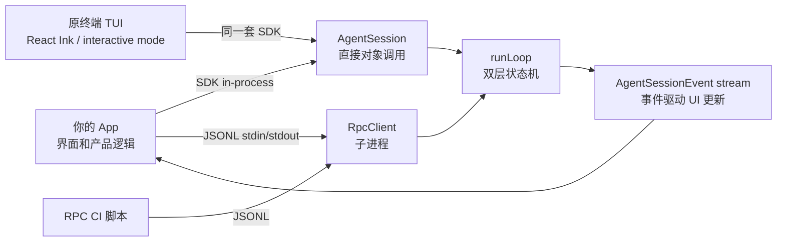

# 集成专题

> 目标读者：想把 pi-mono 接进自己的产品，但不想直接使用终端 TUI 的人。

## 这个专题为什么重要

这里研究的不是"怎么打开终端"，而是一个更关键的问题：

**pi-mono 能不能变成别的产品里的 agent 引擎？**

也就是说，宿主系统不一定想要终端界面，但想要它背后的能力：创建 session、发送 prompt、流式接收模型输出和工具事件、处理权限、管理 compaction、恢复长会话、获取 diff、fork session 树。

这个专题把各种接法都看成 **integration harness**。harness 可以理解成"接线架 / 试验台 / 宿主接入壳"：它把你的产品和 pi-mono 的 agent runtime 接起来，让你能在自己的 UI、后台任务、CI、编辑器或自动化系统里利用这些能力。

## pi-mono 和 OpenCode 的集成路径对比

| 维度 | OpenCode | pi-mono |
|---|---|---|
| 集成范式 | **server-first**（HTTP/SSE） | **library-first**（SDK in-process，RPC 子进程） |
| 主要嵌入方式 | `opencode serve` + SDK v2 sidecar | `createAgentSession()` 直接嵌入，或 `RpcClient` 子进程 |
| 跨语言方案 | HTTP + SSE | JSONL over stdin/stdout（33 个 RPC 命令） |
| web-ui 架构 | 连接本地 server 的前端 | 曾有纯前端 web-ui（浏览器直接调 LLM provider）；包已移除 |
| 权限模型 | 事件驱动交互式弹窗（`/permission` reply） | hook-based（`beforeToolCall` 可与外部阻断逻辑集成） |
| 事件通道 | SSE stream（`/event`） | `session.subscribe()` in-process 或 RPC response/event JSONL |
| session 持久化 | Server 端 JSONL 文件 | 本地 JSONL 文件（`SessionManager`） |
| TUI | Solid.js 终端客户端 | React Ink 终端客户端（interactive mode） |

核心结论：

> pi-mono 更适合**嵌入已有进程**（Electron/Tauri 后端、本地脚本服务、IDE 插件）；OpenCode 更适合**作为独立 sidecar 服务**被多种语言的宿主连接。

## 最简单的心理图



## 先别一口气读完

这组文档分成入门、进阶和实作三层。按你现在的问题选：

| 你现在的状态 | 读哪篇 |
|---|---|
| 我想先知道 pi-mono 能不能接、和 OpenCode 有什么不同 | [`01-start-here.md`](01-start-here.md) |
| 我想理解三层的架构、为什么没有 HTTP server、RPC 协议设计 | [`02-advanced.md`](02-advanced.md) |
| 我准备写代码了，要看 RPC/SDK 调用顺序 | [`03-runtime-api.md`](03-runtime-api.md) |
| 我要做界面，要知道事件怎么渲染 | [`04-event-model.md`](04-event-model.md) |
| 我要按产品形态选方案 | [`05-recipes.md`](05-recipes.md) |
| 我要核对某类能力能不能外部调用 | [`06-coverage-and-parity.md`](06-coverage-and-parity.md) |
| 我看到源码里到处是 `chord` / `facet`，想知道那是什么、要不要管 | [`07-chord-and-facets.md`](07-chord-and-facets.md) |

如果你是第一次看，先读 `01-start-here.md` 就够。读完能回答一句话：

> 可以接核心 agent runtime，但不能直接遥控完整 TUI。

## 一句话总览

如果宿主是 JS/TS（Node/Bun），最推荐的集成方式是直接用 SDK：

```ts
import { createAgentSession } from "@earendil-works/pi-coding-agent"

const { session } = await createAgentSession({ cwd: "/path/to/project" })
await session.prompt("fix the failing tests")
```

如果宿主不是 JS/TS，或者需要进程隔离，用 RPC 子进程方案：

```bash
node dist/cli.js --mode rpc
```

然后通过 stdin 写入 JSONL 命令，stdout 读取 JSONL 响应和事件。

## 集成 harness 的基本做法

做一个 harness，不是把源码硬嵌进你的项目，而是先选一个稳定边界：

| Harness 类型 | 适合做什么 | 优先读 |
|---|---|---|
| JS SDK in-process | Node/Bun、Electron/Tauri 后端、IDE 插件、测试 harness | `01-start-here.md`、`03-runtime-api.md` |
| RPC subprocess | 跨语言宿主、需要进程隔离、独立生命周期管理 | `01-start-here.md`、`03-runtime-api.md` |
| 事件驱动 UI harness | 渲染模型流、工具卡、权限阻断、重连恢复 | `04-event-model.md` |
| 后台任务 harness | 本地 supervisor、任务队列、定时巡检 | `05-recipes.md` |
| CI/脚本 harness | 一次性执行、输出 JSON event stream | `05-recipes.md` |
| 编辑器/IDE 插件 | VS Code / JetBrains 插件、ACP 连接 | `02-advanced.md`、`05-recipes.md` |

## 研究时要坚持的边界

- **先按宿主场景思考。** 不是"源码有什么我就写什么"，而是"Web UI、后台任务、CI、编辑器分别需要什么 harness"。
- **先讲能不能，再讲 endpoint。** 新人先要判断路线，不该一开始就被 RPC command type、AgentSessionEvent payload 淹没。
- **核心能力和 TUI 产品外壳分开。** SDK/RPC 能接核心 agent loop，但不能直接遥控完整 TUI（快捷键、picker、布局）。
- **内部 harness 和外部 harness 分开。** `agent/04-Harness` 讲扩展、Skill、工具、系统提示词如何进入 Agent；本目录讲宿主系统怎么接 pi-mono。
- **当前事实和未来设计分开。** 没有 HTTP server 就写没有；未来可以设计，但不能写成现状。
- **保持可落地。** 最终要能指导一个宿主系统真的创建 Session、发 prompt、听事件、处理权限、恢复状态。

## 文档分工

- [`01-start-here.md`](01-start-here.md)：入门版，判断路线、SDK vs RPC、最小闭环。
- [`02-advanced.md`](02-advanced.md)：进阶版，三层架构、为什么 library-first、RPC 协议设计、web-ui 架构史、protocol/client/server 三件套（v0.85 已重建为 chord 适配层，**dev-only、非 supported**）、experimental remote runtime 与 mini。
- [`03-runtime-api.md`](03-runtime-api.md)：真正开始写代码时读，RPC 命令全集、SDK API 调用顺序。
- [`04-event-model.md`](04-event-model.md)：做自己的 UI 时读，AgentSessionEvent 分类、渲染策略、重连恢复。
- [`05-recipes.md`](05-recipes.md)：按产品形态选方案，Web/Tauri、本地后台、CI、IDE 插件。
- [`06-coverage-and-parity.md`](06-coverage-and-parity.md)：更细的能力边界表，保留给需要核对 parity 的读者。
- [`07-chord-and-facets.md`](07-chord-and-facets.md)：第四条 authoring 面。`packages/chord`（第 11 个包、零 Pi 依赖）与 facet/service 体系是什么、为什么它已在**非实验源码**里（Harness 的 `Context` 就是 chord 的）、与 `core/extensions` 扩展系统的关系、术语碰撞、以及**现状 vs 规格**陷阱（`facets.md` 自称取代 `plugins.md`，但核心改动一条未实现）。dev-only 限定同 06。

## 当前最重要的边界

| 问题 | 答案 |
|---|---|
| 不用 TUI 能不能让它干活？ | 能，用 SDK（`createAgentSession`）或 RPC（`--mode rpc`） |
| 能不能做自己的前端？ | 能，但界面状态要自己做 |
| 能不能复用核心 agent 能力？ | 能，包括 session、event、工具、compaction、diff、revert |
| 有没有 HTTP server？ | 没有。pi-mono 是 library-first |
| 能不能把它当云端多租户 API 裸用？ | 不建议，也不是当前默认定位 |
| web-ui 是什么架构？ | 曾有纯前端 web-ui（浏览器直接调 LLM provider），包已移除；不是 server-client 架构 |

## 源码锚点

- SDK 工厂：[`../../packages/coding-agent/src/core/sdk.ts`](../../packages/coding-agent/src/core/sdk.ts)
- AgentSession 编排器：[`../../packages/coding-agent/src/core/agent-session.ts`](../../packages/coding-agent/src/core/agent-session.ts)
- RPC 协议类型：[`../../packages/coding-agent/src/modes/rpc/rpc-types.ts`](../../packages/coding-agent/src/modes/rpc/rpc-types.ts)
- RPC 客户端：[`../../packages/coding-agent/src/modes/rpc/rpc-client.ts`](../../packages/coding-agent/src/modes/rpc/rpc-client.ts)
- JSONL 成帧：[`../../packages/coding-agent/src/modes/rpc/jsonl.ts`](../../packages/coding-agent/src/modes/rpc/jsonl.ts)
- Agent 循环：[`../../packages/agent/src/agent-loop.ts`](../../packages/agent/src/agent-loop.ts)
- Agent 类型：[`../../packages/agent/src/types.ts`](../../packages/agent/src/types.ts)
- Session 管理：[`../../packages/coding-agent/src/core/session-manager.ts`](../../packages/coding-agent/src/core/session-manager.ts)
- Bash 执行器：[`../../packages/coding-agent/src/core/bash-executor.ts`](../../packages/coding-agent/src/core/bash-executor.ts)
- `web-ui` 入口（`apps/web-ui/`）：~~已移除~~（v0.83.0 前即删除；仅保留历史锚点，目录不存在）
