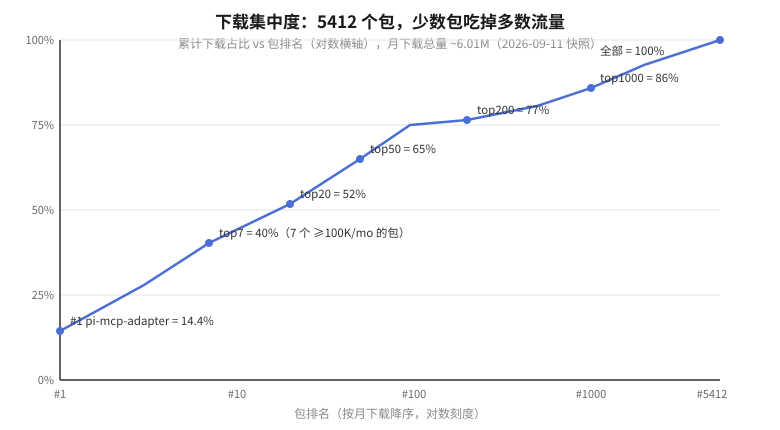

# 1 · 分布：总量、集中度、类型

> 数据快照 2026-09-11，pi 0.85.1。方法见 [7-method.md](7-method.md)。

## 1.1 总量

| 维度 | 数值 |
|---|---|
| 包总数（pi.dev 索引） | 5412 |
| 作者数 | 2189（人均 2.5 个包） |
| 月下载总量 | ~6,013,000 |
| ≥100K/mo | 7 个 |
| 10K–100K/mo | 88 个 |
| 1K–10K/mo | 4155 个 |
| 零下载 / 刚发布 | 1115 个（21%） |

增长速度见 [answer.md](answer.md) 的 timeline 图：5 月 ~2100 包 → 7 月末 npm 上 ~5890 个 `pi-package` 包 → 9 月 pi.dev 索引 5412（索引滞后于 npm，见 issue [#6991](https://github.com/earendil-works/pi/issues/6991)）。主仓库同期 45k → 104k stars。**包生态和主仓库在互相拉动**：stars 涨 → 更多作者入场 → 包目录涨 → 更多人因为包而选 pi。

## 1.2 集中度：一条很陡的 Pareto 曲线

读法：

- **第 1 名吃 14.4%**。`pi-mcp-adapter` 一个包 866K/月，因为 pi 没有内置 MCP，它是唯一通道——单点卡位。
- **top7 = 40%，top20 = 52%，top50 = 65%**。头部 50 个包基本就是"生态的默认安装清单"（见 [3-standouts.md](3-standouts.md)）。
- **95 个包（≥10K/mo）占 75%**。之后曲线变平：rank 200→1000 只涨 9 个百分点，说明 4000 多个 1K 以下的小包加起来也只是零头。
- 作者侧更陡：`nicopreme` 一人 13 个包 178 万/月（**占全生态 30%**）。这个生态还没有"机构作者"，头部全是个人/小团队——`advaitpaliwal`（feynman，35 万）、`juicesharp`（rpiv 系列，32 万）、`narumitw`（22 个包，16 万）。

含义：这是一个**赢家通吃早期市场**。每个品类基本只有一个头部 + 一圈模仿者，装包决策 = 认头部。

## 1.3 类型分布：extension 是绝对主体

包可以在 package.json 里声明多种资源类型（3468/5413 声明了）：

| 类型 | 数量 | 是什么 |
|---|---|---|
| extension | 3219 | TS 代码：挂 hooks、注册 tools/commands/UI。生态的能力来源 |
| skill | 330 | 给模型的指令包（prompt-as-skill），无代码 |
| theme | 93 | TUI 主题、状态栏皮肤 |
| prompt | 67 | prompt 模板 |
| （未声明） | ~1945 | 纯 bundle：只做打包分发 |

两个结构性事实：

1. **流量几乎全被 extension 拿走**。头部 95 个包里 54 个 extension、38 个 bundle、2 个 skill。原因：extension 有独占能力（工具、UI、事件钩子），skill 本质是 prompt 文本，可以被 bundle 吸收、被模型内化，很难独立做大。
2. **skill 单体天花板只有 bigpowers**（62K/月，73 个技能的工程方法论）。其他 skill 想被装上，路径是打进 bundle（如 `@llblab/pi-kit`、reddb-io 系列）。

（extension vs package 的概念区分见 [`08_extension_vs_package/`](../08_extension_vs_package/question.md)：文件=extension，目录=按 package 规则分发。）

## 1.4 活跃度：生态"活着"的证据

| 最近更新 | 包数 |
|---|---|
| <24h | 239 |
| <7 天 | 454 |
| <30 天 | 2844 |
| 1–6 月 | 761 |
| 无数据（= 零下载，多为刚发布） | 1115 |

首页"最近发布"以分钟计刷新（抓取时最新包是 14 分钟前发的）。近 7 天更新且 ≥1K/月的有 54 个——头部包在快速迭代（pi-mcp-adapter、pi-lens、plannotator 都是当天有更新）。对比：npm 传统包生态里，30 天内更新过 30% 已算活跃；这里 52% 的包 30 天内有更新。

注意局限：更新时间只有"x分钟/x天/x月前"粒度，"更新"≠"发布"，一个包每天 patch 会计入 24h 桶。趋势判断以活跃度为准，不做精确发布日期推断。
