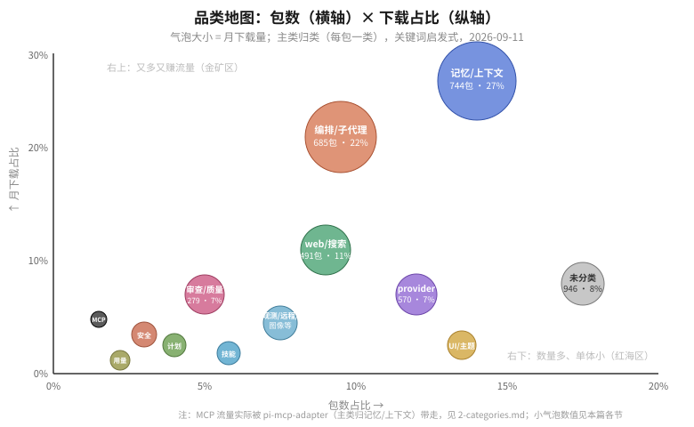

# 2 · 品类：17 个品类各自在干什么

> 主类归类 = 每包只归一类（关键词启发式取首个命中标签）；"未分类"946 个多为命名无特征的小包。分类有误差（例：pi-web-access 因描述含 "Parallel" 被误入编排类），本篇代表包已人工校正。

读图：**右上（又多又赚流量）= 金矿区：记忆/上下文、编排/子代理**。**左上（少而重）= 单点垄断：MCP**。**右下（多而小）= 红海：UI/主题、provider**。

## 2.1 记忆/上下文 —— 744 包 · 161 万/月 · 27%

**在解决什么**：agent 跑长了会忘事、爆 token。这个品类管三件事：会话内容怎么省（压缩/紧凑转录）、跨会话记住什么（持久记忆）、工具输出怎么不淹没上下文（MCP/工具懒加载）。

代表：
- `pi-mcp-adapter` 866K —— MCP 服务器 → pi 工具的适配层，token 高效（主类归这因为它是上下文管理的一部分）
- `@juicesharp/rpiv-todo` 134K —— 模型的 todo 列表，live 覆盖层，/reload 和 compaction 后还在
- `context-mode` 74K —— "省 98% 上下文"的 MCP 插件（跨 agent 通用）
- `billion-context` 73K —— 上下文压缩代理，插在 agent 和模型 API 之间改写流
- `pi-memory` 39K —— qmd 语义检索的持久记忆（日志/长期记忆/scratchpad）

**卷度**：最高。压缩派（proxy 型）和记忆派（存储型）两个流派在打架，mem0/qmd/llm-wiki 一堆集成。

## 2.2 编排/子代理 —— 685 包 · 133 万/月 · 22%

**在解决什么**：一个 agent 干不完的活分给多个。子形态：委托（单任务甩出去）、工作流（脚本化多步）、组网（多 agent 互发消息）、看板（观察一群 agent）。

代表：
- `pi-subagents` 412K —— 单代理委托 + 脚本化多代理工作流，事实标准
- `pi-background-tasks` 108K —— 持久后台 shell 任务 + 只读委派 agent
- `@tintinweb/pi-subagents` 48K —— CC 式子代理：并行、live widget、mid-run steering
- `@quintinshaw/pi-dynamic-workflows` 40K —— 百级子代理扇出 + 模型路由 + 成本核算 + worktree 隔离，当前最激进形态
- 组网层：`pi-intercom` 28K、`pi-messenger`、DoomPi contracts —— agent 之间开始互相说话

**卷度**：极高，是"人人都能写一个"的品类。伴随趋势：编排器自己开始需要成本核算和隔离 → 正在长出自己的子品类。

## 2.3 web/搜索/浏览 —— 491 包 · 64 万/月 · 11%

**在解决什么**：pi 核心没有联网。搜索、抓网页、读 PDF、看 YouTube、克隆仓库——给 agent 装眼睛。

代表：
- `pi-web-access` 404K —— 头号外挂：搜索/抓取/克隆/PDF/YouTube，支持十几个搜索后端
- `@companion-ai/feynman` 352K —— 基于 pi + alphaXiv 的科研 agent（这个品类的"产品化"样本）
- `@ff-labs/pi-fff` 36K —— 模糊文件/内容搜索
- `confluence-cli` 33K —— Confluence CLI（企业文档接入）

**卷度**：中。单体通用型已经饱和，新入场者在做垂直域（Notion、Linear、Jira 各自有人写）。

## 2.4 provider/模型接入 —— 570 包 · 42 万/月 · 7%

**在解决什么**：把各家模型/订阅接进 pi。注意 pi 官方已经内置了大量 provider 和 OAuth（0.80-0.85 的主线工作），所以这个品类的包做的是官方没覆盖的缝隙：LiteLLM 代理、llama.cpp、vLLM、以及"把别的 agent 当 provider"（pi-claude-bridge 用 Agent SDK 调 Claude Code）。

代表：`pi-claude-bridge` 29K、`pi-provider-litellm` 26K、`pi-web-search` 18K（provider-native 搜索）。

**卷度**：数量大但价值密度低——官方每加一个内置 provider，一批包就失效。聪明钱在去 2.2/2.1。

## 2.5 审查/质量 —— 279 包 · 39 万/月 · 7%

**在解决什么**：agent 写完代码后给"第二双眼睛"：LSP/lint 实时回灌、diff review、简化建议。

代表：`pi-lens` 75K（LSP+lint+typecheck 实时反馈，相当于给 agent 装感官）、`@plannotator/pi-extension` 58K（交互式 plan 审查/标注）、`pi-simplify` 40K（变更代码的可维护性审查）。

**卷度**：中，pi-lens 头部明显。机会在"编辑后即时反馈"这个交互模式的深化。

## 2.6 计划/任务/目标 —— 265 包 · 15 万/月 · 2%

**在解决什么**：CC 的 plan mode / todo / goal 在 pi 的对应物。rpiv-todo 也归这类（本篇按能力放 2.1）。

代表：`pi-goal-x` 57K（/goal + 独立完成审计器）、`@narumitw/pi-goal` 46K（自主单目标完成）、`@narumitw/pi-plan-mode` 27K（Codex 式只读 /plan）。

**卷度**：中，narumitw 一人占了小半头部。同质化重，差异化在"完成审计"（独立 auditor）。

## 2.7 安全/权限 —— 232 包 · 17 万/月 · 3%

**在解决什么**：装包即全权执行的世界里管住 agent：权限强制、危险命令拦截、沙箱、secret 扫描。

代表：`@trim21/personal-pi-extensions` 44K（bwrap 沙箱、workspace guard）、`@gotgenes/pi-permission-system` 39K、`cc-safety-net` 27K（跨 agent hook）。沙箱底座：nono（Landlock/Seatbelt）、gondolin（官方出品 micro-VM）。

**卷度**：低但重要——没有头部垄断，是明确的空位品类（见 [6-gaps.md](6-gaps.md)）。

## 2.8 技能包/方法论 —— 181 包 · 15 万/月 · 2%

**在解决什么**：把工程纪律写成模型可执行的指令。skill 是纯 prompt，边际成本为零，是"独立开发者发影响力"的最低门槛品类。

代表：`bigpowers` 62K（73 技能）、`@dietrichgebert/ponytail` 42K（"懒资深开发"方法论）、reddb-io 系列（18K）。

**卷度**：数量增长最快，但变现/留存差——方法论没有护城河，头部随时被下一个 prompt 包替代。

## 2.9 用量/成本 —— 163 包 · 10 万/月 · 2%

代表：`@narumitw/pi-usage` 24K（DeepSeek 余额 + 用量面板）、`@alexanderfortin/pi-deepseek-usage` 11K。**卷度**：低，容易做，容易被内置（官方 0.81 已把工具/压缩用量记入会话统计）。

## 2.10 MCP —— 125 包 · 6 万/月 · 1%（主类口径）

真正吃 MCP 流量的是 pi-mcp-adapter（见 2.1）。这个主类剩下的都是"把某个 MCP server 包成 pi 包"的胶水：log-sink 22K、google-services 等。**启示**：MCP 流量赢家不是"又一个 MCP server"，而是"通道本身"。

## 2.11 其余小品类（观测/远程/图像/git/语音/RAG，合计 ~440 包 · ~30 万/月）

- **可观测/追踪** 69 包 · 14 万/月：Braintrust 26K、Raindrop 28K、LangSmith 21K——**三家 SaaS 厂商全部亲自下场**，pi 成了值得适配的渠道。
- **远程/消息控制** 66 包 · 4 万/月：`@llblab/pi-telegram` 17K、`rpiv-voice` 11K、Discord/Slack 桥。手机上遥控家里的 agent 是稳定小需求。
- **图像/视觉** 86 包：`@amaster.ai/pi-image-gen` 14K 头部，其余是给无视觉模型补视觉（glm-vision、mlx-vision）。
- **git/PR** 66 包 · 2 万/月：几乎全是千级下载的提交助手。头部缺失——官方扩展点（git 事件）还没人做出 monopoly。
- **语音** 40 包：rpiv-voice 11K 一枝独秀，本地 Whisper/TTS 是主流路线。
- **知识/RAG/文档** 25 包 · 4 万/月：confluence-cli 33K（企业入口）+ mem0 类。**包数最少但增速看涨**，是下一个卷点（见 6-gaps.md）。
