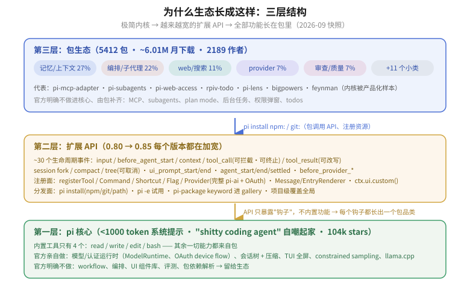

# 5 · 社区：平台、策展层与痛点

## 5.1 平台底盘（官方侧）

| 维度 | 数据 |
|---|---|
| 仓库 | earendil-works/pi（原 badlogic/pi-mono），~104k stars / 13k forks / 202 open issues |
| 公司 | 2026-04 被 Armin Ronacher 的 Earendil 收购，Mario Zechner 留任；RFC 0015：核心 MIT，Fair Source 留给托管层（Lefos 云） |
| 官方渠道 | Discord（3cU7Bz4UPx）、X @pidotdev、作者 @badlogicgames |
| 分发面 | `pi install npm:\|git:\|path` + npm `pi-package` keyword + pi.dev/packages gallery |

官方的存在感刻意压低：目录里只有 badlogic 的 pi-doom（149）/pi-gitlab-duo（107）/pi-radius（838）等示范件。**策略 = 内核极简 + 扩展点加宽 + 生态自己长**（对比 CC：官方功能吸走生态空间）。

## 5.2 扩展 API：为什么生态能长这么快

- **~30 个生命周期事件**：input 拦截、before_agent_start 注入、context 改写、tool_call 可拦截/终止、tool_result 可改写、session fork/compact/tree 可取消、ui_prompt_start/end、before_provider_*。
- **注册面**：registerTool（TypeBox schema，可覆盖内置工具）、registerCommand/Shortcut/Flag（扩展可加 CLI flag）、registerProvider（完整 pi-ai provider + OAuth config-form）、Message/EntryRenderer、MarkdownTransformer。
- **ctx**：ctx.ui.custom() 全功能 TUI 组件、ctx.sessionManager（fork/树导航/切换）、ctx.compact()、ctx.reload() 热重载。
- **分发**：npm/git/path 三源、`pi -e` 临时试用、项目级覆盖全局、`pi-package` keyword 进 gallery。
- **示范**：40+ 官方示例扩展（git-checkpoint、confirm-destructive、dynamic-tools、custom-compaction、kimi-deferred-tools、doom-overlay…）。

每个新钩子都会长出一个包品类——这是生态 4 个月 2.5 倍的机制原因。

## 5.3 策展层：谁在替你过滤 5412 个包

- **[awesome-pi-agent](https://github.com/thevibeworks/awesome-pi-agent)**（thevibeworks，270 行）：当前最好的手工策展。分节：Mothership / fork（oh-my-pi、pi-rs、senpi、rho）/ 前端（Emacs、VSCode、Tauri、Android over Tailscale）/ 扩展包 / 子代理 / 记忆 / UI / 安全 / 通知桥 / skills / providers / MCP / 沙箱 / 观测 / review / 玩具（pi-doom）/ dotfiles / Lore（前身史：shittycodingagent.ai、awesome 列表换代）。**npm 目录是量的全集，awesome 是质的子集**——两者互为镜像。
- **oh-my-pi**（can1357）：最大"发行版"——hash 锚定编辑、优化工具 harness、LSP、浏览器、子代理。oh-my-zsh 模式验证成功，带出自己的 orbit（omp-deck、harness-remote、t4-code）。
- **次级策展**：pi-lab、sysid/aktech pi-extensions（含 HowTo 教程）、GalaxyXieyu 中文生态报告、pi-book（中文书）。
- **作者亲自下场**：mariozechner.at 博客讲设计理由；badlogic 维护 pi-skills/pi-telegram/pi-diff-review/pi-doom 当活示范。

## 5.4 社区反复出现的痛点（GitHub issues 实证）

这些痛点直接定义了"必须做"清单（见 [6-gaps.md](6-gaps.md)）：

1. **包管理可靠性是第一大坑**：pnpm 11 全局布局导致每次启动重装（[#4501](https://github.com/earendil-works/pi/issues/4501)）、`pi update` 无条件重装（[#3000](https://github.com/earendil-works/pi/issues/3000)）、bun 全局根解析（#3809）、node 版本管理器反复重装（#2072）、pnpm isolated layout 下 jiti 解析失败（[#8112](https://github.com/earendil-works/pi/pull/8112)）。
2. **发现/分发缺口**：新包进不了 gallery（[#6991](https://github.com/earendil-works/pi/issues/6991)、[#6873](https://github.com/earendil-works/pi/issues/6873)——npm ~5890 vs 索引 ~5400）；git monorepo 子目录安装被拒（#4530）；包间依赖被拒（#4269）；更新后想看 changelog（#5958）。
3. **扩展作者的隐形坑**：多 realm 下扩展从自己的 node_modules 解析 pi-tui 导致单例失效、快捷键渲染为空（[#4748](https://github.com/earendil-works/pi/issues/4748)）；命名空间迁移迫使改 import（#1831）。
4. **官方拒绝的方向 = 生态机会**：RPC attachments/媒体处理（#6493，"留给扩展"）、monorepo 子路径、pi.dependencies。**官方说"不"的地方就是社区该做的地方**。

## 5.5 社区情绪速写

- 正面："极简 = 可信/可调试"、"Vim of coding agents"、session tree 被点名为关键细节（Armin Ronacher）、中文圈评价"比多数 OpenCode 配置更强、效率翻倍"（[weste.net 转述](https://www.weste.net/2026/05-27/Pi-Agent.html)）。
- "Agent = Model + Harness" 官方入门文上 HN 118pt（[日文综述](https://labmemo.com/agent-harness-what-is-harness-earendil-pi-2026/)、[中文翻译](https://raw.githubusercontent.com/deusyu/harness-engineering/refs/heads/main/works/pi-what-is-a-harness-translation.md)）。
- 典型用户配置画像（[#4501](https://github.com/earendil-works/pi/issues/4501) 的 settings.json）：web-access + subagents + lens + tool-display + powerline-footer + plannotator——与 3.1 必装清单高度重合，说明"默认套装"已经在自发收敛。
