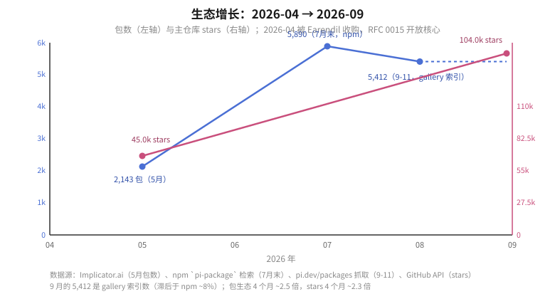

# A09: pi 包生态全景（2026-09 快照）

> 数据：全量抓取 pi.dev/packages（5412 包）+ GitHub API + pi.dev/news + 社区 writeup。快照 2026-09-11，pi 0.85.1。方法与口径见 [7-method.md](7-method.md)。

## TL;DR

- **规模**：5412 包 / 2189 作者 / ~601 万月下载。4 个月从 ~2100 涨到 ~5900（npm 口径），239 包近 24h 内更新过——爆发期早中段，主仓库同期 45k→104k stars。
- **集中度**：top20 包占 52% 下载、top50 占 65%；作者侧更陡——`nicopreme` 一人占全生态 30% 下载。每个品类基本只有一个头部。
- **金矿品类**（下载占比）：记忆/上下文 27% > 编排/子代理 22% > MCP 17%（被一个 adapter 垄断）> web 访问 11%——全在解决"agent 跑得久、看得多、记得住"。UI/主题包多（7%）但只占 4% 下载，是红海。
- **本质**：官方把核心收得很窄（4 工具 + 运行时），把扩展 API 开得很宽（~30 事件 + 全套注册面），于是"CC 有什么交互原语，pi 生态就长什么品类"。
- **机会**：信任层（包审计）、发现层（搜索）、标准件（包间依赖、cron、评测）全部空缺——官方明确说"不做"的位置就是生态的位置。

## 阅读顺序

| 篇 | 内容 | 图 |
|---|---|---|
| [1-distribution.md](1-distribution.md) | 总量、集中度 Pareto、类型分布、活跃度 | [pareto.svg](svg/pareto.svg) |
| [2-categories.md](2-categories.md) | 17 个品类逐个展开：干什么、代表、卷度 | [categories.svg](svg/categories.svg) |
| [3-standouts.md](3-standouts.md) | 头部包分三档逐个解读：必装 / 按需 / 研究样本 | — |
| [4-trends.md](4-trends.md) | 8 条趋势 + 官方路线如何塑造生态 | — |
| [5-community.md](5-community.md) | 平台底盘、扩展 API 面、策展层、社区痛点 | [layers.svg](svg/layers.svg) |
| [6-gaps.md](6-gaps.md) | 8 个空位：现状证据 → 为什么空 → 做成什么样 | — |
| [7-method.md](7-method.md) | 抓取/分类方法、数字口径、局限 | — |

## 一张图记住结论

**金字塔**：`pi-mcp-adapter`(866K) > `pi-subagents`(412K) ≈ `pi-web-access`(404K) > `feynman`(352K) > `rpiv-ask/todo`(152K/134K) > `pi-background-tasks`(108K) > `pi-lens`(75K) — 这 9 个包 = 生态 37% 的下载 = "默认套装"的事实候选。社区 issue 里晒出的真实 settings.json 和这份清单高度重合——**收敛已经在发生**。

**三句话趋势**：
1. 移植 Claude Code 是第一驱动力（体验层创业窗口）。
2. 编排在卷"多 agent 组网 + 可观测"，上下文在卷"压缩 + 懒加载 + 计量"。
3. pi 正从终端工具变成 agent 引擎的 busybox——前端矩阵、发行版（oh-my-pi）、SaaS 适配（Braintrust/LangSmith/Raindrop）都在证明这一点。

## 相关问题

- [`07_pi_usage_scenarios/`](../07_pi_usage_scenarios/question.md) — 包生态在"三层组装"里的位置（starter kit）
- [`08_extension_vs_package/`](../08_extension_vs_package/question.md) — extension/package 概念区分（本篇 1.3 的类型表依赖它）
